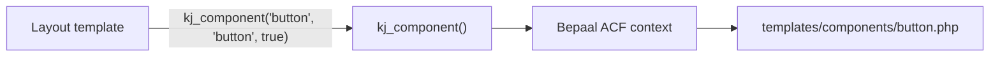

## Overzicht

Components zijn herbruikbare PHP-templates die in de hele site kunnen worden ingezet — binnen pagebuilder layouts, page templates of andere componenten. Ze worden aangeroepen via de `kj_component()` helper functie die automatisch ACF-data doorgeeft.



---

## Mappenstructuur

```
theme/
└── templates/
    └── components/
        ├── button.php            # Button component (meest gebruikt)
        ├── card.php              # Card component voor listings
        ├── social-links.php      # Social media links
        └── ...                   # Overige project-specifieke componenten
```

---

## De kj_component() functie

De kern van het component systeem. Gedefinieerd in `inc/acf.php`.

### Signatuur

```php
kj_component($component, $field_name = '', $is_subfield = false, $is_option = false)
```

### Parameters

| Parameter | Type | Standaard | Beschrijving |
|-----------|------|-----------|-------------|
| `$component` | `string` | — | Componentnaam (zonder `.php`), bijv. `'button'` |
| `$field_name` | `string\|array` | `''` | ACF veldnaam of direct een array met data |
| `$is_subfield` | `bool` | `false` | `true` als het veld een subfield is (binnen repeater/flexible content) |
| `$is_option` | `bool` | `false` | `true` als het veld van een Options Page komt |

### Hoe het werkt

<Steps>
  <Step title="Data context instellen" icon="database">
    De functie stelt globale variabelen in (`$field`, `$subfield`, `$option`) die het component template kan gebruiken om te weten waar de ACF data vandaan moet komen.
  </Step>
  <Step title="Button auto-detectie" icon="zap">
    Voor het button component probeert de functie automatisch veelgebruikte veldnamen (`button`, `link`, `cta_button`) als geen `$field_name` is opgegeven.
  </Step>
  <Step title="Repeater support" icon="layers">
    Als het button veld een repeater is (array van arrays), worden automatisch meerdere buttons gerenderd.
  </Step>
  <Step title="Template laden" icon="file-text">
    Het component template wordt geladen via `get_template_part('templates/components/' . $component)`.
  </Step>
</Steps>

---

## Gebruik

### Basis — vanuit een layout template

```php
<!-- Button renderen vanuit een pagebuilder layout (subfield) -->
<?php kj_component('button', 'button', true); ?>

<!-- Project card renderen -->
<?php kj_component('project-card'); ?>
```

### Met Options Page data

```php
<!-- Button uit de Options Page -->
<?php kj_component('button', 'header_cta', false, true); ?>
```

### Direct data meegeven

```php
<!-- Button met directe data (geen ACF lookup) -->
<?php kj_component('button', [
    'button_label' => 'Neem contact op',
    'button_type'  => 'intern',
    'button_link_intern' => get_permalink(123),
    'button_stijl' => 'primary',
]); ?>
```

---

## Button component

Het meest gebruikte component. Ondersteunt meerdere link types, stijlen en kan als repeater worden gebruikt.

### Link types

| Type | Beschrijving | Veldnaam |
|------|-------------|----------|
| `intern` | Interne WordPress pagina/post | `button_link_intern` |
| `extern` | Externe URL | `button_link_extern` |
| `section` | Scroll naar sectie op dezelfde pagina | `button_link_section` |
| `contact` | Link naar contactpagina of -formulier | — |

### Stijlen

| Stijl | Beschrijving |
|-------|-------------|
| `primary` | Primaire button met achtergrondkleur |
| `secondary` | Secundaire button met outline |
| `text` | Tekst-link stijl met pijl |

### ACF velden voor button

```
button (Group)
├── button_label        (Text)
├── button_type         (Select: intern/extern/section/contact)
├── button_link_intern  (Page Link)
├── button_link_extern  (URL)
├── button_link_section (Text - anchor ID)
├── button_stijl        (Select: primary/secondary/text)
└── button_target       (True/False - open in nieuw tabblad)
```

### Voorbeeld template code

```php
<?php
global $field, $subfield, $option;

// Data ophalen op basis van context
if ($subfield) {
    $data = get_sub_field($field ?: 'button');
} elseif ($option) {
    $data = get_field($field ?: 'button', 'option');
} else {
    $data = get_field($field ?: 'button');
}

if (empty($data)) return;

$label = $data['button_label'] ?? '';
$type  = $data['button_type'] ?? 'intern';
$stijl = $data['button_stijl'] ?? 'primary';

// URL bepalen op basis van type
switch ($type) {
    case 'intern':
        $url = $data['button_link_intern'] ?? '#';
        break;
    case 'extern':
        $url = $data['button_link_extern'] ?? '#';
        break;
    case 'section':
        $url = '#' . ($data['button_link_section'] ?? '');
        break;
    default:
        $url = '#';
}
?>

<a href="<?php echo esc_url($url); ?>"
   class="btn btn--<?php echo esc_attr($stijl); ?>">
    <?php echo esc_html($label); ?>
</a>
```

---

## Eigen component aanmaken

<Steps>
  <Step title="Template bestand aanmaken" icon="plus">
    Maak een nieuw PHP-bestand in `templates/components/`:

    ```bash
    touch templates/components/mijn-component.php
    ```
  </Step>
  <Step title="ACF velden opzetten" icon="database">
    Maak de bijbehorende ACF velden aan (of gebruik bestaande velden). Het component leest data via de globale context variabelen.
  </Step>
  <Step title="Component aanroepen" icon="code">
    Gebruik `kj_component()` om het component in te laden:

    ```php
    <?php kj_component('mijn-component', 'veldnaam', true); ?>
    ```
  </Step>
</Steps>

<Callout kind="tip" title="Naamgeving conventie">
  Gebruik lowercase met streepjes voor componentnamen: `project-card.php`, niet `projectCard.php` of `project_card.php`. Dit sluit aan bij de WordPress `get_template_part()` conventie.
</Callout>

---

## Helper functies

Naast `kj_component()` zijn er helper functies beschikbaar voor veelvoorkomende ACF-taken:

| Functie | Beschrijving | Gebruik |
|---------|-------------|---------|
| `kj_acf($field, $post_id)` | Veld ophalen met auto-escape | `kj_acf('titel')` |
| `kj_image($field, $size, $post_id)` | Afbeelding renderen met `wp_get_attachment_image()` | `kj_image('foto', 'large')` |
| `kj_sub_image($field, $size)` | Subfield afbeelding renderen | `kj_sub_image('afbeelding', 'medium')` |

<Expandable title="kj_acf() details" default-open="false">
  De functie haalt een ACF-veld op en escaped de output automatisch via `kj_escape_html()`. Ondersteunt zowel reguliere velden als subfields:

  ```php
  // Regulier veld
  kj_acf('titel');

  // Subfield (binnen repeater/flexible content)
  kj_acf('titel', 'sub');

  // Veld van specifieke post
  kj_acf('titel', 123);
  ```

  De escape-functie staat `<br>`, `<p>`, headings, `<strong>`, `<span>`, lijsten en links toe.
</Expandable>