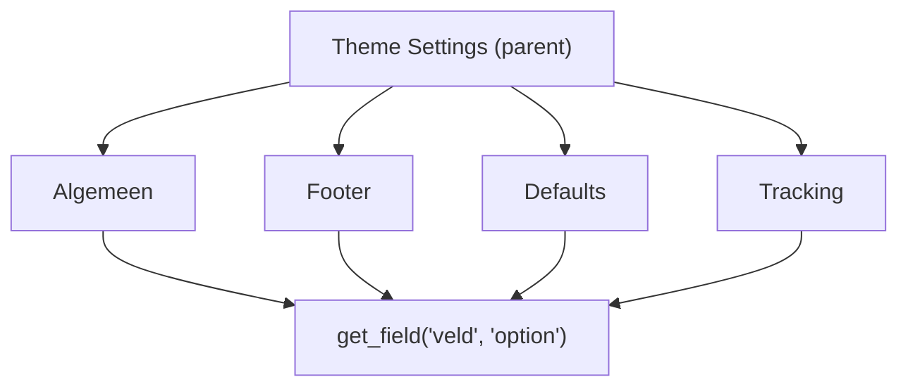

## Overzicht

ACF Options Pages worden gebruikt voor globale thema-instellingen die niet aan een specifieke pagina of post zijn gekoppeld — denk aan footer content, standaardwaarden, tracking scripts en algemene contactgegevens. Ze worden geregistreerd in `inc/acf.php` en zijn beschikbaar in de WordPress admin onder het menu-item "Theme Settings".



---

## Registratie

Options Pages worden geregistreerd in `inc/acf.php`. Er is altijd een **parent page** met optioneel meerdere **subpagina's**.

### Basisstructuur

```php
if (function_exists('acf_add_options_page')) {

    // Parent page
    $parent = acf_add_options_page([
        'page_title'  => __('Theme Settings', 'kj'),
        'menu_title'  => __('Theme Settings', 'kj'),
        'menu_slug'   => 'theme-settings',
        'redirect'    => true,  // Redirect naar eerste subpagina
    ]);

    // Subpagina: Algemeen
    acf_add_options_sub_page([
        'page_title'  => __('Algemeen', 'kj'),
        'menu_title'  => __('Algemeen', 'kj'),
        'menu_slug'   => 'theme-settings-algemeen',
        'parent_slug' => $parent['menu_slug'],
    ]);

    // Subpagina: Footer
    acf_add_options_sub_page([
        'page_title'  => __('Footer', 'kj'),
        'menu_title'  => __('Footer', 'kj'),
        'menu_slug'   => 'theme-settings-footer',
        'parent_slug' => $parent['menu_slug'],
    ]);
}
```

<Callout kind="info" title="Redirect instelling">
  Als `redirect` op `true` staat, leidt de parent page door naar de eerste subpagina. Stel het in op `false` als de parent zelf ook velden moet tonen.
</Callout>

---

## Opzet per project

<Tabs>
  <Tab title="PerfectFinish" icon="layout">
    | Pagina | Menu slug | Beschrijving |
    |--------|-----------|-------------|
    | **Theme Settings** | `theme-settings` | Parent (redirect: `false`) |

    PerfectFinish gebruikt de parent page direct zonder subpagina's. Alle instellingen staan op één pagina.
  </Tab>
  <Tab title="Vullingsmedia" icon="layout">
    | Pagina | Menu slug | Beschrijving |
    |--------|-----------|-------------|
    | **Theme Settings** | `theme-settings` | Parent (redirect: `true`) |
    | Algemeen | `theme-settings-algemeen` | Contactgegevens, social media |
    | Footer | `theme-settings-footer` | Footer content en links |
    | Defaults | `theme-settings-defaults` | Standaardwaarden voor layouts |

    Vullingsmedia splitst instellingen op in subpagina's voor overzicht.
  </Tab>
</Tabs>

---

## Data ophalen

Options Page velden worden opgehaald met de `'option'` post ID:

```php
// Enkel veld ophalen
$telefoonnummer = get_field('telefoonnummer', 'option');

// Met auto-escape helper
kj_acf('telefoonnummer', 'option');

// Afbeelding ophalen
kj_image('logo', 'full', 'option');
```

### Binnen een component

Gebruik `kj_component()` met de `$is_option` parameter:

```php
// Button uit Options Page renderen
kj_component('button', 'header_cta', false, true);
//                                    ^subfield ^option
```

---

## Veelgebruikte velden

Typische velden die op Options Pages staan:

| Veld | Type | Pagina | Beschrijving |
|------|------|--------|-------------|
| `telefoonnummer` | Text | Algemeen | Hoofdtelefoonnummer |
| `email` | Email | Algemeen | Hoofd e-mailadres |
| `adres` | Textarea | Algemeen | Vestigingsadres |
| `social_media` | Repeater | Algemeen | Social media links |
| `footer_tekst` | WYSIWYG | Footer | Footer content |
| `footer_links` | Repeater | Footer | Footer navigatie links |
| `default_cta_tekst` | Text | Defaults | Standaard CTA tekst |
| `default_cta_button` | Group | Defaults | Standaard CTA button |
| `tracking_head` | Textarea | Tracking | Scripts in `<head>` |
| `tracking_body` | Textarea | Tracking | Scripts na `<body>` |

---

## Helper functies

Drie helper functies in `inc/acf.php` vereenvoudigen het ophalen en tonen van ACF-data:

### kj_acf()

Haalt een veld op en escaped de output automatisch. Staat veilige HTML-tags toe (headings, links, lijsten, `<strong>`, `<span>`).

```php
// Regulier veld
kj_acf('titel');

// Subfield (in repeater/flexible content)
kj_acf('titel', 'sub');

// Options Page veld
kj_acf('telefoonnummer', 'option');

// Veld van specifieke post
kj_acf('titel', 123);
```

### kj_image()

Rendert een afbeelding via `wp_get_attachment_image()` — geeft automatisch `srcset`, `sizes` en `alt` mee.

```php
// Reguliere afbeelding
kj_image('foto', 'large');

// Featured image
kj_image('featured', 'full');

// Options Page afbeelding
kj_image('logo', 'full', 'option');
```

### kj_sub_image()

Zelfde als `kj_image()` maar dan voor subfields binnen een repeater of Flexible Content.

```php
kj_sub_image('afbeelding', 'medium');
```

---

## ACF JSON sync

De JSON sync configuratie zorgt dat field groups automatisch worden opgeslagen en geladen vanuit de `acf-json/` map in het thema:

```php
// Opslaan naar thema map
add_filter('acf/settings/save_json', function($path) {
    return get_template_directory() . '/acf-json';
});

// Laden vanuit thema map
add_filter('acf/settings/load_json', function($paths) {
    unset($paths[0]);
    $paths[] = get_template_directory() . '/acf-json';
    return $paths;
});
```

<Callout kind="warning" title="Vergeet niet te committen">
  Als je field groups wijzigt in WordPress, worden de JSON-bestanden in `acf-json/` bijgewerkt. Commit deze bestanden altijd mee naar Git zodat ze gesynchroniseerd blijven tussen omgevingen.
</Callout>

---

## Nieuwe Options Page toevoegen

<Steps>
  <Step title="Subpagina registreren" icon="plus">
    Voeg een `acf_add_options_sub_page()` call toe in `inc/acf.php`:

    ```php
    acf_add_options_sub_page([
        'page_title'  => __('Mijn Pagina', 'kj'),
        'menu_title'  => __('Mijn Pagina', 'kj'),
        'menu_slug'   => 'theme-settings-mijn-pagina',
        'parent_slug' => $parent['menu_slug'],
    ]);
    ```
  </Step>
  <Step title="Field group aanmaken" icon="database">
    Maak een ACF field group aan en wijs deze toe aan de Options Page via **Location Rules**:

    ```
    Options Page → is gelijk aan → Mijn Pagina
    ```
  </Step>
  <Step title="Data gebruiken in templates" icon="code">
    Haal de velden op met `'option'` als post ID:

    ```php
    $waarde = get_field('mijn_veld', 'option');
    ```
  </Step>
</Steps>