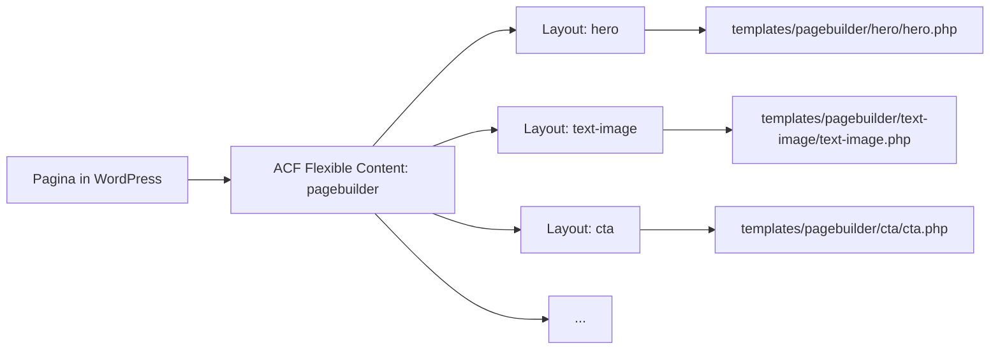

## Overzicht

De pagebuilder is gebouwd op **ACF Flexible Content** in combinatie met **ACF Extended (ACFE)**. Elke pagina kan een reeks secties (layouts) bevatten die de redacteur vrij kan samenstellen. Elke layout is een apart ACF field group bestand dat via clone fields wordt ingeladen in het hoofdveld `pagebuilder`.



<Callout kind="info" title="ACF Extended vereist">
  De pagebuilder maakt gebruik van ACF Extended (ACFE) voor layout thumbnails en geavanceerde Flexible Content opties. Zorg dat zowel ACF Pro als ACFE geïnstalleerd zijn.
</Callout>

---

## Hoe het werkt

<Steps>
  <Step title="Flexible Content field" icon="layers">
    Het veld `pagebuilder` is een **Flexible Content** field dat is toegewezen aan pagina's. Elke layout verwijst via een **clone field** naar een aparte field group (bijv. `group_layout_hero`).

    Dit zorgt voor scheiding van verantwoordelijkheden: de pagebuilder bepaalt welke layouts beschikbaar zijn, de individuele field groups bepalen welke velden elke layout heeft.
  </Step>
  <Step title="Template rendering" icon="code">
    De `loop.php` itereert over alle layouts met `have_rows('pagebuilder')` en laadt het juiste template in. Er zijn drie fallback paden:

    ```php
    // 1. Nieuwe structuur (voorkeur)
    templates/pagebuilder/{layout}/{layout}.php

    // 2. Oude structuur (fallback)
    templates/pagebuilder/{layout}.php

    // 3. Component fallback
    templates/components/{layout}.php
    ```
  </Step>
  <Step title="Layout thumbnails via ACFE" icon="image">
    Elke layout kan een thumbnail tonen in de WordPress editor. De `kj_set_layout_thumbnail()` functie zoekt automatisch naar een `thumbnail.jpg` (of .png/.webp) in de layout map:

    ```
    templates/pagebuilder/hero/thumbnail.jpg
    ```
  </Step>
</Steps>

---

## Mappenstructuur

```
theme/
├── acf-json/
│   ├── group_pagebuilder.json          # Hoofd Flexible Content field
│   ├── group_pagebuilder_defaults.json  # Gedeelde default velden
│   ├── group_layout_hero.json          # Velden voor hero layout
│   ├── group_layout_text_image.json    # Velden voor text-image layout
│   ├── group_layout_cta.json          # Velden voor CTA layout
│   └── ...                             # Per layout een field group
├── templates/
│   └── pagebuilder/
│       ├── loop.php                    # Rendert alle layouts
│       ├── hero/
│       │   ├── hero.php                # Template
│       │   └── thumbnail.jpg           # ACFE thumbnail
│       ├── text-image/
│       │   ├── text-image.php
│       │   └── thumbnail.jpg
│       ├── cta/
│       │   ├── cta.php
│       │   └── thumbnail.jpg
│       └── ...
```

---

## Loop rendering

De `loop.php` is het startpunt voor het renderen van de pagebuilder. Include dit bestand in je page template:

```php
<?php get_template_part('templates/pagebuilder/loop'); ?>
```

De loop zelf werkt als volgt:

```php
<?php if (have_rows('pagebuilder')) : ?>
    <?php while (have_rows('pagebuilder')) : the_row();
        $layout = get_row_layout();
        $slug = str_replace('_', '-', $layout);

        // Probeer drie paden
        $paths = [
            "templates/pagebuilder/{$slug}/{$slug}",
            "templates/pagebuilder/{$slug}",
            "templates/components/{$slug}",
        ];

        foreach ($paths as $path) {
            if (locate_template("{$path}.php")) {
                get_template_part($path);
                break;
            }
        }
    endwhile; ?>
<?php endif; ?>
```

---

## Layout voorbeeld

Een typisch layout template (bijv. `text-image.php`):

```php
<?php
$titel    = get_sub_field('titel');
$tekst    = get_sub_field('tekst');
$afbeelding = get_sub_field('afbeelding');
?>

<section class="py-16 lg:py-24">
    <div class="max-w-7xl mx-auto px-6 grid lg:grid-cols-2 gap-12 items-center">
        <div>
            <?php if ($titel) : ?>
                <h2 class="text-3xl font-bold mb-4"><?php echo esc_html($titel); ?></h2>
            <?php endif; ?>
            <?php if ($tekst) : ?>
                <div class="prose"><?php echo $tekst; ?></div>
            <?php endif; ?>
            <?php kj_component('button', 'button', true); ?>
        </div>
        <div>
            <?php kj_sub_image('afbeelding', 'large'); ?>
        </div>
    </div>
</section>
```

---

## ACF JSON sync

Alle field groups worden gesynchroniseerd via JSON-bestanden in de `acf-json/` map. Dit wordt geconfigureerd in `inc/acf.php`:

```php
// Opslaan naar acf-json/
add_filter('acf/settings/save_json', function($path) {
    return get_template_directory() . '/acf-json';
});

// Laden vanuit acf-json/
add_filter('acf/settings/load_json', function($paths) {
    unset($paths[0]);
    $paths[] = get_template_directory() . '/acf-json';
    return $paths;
});
```

<Callout kind="tip">
  Wijzigingen aan field groups in WordPress worden automatisch opgeslagen als JSON in `acf-json/`. Commit deze bestanden altijd mee zodat ze via Git worden gesynchroniseerd.
</Callout>

---

## Veelgebruikte layouts

Typische layouts die in projecten voorkomen:

| Layout | Beschrijving | Max |
|--------|-------------|-----|
| `hero` | Hero sectie met video/afbeelding en CTA | 1 |
| `text-image` | Tekst naast afbeelding (twee kolommen) | - |
| `call-to-action` | CTA blok met button | - |
| `diensten` | Diensten overzicht met cards | 1 |
| `reviews` | Klantbeoordelingen | 1 |
| `veelgestelde-vragen` | FAQ accordeon | 1 |
| `info-cards` | Informatiekaarten grid | - |
| `logos` | Logo carousel | 1 |
| `image` | Full-width afbeelding | - |

<Callout kind="info" title="Max instelling">
  Sommige layouts hebben een maximum van 1 per pagina — dit wordt ingesteld via de ACFE Flexible Content opties. Layouts zonder limiet (`-`) kunnen meerdere keren worden toegevoegd.
</Callout>

---

## Nieuwe layout toevoegen

<Steps>
  <Step title="ACF field group aanmaken" icon="database">
    Maak een nieuwe field group aan in WordPress met de naam `Layout: {naam}`. Sla op — het JSON-bestand verschijnt in `acf-json/group_layout_{naam}.json`.
  </Step>
  <Step title="Clone field toevoegen aan pagebuilder" icon="link">
    Ga naar de `Pagebuilder` field group, voeg een nieuwe layout toe en gebruik een **clone field** dat verwijst naar je nieuwe field group.
  </Step>
  <Step title="Template aanmaken" icon="file-text">
    Maak de map en het template bestand aan:

    ```bash
    mkdir templates/pagebuilder/mijn-layout
    touch templates/pagebuilder/mijn-layout/mijn-layout.php
    ```
  </Step>
  <Step title="Thumbnail toevoegen" icon="image">
    Plaats een `thumbnail.jpg` (ca. 400x300px) in de layout map voor de ACFE preview in de editor.
  </Step>
</Steps>

<Callout kind="warning" title="Naamgeving">
  De layout naam in ACF gebruikt underscores (`mijn_layout`), maar de mapnaam en het template gebruiken streepjes (`mijn-layout`). De conversie gebeurt automatisch in de loop via `str_replace('_', '-', $layout)`.
</Callout>