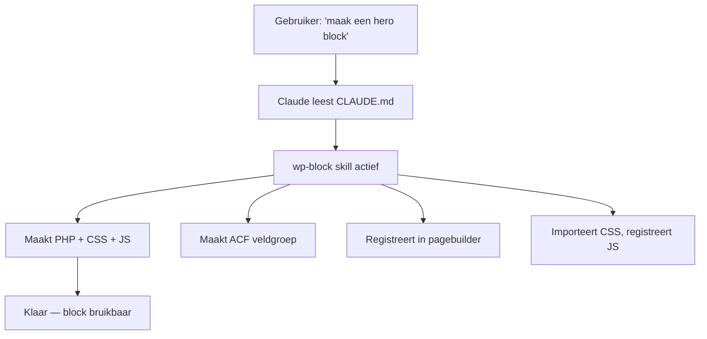

## Overzicht

Claude Code is geconfigureerd met een set **skills** — gespecialiseerde commando's die veelvoorkomende taken automatiseren. Elke skill kent de conventies, patronen en structuur van onze projecten.

---

## WordPress Development Skills

<Tabs>
  <Tab title="Block & Component" icon="layers">
    | Skill | Trigger | Beschrijving |
    |-------|---------|-------------|
    | **wp-block** | "maak een block", "nieuw block" | Maakt een compleet pagebuilder block: PHP template, CSS, JS, en ACF veldgroep. Registreert automatisch in de pagebuilder. |
    | **wp-component** | "maak een component" | Maakt een herbruikbaar PHP component met helper functie. |
    | **wp-post-type** | "maak een CPT", "nieuw post type" | Registreert een Custom Post Type met Nederlandse labels, rewrite rules, en optionele taxonomieën. |
    | **acf-fields** | "maak ACF velden" | Maakt ACF veldgroepen met juiste naamgeving, JSON sync, en best practices. |
  </Tab>
  <Tab title="Project Setup" icon="rocket">
    | Skill | Trigger | Beschrijving |
    |-------|---------|-------------|
    | **wp-init** | "nieuw project", "init theme" | Initialiseert een nieuw WordPress theme met CLAUDE.md, folderstructuur, Tailwind config, en basisbestanden. |
    | **wp-cookies** | "cookie consent", "cookies" | Configureert Pressidium Cookie Consent met custom styling. |
    | **wp-tracking** | "tracking setup", "analytics" | Zet ACF-based tracking/scripts management op voor Head, Body, Footer. |
    | **wp-schema** | "schema markup", "structured data" | Implementeert Schema.org structured data voor pagebuilder blocks. |
  </Tab>
  <Tab title="Quality & Deploy" icon="check-circle">
    | Skill | Trigger | Beschrijving |
    |-------|---------|-------------|
    | **ci-cd** | "CI/CD setup", "pipeline" | Zet GitHub Actions, ESLint, Husky, en deployment pipeline op. |
    | **wp-deployment-check** | "deployment check", "QA" | Draait uitgebreide quality checks voor go-live. |
    | **wp-pentest** | "pentest", "security scan" | WordPress penetration testing en vulnerability scanning. |
    | **update-theme** | "modernize CSS", "migrate to Tailwind" | Migreert legacy CSS (SCSS/Bootstrap) naar Tailwind. |
  </Tab>
</Tabs>

---

## Design Skills

| Skill | Trigger | Beschrijving |
|-------|---------|-------------|
| **figma-to-code** | "Figma implementeren", Figma URL | Converteert Figma designs naar WordPress code met exacte design fidelity. |
| **figma:implement-design** | "implement design" | Vertaalt Figma designs naar productie-ready code. |
| **tailwind-ref** | "welke kleuren", "design tokens" | Toont beschikbare Tailwind config: kleuren, fonts, spacing. |

---

## Documentatie Skills

| Skill | Trigger | Beschrijving |
|-------|---------|-------------|
| **docs** | "documentatie schrijven", "docs maken" | Maakt documentatiepagina's voor deze knowledge base. |
| **manual** | "handleiding maken", "manual" | Genereert stapsgewijze handleidingen voor eindklanten. |

---

## Hoe Skills Werken

Skills gebruiken de **CLAUDE.md** bestanden in elk project om de juiste conventies toe te passen:



**CLAUDE.md** bevat:
- Naamgevingsconventies (`kj_` prefix)
- Tailwind kleuren en fonts
- ACF regels (JSON sync, image format, buttons)
- CSS regels (geen media queries, Tailwind eerst)
- Build workflow

---

## Skill Gebruiken

Roep een skill aan door de bijbehorende trigger te typen in Claude Code:

```
> maak een nieuw pagebuilder block "team" met velden voor naam, foto, en functie

> maak een custom post type "evenement" met taxonomy "evenement_categorie"

> schrijf documentatie voor het Ecoxbouw project
```

Claude Code herkent de intentie en activeert automatisch de juiste skill.
