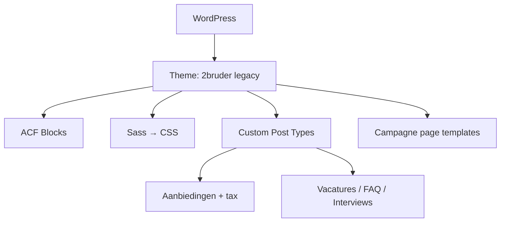

## Project Overzicht

| Detail | Waarde |
|--------|--------|
| **Klant** | 2Brüder |
| **Type** | Bedrijfswebsite (retail / horeca, DE/NL) |
| **Status** | Actief |
| **Pad** | `/DEV/2bruder/wp-content/themes/2bruder/` |
| **Lokaal** | `2bruder.local` |
| **Versie** | 1.03 |

Ouder custom theme (oorspronkelijk Een Pot Creatief) met Sass-build, ACF content blocks en Duitstalige campagnes (Sommerfest, Jubiläumsfest, WK-actie). Geen moderne CLAUDE.md — documentatie op basis van wat in de codebase staat.

<Callout kind="warning" title="Legacy theme">
  Geen Tailwind, geen moderne pagebuilder-conventies. Styling via Sass (`sass/` → `css/`). Functieprefix `epc_` i.p.v. `kj_`.
</Callout>

---

## Tech Stack

<Columns cols={3}>
  <Card title="WordPress + ACF" icon="code">
    Blocks in `blocks/` + page templates
  </Card>
  <Card title="Sass" icon="palette">
    `sass/styles.scss` → compiled CSS
  </Card>
  <Card title="jQuery / legacy JS" icon="terminal">
    Klassieke theme-structuur (EPC)
  </Card>
</Columns>

---

## Huisstijl / Design Tokens

Tokens uit `sass/global/_vars.scss`:

<Tabs>
  <Tab title="Kleuren" icon="palette">
    | Token (Sass) | Hex | Gebruik |
    |--------------|-----|---------|
    | `$primary` | `#001F60` | Primair blauw |
    | `$secondary` | `#FFDA26` | Geel accent |
    | `$rood` | `#E30613` | Rood |
    | `$oranje` | `#EC721C` | Oranje |
    | `$gray` | `#FFFADE` | Crème / licht |
    | `$primary_light` | `#E5E9EF` | Licht blauw |
  </Tab>
  <Tab title="Typografie" icon="file-text">
    | Type | Font | Gebruik |
    |------|------|---------|
    | **Sans** | Roboto (self-hosted) | Body |
    | **Display** | Baloo (self-hosted) | Koppen / display |
    | **Condensed** | Roboto Condensed | Condensed UI |
    | **Actie** | Luckiest Guy | Sommerfest e.d. |
  </Tab>
</Tabs>

---

## ACF Blocks (`blocks/`)

Geen flexible pagebuilder-map à la moderne themes; content blocks als PHP-templates:

| Block | Beschrijving |
|-------|-------------|
| `block_section` | Generieke sectie |
| `block_slider` | Slider |
| `block_slider_content` | Slider met content |
| `block_usps` | USP's |
| `block_accordeon` | Accordion |
| `block_faq` | FAQ |
| `block_content_blokken` | Contentblokken |
| `block_timeline` | Tijdlijn |
| `block_interviews` | Interviews uit CPT |
| `block_newsletter` | Nieuwsbrief |
| `block_mailerlite` | MailerLite embed |
| `block_openingstijden` | Openingstijden |

---

## Page Templates

| Template | Doel |
|----------|------|
| `formulier.php` | Generiek formulier |
| `newsletter.php` | Nieuwsbrief |
| `sommerfest.php` / `sommerfest-bedankt.php` | Zomeractie + bedankt |
| `jubilaumfest.php` / `jubilaumfest-bedankt.php` | Jubileumactie + bedankt |
| `wk-actie.php` | WK-campagne |
| `bestelformulier-bedankt.php` | Bestelling bedankt |

---

## Custom Post Types

Geregistreerd in `inc/custom-posts.php`:

<Expandable title="Secties (sections)" default-open="false">
  | Eigenschap | Waarde |
  |-----------|--------|
  | **Supports** | title, editor, thumbnail |
  | **Hiërarchisch** | Ja |
  | **Archive** | Ja |
</Expandable>

<Expandable title="Aanbiedingen (aanbiedingen)" default-open="true">
  | Eigenschap | Waarde |
  |-----------|--------|
  | **Rewrite** | `/angebote/` |
  | **Archive** | Ja |
  | **Supports** | title, thumbnail |
  | **Taxonomieën** | `aanbieding_category`, `aanbieding_filters` |
</Expandable>

<Expandable title="Vacatures (vacatures)" default-open="false">
  | Eigenschap | Waarde |
  |-----------|--------|
  | **Rewrite** | `/vacatures/` |
  | **Archive** | Ja |
  | **Taxonomie** | `vacatures_category` |
  | **Supports** | title, editor, thumbnail |
</Expandable>

<Expandable title="FAQ (faq)" default-open="false">
  | Eigenschap | Waarde |
  |-----------|--------|
  | **Archive** | Ja |
  | **Taxonomie** | `faq_category` |
  | **Supports** | title, editor |
</Expandable>

<Expandable title="Interviews (interviews)" default-open="false">
  | Eigenschap | Waarde |
  |-----------|--------|
  | **Archive** | Ja |
  | **Supports** | title, editor, thumbnail |
</Expandable>

---

## Architectuur



---

## Build & Development

```bash
npm run dev        # Sass watch → css/styles.css
npm run build      # Compressed → css/styles.min.css
npm run build:dev  # Expanded build met source map
```

---

## Bijzonderheden

- Theme header in `style.css` verwijst nog naar Een Pot Creatief
- Duitse labels in admin (o.a. Angebote) naast Nederlandse CPT-namen
- MailerLite-sectie en actiepagina's (Sommerfest / Jubiläum / WK)
- Geen moderne `kj_`-conventies of Tailwind tokens
