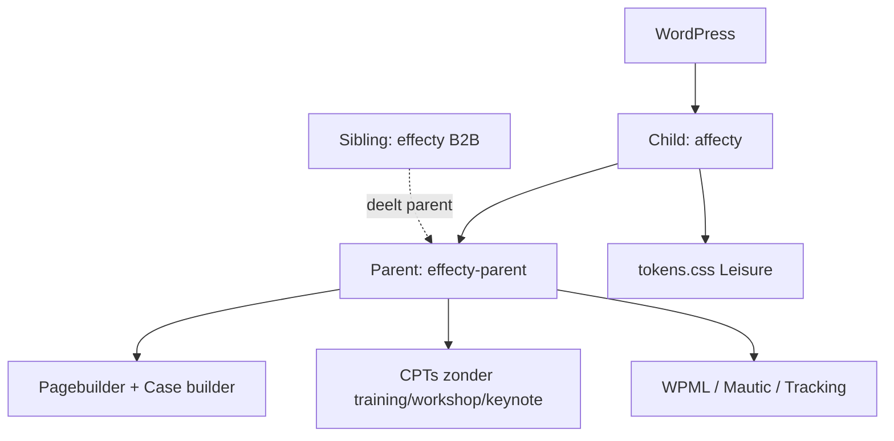

## Project Overzicht

| Detail | Waarde |
|--------|--------|
| **Klant** | Affecty |
| **Type** | Bedrijfswebsite (Leisure-markt) |
| **Markt** | Leisure (`kj_market()` → `leisure`) |
| **Status** | Actief |
| **Child** | `/DEV/affecty/wp-content/themes/affecty/` |
| **Parent** | `/DEV/affecty/wp-content/themes/effecty-parent/` (submodule) |
| **Lokaal** | `affecty.local` |

Affecty is het **Leisure-sibling** van Effecty: identieke parent-functionaliteit, andere merkkleuren. Child bevat vrijwel alleen `tokens.css` + `functions.php` (+ optionele `acf-json/`).

---

## Tech Stack

<Columns cols={3}>
  <Card title="Parent + child" icon="layers">
    effecty-parent + child `affecty`
  </Card>
  <Card title="ACF Pro pagebuilder" icon="code">
    Zelfde ~38 layouts als Effecty
  </Card>
  <Card title="Token branding" icon="palette">
    Turquoise Leisure-palet via tokens.css
  </Card>
</Columns>

Zie [Project: Effecty](client-projects/effecty) voor de volledige parent-stack (WPML, Mautic, Swiper, case-pagebuilder).

---

## Huisstijl / Design Tokens

Child overschrijft brand/accent; neutrals en light/dark/accent modes blijven van de parent.

<Tabs>
  <Tab title="Leisure (child)" icon="palette">
    | Token | Hex | Gebruik |
    |-------|-----|---------|
    | `--color-brand-rgb` | `#56AAAD` | Turquoise merk |
    | `--color-accent-rgb` | `#56AAAD` | Accent (TODO: definitief bevestigen) |
    | `--color-brand-contrast-rgb` | `#FFFFFF` | Tekst op brand |
  </Tab>
  <Tab title="Parent neutrals" icon="sun">
    | Token | Hex |
    |-------|-----|
    | Light bg | `#f9f8f4` |
    | Navy / dark bg | `#070020` |
    | Beige | `#f1ede4` |
    | Border | `#bab19d` |
  </Tab>
  <Tab title="Typografie" icon="file-text">
    | Type | Font |
    |------|------|
    | Title / Button | Nexa |
    | Body | Old Standard TT |
  </Tab>
</Tabs>

---

## Blocks & Templates

Geen eigen pagebuilder in het child — alles uit **effecty-parent** (`templates/pagebuilder/`, case-blocks, components).

Child-map is minimaal:

| Bestand / map | Rol |
|---------------|-----|
| `style.css` | Theme header, `Template: effecty-parent` |
| `functions.php` | Enqueue `assets/css/tokens.css` |
| `assets/css/tokens.css` | Leisure kleur-overrides |
| `acf-json/` | Markt-specifieke ACF-groepen (indien aanwezig) |

ACF-groepen met "Leisure" in de titel syncen naar dit child.

---

## Custom Post Types

Zelfde parent-CPT's als Effecty, **zonder** B2B-only types:

| CPT | Op Affecty |
|-----|------------|
| `case` | Ja — `/cases/` |
| `team`, `review`, `klant`, `partner` | Ja (intern / redirect) |
| `training`, `workshop`, `keynote` | **Nee** — alleen bij `kj_market_is( 'b2b' )` |

Taxonomieën `dienst` en `teams` blijven beschikbaar.

---

## Architectuur



---

## Build & Development

```bash
cd wp-content/themes/effecty-parent
npm run dev
npm run build
```

Child heeft geen npm-scripts. Activeer theme `affecty` (niet de parent).

---

## Bijzonderheden

- Functieprefix / text domain parent: `kj_`
- Leisure-accent staat nog als **TODO** in `tokens.css` (nu gelijk aan brand)
- Eigen `screenshot.jpg` ontbreekt nog (README)
- Tracking/Mautic per install via Theme Settings — niet hardcoden
- Documentatie parent: `CLAUDE.md`, `LAYOUT-MAPPING.md`, `SPLIT-PLAN.md`
