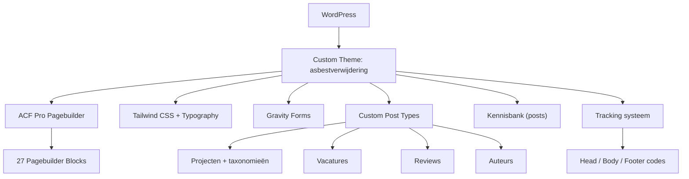

## Project Overzicht

| Detail | Waarde |
|--------|--------|
| **Klant** | Asbestverwijderingsbedrijf |
| **Type** | Bedrijfswebsite (asbestverwijdering / sanering) |
| **Status** | Actief |
| **Pad** | `/DEV/asbestverwijdering/wp-content/themes/asbestverwijdering/` |

Uitgebreide bedrijfswebsite voor een asbestverwijderingsbedrijf met kennisbank, teamoverzicht, projectportfolio, vacatures, offerte-aanvragen, en tracking/analytics integratie. Dit is qua blocks het meest uitgebreide project.

---

## Tech Stack

<Columns cols={3}>
  <Card title="WordPress + ACF Pro" icon="code">
    Pagebuilder met 27 blocks, meerdere CPTs
  </Card>
  <Card title="Tailwind CSS 3.4 + Typography" icon="palette">
    Inclusief @tailwindcss/typography plugin voor kennisbank content
  </Card>
  <Card title="ESLint + Husky" icon="terminal">
    Code quality met linting en pre-commit hooks
  </Card>
</Columns>

---

## Huisstijl / Design Tokens

<Tabs>
  <Tab title="Kleuren" icon="palette">
    | Token | Hex | Gebruik |
    |-------|-----|---------|
    | `primary` / `yellow` | `#FFD500` | Primaire kleur, knoppen |
    | `secondary` / `grey-dark` | `#1A1603` | Donkere tekst |
    | `blue` | `#004E64` | Accent kleur, links |
    | `beige` | `#F5F2EC` | Lichte achtergrond |
    | `grey-surface` | `#454545` | Oppervlakken |
    | `grey-decor` | `#DADADA` | Borders, decoratie |
    | `grey` | `#414039` | Standaard grijs |
    | `grey-light` | `#F7F7F7` | Lichte achtergrond |
    | `grey-text` | `#8A8A8A` | Subtiele tekst |
    | `grey-card` | `#E9E9E9` | Kaart achtergrond |
    | `yellow-light` | `#F2F1EB` | Lichte geel |
  </Tab>
  <Tab title="Typografie" icon="file-text">
    | Type | Font | Gebruik |
    |------|------|---------|
    | **Sans** (`font-sans`) | Karla | Body tekst |
    | **Button** (`font-button`) | Karla | Knoppen |
    | **Title** (`font-title`) | TGS | Koppen en titels |

    De `@tailwindcss/typography` plugin is geconfigureerd voor kennisbank artikelen met custom blockquote styling (gele linkerborder).
  </Tab>
</Tabs>

---

## Pagebuilder Blocks (27)

<Tabs>
  <Tab title="Standaard" icon="layout">
    | Block | Beschrijving |
    |-------|-------------|
    | `hero` | Hero sectie |
    | `text-image` | Tekst naast afbeelding |
    | `text` | Tekst-only sectie |
    | `call-to-action` | CTA met buttons |
    | `reviews` | Klantbeoordelingen |
    | `projecten-cases` | Projecten showcase |
    | `veelgestelde-vragen` | FAQ accordion |
    | `proces` | Werkproces stappen |
    | `route` | Locatie/route info |
    | `waar` | Werkgebied |
    | `waarom` | USPs / waarom kiezen |
    | `highlights` | Uitgelichte kenmerken |
    | `info-cards` | Informatiekaarten |
    | `uitdagingen` | Uitdagingen sectie |
    | `certificeringen` | Keurmerken |
    | `content-usps` | USP grid |
    | `text-services` | Diensten tekst |
  </Tab>
  <Tab title="Branche-specifiek" icon="star">
    | Block | Beschrijving |
    |-------|-------------|
    | `hero-offerte` | Hero met offerte-formulier |
    | `offerte` | Offerte aanvraag sectie |
    | `zakelijke-aanvraag` | Zakelijke aanvraag formulier |
    | `kennisbank` | Kennisbank artikelen overzicht |
    | `team` | Teamleden grid |
    | `sparren` | "Sparren" / contact sectie |
    | `stappen` | Stappen uitleg |
    | `proces-kort` | Compact proces overzicht |
    | `vacatures` | Vacature listings |
    | `werken-bij` | Werken-bij pagina sectie |
  </Tab>
</Tabs>

---

## Custom Post Types

<Expandable title="Projecten (project)" default-open="false">
  | Eigenschap | Waarde |
  |-----------|--------|
  | **Rewrite** | `/projecten/` |
  | **Archive** | Ja |
  | **Taxonomieën** | `project_dienst`, `project_doelgroep` |
</Expandable>

<Expandable title="Vacatures (vacature)" default-open="false">
  | Eigenschap | Waarde |
  |-----------|--------|
  | **Rewrite** | `/vacatures/` |
  | **Archive** | Ja |
</Expandable>

<Expandable title="Reviews (review)" default-open="false">
  | Eigenschap | Waarde |
  |-----------|--------|
  | **Publiek** | Nee |
  | **Doel** | Klantbeoordelingen via pagebuilder block |
</Expandable>

<Expandable title="Auteurs (auteur)" default-open="false">
  | Eigenschap | Waarde |
  |-----------|--------|
  | **Publiek** | Nee |
  | **Doel** | Auteurs voor kennisbank artikelen |
</Expandable>

<Expandable title="Kennisbank (standaard posts)" default-open="false">
  Kennisbank artikelen gebruiken het standaard WordPress post type (`post`) met categories. Het archief heeft een categorie-filter.

  De `@tailwindcss/typography` plugin wordt gebruikt voor de content styling.
</Expandable>

---

## Tracking & Analytics

<Callout kind="info" title="Tracking codes via ACF">
  Dit project heeft een tracking-systeem via ACF optiepagina waarmee je analytics codes kunt beheren zonder de code aan te passen.
</Callout>

Drie injectie-punten:
| Locatie | Hook | Gebruik |
|---------|------|---------|
| **Head** | `wp_head` | Google Tag Manager, meta tags |
| **Body** (na `<body>`) | `wp_body_open` | GTM noscript, body scripts |
| **Footer** (voor `</body>`) | `wp_footer` | Analytics, chat widgets |

Elk script heeft een actief/inactief toggle en een naam voor identificatie. Beheer via **WordPress admin > Instellingen > Tracking Codes**.

---

## Code Quality

Dit project heeft ESLint en Husky pre-commit hooks:

```bash
# Lint JavaScript
npm run lint:js

# Fix linting issues
npm run lint:js:fix
```

Pre-commit hook via Husky draait automatisch `eslint` op gewijzigde `.js` bestanden.

---

## Architectuur



---

## Build & Development

```bash
npm run dev          # Tailwind watch mode
npm run build        # CSS + JS build
npm run lint:js      # ESLint check
npm run lint:js:fix  # ESLint auto-fix
```

---

## Bijzonderheden

- Meest uitgebreide project qua blocks (27 stuks)
- Kennisbank met categorie-filtering op archief
- Tracking codes beheer via ACF optiepagina
- ESLint + Husky pre-commit hooks
- Tailwind Typography plugin voor blog/kennisbank content
- Auteurs CPT voor kennisbank artikelen
