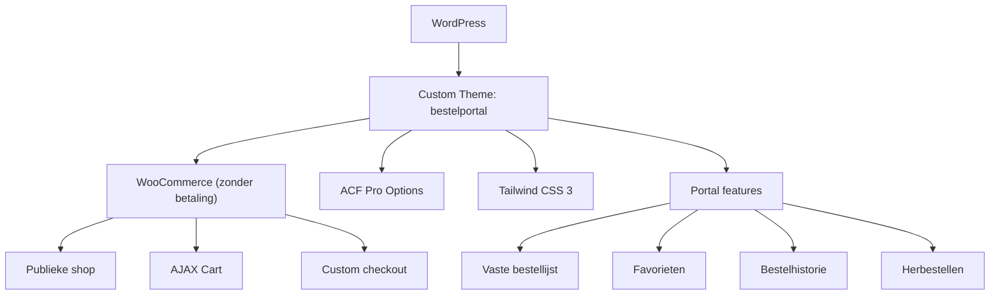

## Project Overzicht

| Detail | Waarde |
|--------|--------|
| **Klant** | Gezellig Koffie en Thee |
| **Website** | [gezellig-bestellen.nl](https://gezellig-bestellen.nl) |
| **Type** | B2B Bestelportaal (besloten, login vereist) |
| **Status** | In ontwikkeling |
| **Repo** | [github.com/kayjilesen/gezellig-bestellen](https://github.com/kayjilesen/gezellig-bestellen) |

Besloten bestelportaal waar zakelijke klanten van Gezellig Koffie en Thee hun koffie- en theeproducten kunnen bestellen. Het portaal werkt zonder prijzen — facturatie verloopt extern. Klanten loggen in, bestellen producten, en beheren hun vaste bestellijsten.

<Callout kind="info" title="B2B model">
  Dit is geen reguliere webshop. Prijzen zijn volledig verborgen, betaling is uitgeschakeld in WooCommerce, en alle bestellingen worden extern gefactureerd. De shop is publiek toegankelijk om producten te bekijken, maar afrekenen vereist een account.
</Callout>

---

## Folderstructuur

```
bestelportal/
├── assets/
│   ├── css/
│   │   └── input.css              # Tailwind source (met @font-face)
│   └── js/
│       └── portal.js              # AJAX cart, favorieten, vaste bestellijst
├── dist/
│   └── css/
│       └── style.css              # Gecompileerde + geminificeerde CSS (productie)
├── includes/
│   ├── class-favorites.php        # Favorieten systeem (user meta based)
│   ├── class-fixed-order-list.php # Vaste bestellijst functionaliteit
│   ├── class-page-cleanup.php     # WordPress head cleanup
│   └── run-page-cleanup.php       # Cleanup runner
├── template-parts/
│   ├── breadcrumbs.php            # Breadcrumb navigatie
│   ├── cart-notification-bar.php  # Winkelmand notificatie balk
│   ├── footer-portal.php          # Portal footer
│   ├── header-checkout.php        # Header voor checkout pagina
│   ├── header-portal.php          # Standaard portal header
│   ├── header-thankyou.php        # Header voor bedankpagina
│   ├── hero.php                   # Hero sectie
│   ├── product-row.php            # Herbruikbare product rij component
│   ├── quantity-controls.php      # +/- hoeveelheid knoppen
│   └── side-cart.php              # Zijbalk winkelwagen
├── templates/
│   ├── bedankt.php                # Bedankpagina na bestelling
│   ├── bestelhistorie.php         # Bestelgeschiedenis overzicht
│   ├── contact.php                # Contactpagina
│   ├── dashboard.php              # Klant dashboard / overzicht
│   ├── duurzaam.php               # Duurzaamheid info pagina
│   ├── fixed-order-list.php       # Vaste bestellijst beheer
│   ├── form.php                   # Formulier template
│   ├── login.php                  # Login pagina (publiek)
│   ├── over.php                   # Over ons pagina
│   ├── register.php               # Registratie pagina
│   ├── text.php                   # Generieke tekst template
│   └── vaste-bestellijst.php      # Vaste bestellijst weergave
├── woocommerce/
│   ├── archive-product.php        # Shop pagina (productoverzicht)
│   ├── content-product.php        # Individueel product in loop
│   └── checkout/
│       └── form-checkout.php      # Custom checkout formulier
├── schema/
│   └── faq.php                    # FAQ Schema.org markup
├── functions.php                  # Hoofd theme functies
├── header.php                     # HTML head + header routing
├── footer.php                     # Footer
├── index.php                      # Fallback template
├── page.php                       # Standaard pagina template
├── 404.php                        # 404 pagina
├── style.css                      # WordPress theme header
├── tailwind.config.js             # Tailwind configuratie
├── package.json                   # NPM dependencies
└── screenshot.jpg                 # Theme screenshot
```

---

## Tech Stack

<Columns cols={3}>
  <Card title="WordPress + WooCommerce" icon="code">
    Custom theme, WooCommerce als bestelmotor (zonder betaling/prijzen)
  </Card>
  <Card title="Tailwind CSS 3" icon="palette">
    Utility-first CSS, custom kleuren en fonts via tailwind.config.js
  </Card>
  <Card title="ACF Pro" icon="database">
    Thema-instellingen via Options Page
  </Card>
</Columns>

---

## Huisstijl / Design Tokens

<Tabs>
  <Tab title="Kleuren" icon="palette">
    | Token | Hex | Gebruik |
    |-------|-----|---------|
    | `blue` | `#0B3150` | Primaire kleur, tekst, knoppen |
    | `green` | `#435125` | Accent, koffie-gerelateerd |
    | `gold` | `#CFB291` | Accent, highlights, hover states |
    | `bg` | `#F3F5F6` | Achtergrond (lichtgrijs) |
    | `grey-light` | `#E7EAED` | Borders, subtle achtergronden |
    | `grey-dark` | `#141414` | Standaard tekst body |
    | `white` | `#FFFFFF` | Kaarten, panels |
    | `black` | `#000000` | Zwart (sparend gebruik) |
  </Tab>
  <Tab title="Typografie" icon="file-text">
    | Type | Font | Fallback |
    |------|------|----------|
    | **Sans** (standaard) | Azo Sans | system-ui, sans-serif |
    | **Serif** (koppen) | Roboto Slab | Georgia, serif |

    Fonts worden geladen via `@font-face` in `assets/css/input.css`.
  </Tab>
  <Tab title="Layout" icon="layout">
    | Token | Waarde | Gebruik |
    |-------|--------|---------|
    | `max-w-portal` | `1640px` | Maximale breedte portal container |
    | Background gradient | `radial-gradient` | Via custom `bg-gradient-radial` utility |
  </Tab>
</Tabs>

---

## Essentiële Plugins

| Plugin | Doel | Vereist |
|--------|------|---------|
| **WooCommerce** | Bestelmotor — producten, winkelwagen, checkout | Ja |
| **ACF Pro** | Thema-instellingen via Options Page | Ja |
| **Yoast SEO** | SEO management | Aanbevolen |

<Callout kind="warning" title="WooCommerce configuratie">
  WooCommerce wordt gebruikt als bestelmotor maar **zonder betaling**. Prijzen zijn volledig verborgen via filters in `functions.php`. Bestellingen worden extern gefactureerd. De `woocommerce_cart_needs_payment` en `woocommerce_order_needs_payment` filters retourneren `false`.
</Callout>

---

## Features

<Steps>
  <Step title="Publieke productcatalogus" icon="shopping-cart">
    De shop is publiek toegankelijk — bezoekers kunnen producten bekijken zonder login. Individuele productpagina's zijn uitgeschakeld (redirect naar shop). Producten worden gesorteerd op `menu_order`.
  </Step>
  <Step title="B2B bestelflow" icon="check-circle">
    Ingelogde klanten kunnen producten toevoegen via AJAX, hoeveelheden aanpassen, en bestellen via een custom checkout. Geen prijzen, geen betaling — alleen product + hoeveelheid.
  </Step>
  <Step title="Vaste bestellijst" icon="layers">
    Klanten kunnen een vaste bestellijst samenstellen (`class-fixed-order-list.php`). Dit maakt herhaalde bestellingen eenvoudig met één klik.
  </Step>
  <Step title="Favorieten" icon="star">
    Producten markeren als favoriet (`class-favorites.php`). Opgeslagen als user meta.
  </Step>
  <Step title="Bestelhistorie" icon="clock">
    Overzicht van eerdere bestellingen met mogelijkheid om een bestelling opnieuw te plaatsen (herbestellen via AJAX).
  </Step>
  <Step title="Klant dashboard" icon="home">
    Overzichtspagina na login met snelle toegang tot bestellen, bestellijst, en historie.
  </Step>
</Steps>

---

## Domeinen & Omgeving

| Omgeving | URL | Opmerking |
|----------|-----|-----------|
| **Productie** | `gezellig-bestellen.nl` | Live site |
| **Lokaal** | `localhost:8888` of subdomein | Detectie via `is_live_domain()` |

<Callout kind="info" title="Omgeving detectie">
  De functie `is_live_domain()` in `functions.php` detecteert of de site lokaal draait (poort 8888 of subdomein). Op lokale omgevingen worden automatische updates voor plugins, core en thema's ingeschakeld.
</Callout>

---

## SMTP & E-mail

<Callout kind="warning" title="SMTP configuratie">
  SMTP-configuratie nog vast te stellen. Controleer of er een SMTP-plugin is geïnstalleerd (bijv. WP Mail SMTP, FluentSMTP) en documenteer de provider en instellingen hier.
</Callout>

| Item | Waarde |
|------|--------|
| **SMTP Plugin** | *Nog te bepalen* |
| **Provider** | *Nog te bepalen* |
| **Poort** | *Nog te bepalen* |

---

## Architectuur



---

## Custom Functionaliteit

<Expandable title="AJAX Handlers (functions.php)" default-open="false">
  | Handler | Action | Beschrijving |
  |---------|--------|-------------|
  | `kj_add_to_cart_handler` | `wp_ajax_kj_add_to_cart` | Product toevoegen aan winkelwagen |
  | `kj_update_cart_qty_handler` | `wp_ajax_kj_update_cart_qty` | Hoeveelheid bijwerken |
  | `kj_remove_cart_item_handler` | `wp_ajax_kj_remove_cart_item` | Product verwijderen |
  | `kj_reorder_handler` | `wp_ajax_kj_reorder` | Bestelling opnieuw plaatsen |

  Alle handlers gebruiken nonce-verificatie en vereisen een ingelogde gebruiker.
</Expandable>

<Expandable title="Includes Classes" default-open="false">
  | Class | Bestand | Beschrijving |
  |-------|---------|-------------|
  | Fixed Order List | `includes/class-fixed-order-list.php` | Vaste bestellijst per gebruiker |
  | Favorites | `includes/class-favorites.php` | Favorieten systeem (user meta) |
  | Page Cleanup | `includes/class-page-cleanup.php` | WordPress head cleanup |
</Expandable>

<Expandable title="WooCommerce Aanpassingen" default-open="false">
  - **Prijzen verborgen** — Alle prijs-gerelateerde filters retourneren lege strings
  - **Betaling uitgeschakeld** — `woocommerce_cart_needs_payment` → `false`
  - **Single product redirect** — Redirect naar shop (geen individuele productpagina's)
  - **Checkout fields** — Pre-fill vanuit user meta, opslaan na bestelling
  - **Product ordering** — Op `menu_order` ASC
  - **E-mail items** — Zonder prijzen, met SKU en afbeelding
</Expandable>

<Expandable title="Toegangscontrole" default-open="false">
  - **wp-admin geblokkeerd** voor niet-admins → redirect naar `/overzicht/`
  - **Login redirect** → niet-admins gaan naar `/overzicht/`
  - **Portal pagina's** vereisen login (behalve login-pagina zelf)
  - **Shop & cart** zijn publiek toegankelijk
  - **Checkout** vereist login
</Expandable>

---

## Build & Development

<Tabs>
  <Tab title="Development" icon="terminal">
    ```bash
    cd wp-content/themes/bestelportal
    npm run dev
    ```
    Tailwind CSS watch mode: `assets/css/input.css` → `assets/css/style.css`
  </Tab>
  <Tab title="Production" icon="upload">
    ```bash
    npm run build
    ```
    Geminificeerde output: `assets/css/input.css` → `dist/css/style.css`

    De `is_live_domain()` functie schakelt automatisch tussen `assets/` (dev) en `dist/` (productie) CSS pad.
  </Tab>
</Tabs>

---

## Inloggegevens & Toegang

<Callout kind="warning" title="Gevoelige informatie">
  Sla geen wachtwoorden op in de documentatie. Verwijs naar de wachtwoordmanager of beveiligde opslag.
</Callout>

- **WordPress admin**: `gezellig-bestellen.nl/wp-admin`
- **Git repo**: `github.com/kayjilesen/gezellig-bestellen`
- **Inloggegevens**: Opgeslagen in wachtwoordmanager

---

## Overige Belangrijke Zaken

<Callout kind="tip" title="Let op bij updates">
  - Automatische updates (plugins, core, thema) zijn **alleen actief op lokale omgevingen**
  - Core update e-mails zijn uitgeschakeld via filter
  - Admin bar is verborgen voor alle gebruikers
  - Lazy loading is uitgeschakeld (`wp_lazy_loading_enabled` → false)
  - Comments menu-item is verwijderd uit wp-admin
</Callout>
