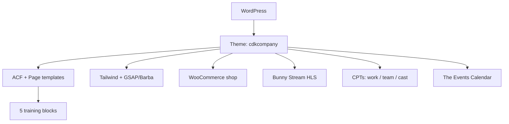

## Project Overzicht

| Detail | Waarde |
|--------|--------|
| **Klant** | CDK Company |
| **Type** | Portfolio + shop (performance / dance / choreografie) |
| **Status** | Actief |
| **Pad** | `/DEV/cdkcompany/wp-content/themes/cdkcompany/` |
| **Lokaal** | `cdkcompany.local` |
| **Live** | cdk-company.com |
| **Text domain** | `cdkcompany` (Engelse content/admin) |

Performance-/dansgezelschap in Eindhoven (Kronehoefstraat 85). Work-portfolio met video (Bunny.net Stream), training-pagina's met pagebuilder, WooCommerce-shop (Mollie) en events via The Events Calendar.

---

## Tech Stack

<Columns cols={3}>
  <Card title="WordPress + ACF Pro" icon="code">
    Page templates + 5 pagebuilder blocks
  </Card>
  <Card title="Tailwind + GSAP" icon="palette">
    Host Grotesk, Barba transitions, ScrollSmoother
  </Card>
  <Card title="WooCommerce + Bunny" icon="shopping-cart">
    Shop (Mollie) + HLS video via hls.js
  </Card>
</Columns>

---

## Huisstijl / Design Tokens

<Tabs>
  <Tab title="Kleuren" icon="palette">
    Zwart/wit-systeem (geen gekleurde accenten):

    | Token | Waarde | Gebruik |
    |-------|--------|---------|
    | `primary` | `#231B15` | Primair (Figma-fallback) |
    | `dark` | `#1E1E1E` | Donker |
    | `light` | `#F5F5F5` | Licht oppervlak |
    | `muted` | `#737373` | Gedempte tekst |
    | `border` | `rgba(30,30,30,0.1)` | Border op licht |
    | `border-on-dark` | `rgba(255,255,255,0.1)` | Border op donker |
  </Tab>
  <Tab title="Typografie" icon="file-text">
    | Type | Font | Gebruik |
    |------|------|---------|
    | **Display / Title / Sans / Body** | Host Grotesk (variable, self-hosted) | Koppen en body |

    `tailwind.config.js` map alle font-families naar Host Grotesk.
  </Tab>
</Tabs>

---

## Page Templates & Pagebuilder

Geen klassieke homepage-flexible builder voor de hele site: specifieke page templates + pagebuilder op training-pagina's.

### Page templates

| Template | Pad / doel |
|----------|------------|
| `front-page.php` | Home: full-bleed video-hero |
| `templates/work.php` | `/work/` portfolio-grid + filters |
| `templates/training.php` | Training: pinned nav + pagebuilder |
| `templates/events.php` | `/events/` (The Events Calendar) |
| `templates/team.php` | Team overzicht |
| `templates/cast.php` | Cast overzicht |
| `templates/contact.php` | Contact |
| `templates/shop-page.php` | WooCommerce wrappers (cart/checkout/account) |

### Pagebuilder blocks (5) — `templates/blocks/`

| Block | Beschrijving |
|-------|-------------|
| `text` | Tekstblok |
| `columns` | Kolommen |
| `accordion` | Accordion |
| `media-text` | Media naast tekst |
| `cta` | Call-to-action (o.a. sign-up panel) |

Blocks hebben een `nav_label` voor de gegenereerde in-page navigatie op training-pagina's.

---

## Custom Post Types

<Expandable title="Work (work)" default-open="true">
  | Eigenschap | Waarde |
  |-----------|--------|
  | **Rewrite** | `/work/` (archive via Page; single via rewrite) |
  | **Archive** | Nee (`has_archive => false`) |
  | **Supports** | title, thumbnail, page-attributes |
  | **Taxonomie** | `work_category` (slug `work-category`) |
  | **Menu icon** | `dashicons-portfolio` |

  Filter-URL's: `/work/{term-slug}/`. Hover-preview video + Bunny Stream op singles.
</Expandable>

<Expandable title="Team (team)" default-open="false">
  | Eigenschap | Waarde |
  |-----------|--------|
  | **Rewrite** | `/team/` |
  | **Archive** | Nee |
  | **Supports** | title, thumbnail, page-attributes |
  | **Menu icon** | `dashicons-groups` |
</Expandable>

<Expandable title="Cast (cast)" default-open="false">
  | Eigenschap | Waarde |
  |-----------|--------|
  | **Rewrite** | `/cast/` |
  | **Archive** | Nee |
  | **Supports** | title, thumbnail, page-attributes |
  | **Menu icon** | `dashicons-universal-access` |
</Expandable>

---

## Architectuur



---

## Build & Development

```bash
npm run dev      # Tailwind watch
npm run build    # Tailwind minify
```

Geen aparte `build:js` — JS (GSAP, Barba, cart-panel, bunny-player) wordt als theme-assets geladen.

---

## Bijzonderheden

- Homepage-hero: MP4 → Bunny background → poster (omgekeerde cascade t.o.v. single-work)
- Cart als slide-over panel (geen klassieke cart-first UX); WooCommerce CSS volledig vervangen
- Training sign-up panel buiten `#smooth-wrapper` (ScrollSmoother)
- Work view-switcher (1/2/3 kolommen) via cookie `cdk_work_view`
- Figma: `Design | CDK Company` (`JbQz6rOu7NPL8OWDY2SUry`)
