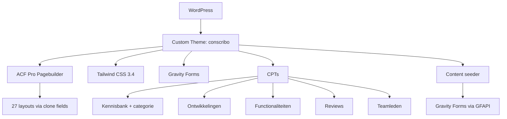

## Project Overzicht

| Detail | Waarde |
|--------|--------|
| **Klant** | Conscribo |
| **Type** | SaaS-marketingwebsite (ledenadministratie + boekhouding) |
| **Status** | Actief |
| **Pad** | `/DEV/conscribo/wp-content/themes/conscribo/` |
| **Lokaal** | `conscribo.local` |

Marketing- en kennisplatform voor Conscribo: functionaliteiten, pakketten, kennisbank, productupdates (ontwikkelingen), reviews en demo-formulieren.

---

## Tech Stack

<Columns cols={3}>
  <Card title="WordPress + ACF Pro" icon="code">
    Pagebuilder met 27 layouts (clone-pattern)
  </Card>
  <Card title="Tailwind CSS 3.4" icon="palette">
    Groen/oranje palet + knop-gradients
  </Card>
  <Card title="Gravity Forms + Husky" icon="terminal">
    Formulieren; ESLint/PHPCS pre-commit
  </Card>
</Columns>

---

## Huisstijl / Design Tokens

<Tabs>
  <Tab title="Kleuren" icon="palette">
    | Token | Hex | Gebruik |
    |-------|-----|---------|
    | `primary` / `orange-500` | `#FB7E25` | Primaire CTA |
    | `orange-400` | `#E9993D` | Oranje gradient-midden |
    | `secondary` / `dark` / `green-900` | `#1D501E` | Topbar, footer, CTA-band |
    | `accent` / `green-500` | `#61B83B` | Accent, tegels |
    | `green-700` | `#248326` | Groene knop-gradient |
    | `green-50` / `light` | `#F1F8EE` | Lichte secties |
    | `ink` | `#161616` | Navigatie + body |
    | `mist` | `#F4F6F4` | Rollenbalk, neutrale achtergrond |
  </Tab>
  <Tab title="Typografie" icon="file-text">
    | Type | Font | Gebruik |
    |------|------|---------|
    | **Title** (`font-title`) | Host Grotesk 700 | Koppen (H1 48 / H2 36 / H3 24) |
    | **Sans** (`font-sans`) | DM Sans | Body 16px (`opacity-80`), UI, knoppen |

    Fonts self-hosted in `assets/fonts/`.
  </Tab>
  <Tab title="Knoppen & radius" icon="layout">
    | Token | Waarde |
    |-------|--------|
    | `rounded-btn` | `6px` |
    | `rounded-tile` | `8px` |
    | `rounded-card` | `16px` |
    | `bg-btn-primary` | Oranje gradient (96deg) |
    | `bg-btn-secondary` | Groene gradient |
    | `bg-btn-accent` | Lichtgroene accent-gradient |

    Varianten: `btn--primary`, `btn--secondary`, `btn--accent`, `btn--white`, `btn--link`.

    Alle knoppen: `px-5 py-3.5`, DM Sans Medium 16px / `leading-[21px]` → 49px hoog. Bewust subtieler dan Figma (klantfeedback sep 2026).
    De 4px ring is een `box-shadow: 0 0 0 4px`, géén border. Pijl-swap op hover via `kj_btn_arrow()`.

    <Callout kind="warning">
      Neem de knop-gradients over uit Figma Dev Mode ("Copy as CSS"), niet uit de Figma MCP-output: die zet hoek en stops verkeerd om (`113.41deg` / `+31.77%` i.p.v. `96deg` / `-31.77%`).
    </Callout>
  </Tab>
</Tabs>

---

## Pagebuilder Blocks (27)

| Block | Beschrijving |
|-------|-------------|
| `hero` | Hero |
| `page-header` | Pagina-header |
| `punten` | Puntenlijst |
| `text-image` | Tekst ↔ afbeelding |
| `text-video` | Tekst ↔ video |
| `video` | Losse video |
| `cta` | Call-to-action |
| `partners` | Klikbare logo-tegels of kaarten met logo, tekst en link |
| `cijfers` | Statistieken |
| `feature-cards` | Feature-kaarten |
| `accordion` | Accordion |
| `functionaliteiten` | Functionaliteiten-grid (CPT), icoon per item instelbaar met SVG-fallback per slug |
| `voor-wie` | Doelgroepsectie |
| `bestuurders` | Bestuurders-sectie |
| `review` | Reviews uit CPT |
| `pakketten` | Prijspakketten |
| `vergelijkingstabel` | Vergelijkingstabel |
| `volume-module` | Volume-module |
| `team` | Team |
| `herken-je-dit` | Herkenning / pijnpunten |
| `handleiding-cta` | Handleiding CTA |
| `tekst-faq` | Tekst + FAQ |
| `kennisbank-zoek` | Kennisbank zoek |
| `nieuws` | Nieuwsuitgelicht |
| `changelog` | Productupdates |
| `contact` | Contact |
| `demo-form` | Demo-aanvraag (Gravity Forms) |

Doelgroepen zijn **pagina's** onder `/voor-wie/`, geen CPT.

Elk blok volgt dezelfde ACF-opbouw: eerste veld is tab "Inhoud", opties onder tab "Opties", styling-clone (`group_section_styling`) als laatste. Velden vóór de eerste tab renderen boven de tabbalk.

---

## Custom Post Types

<Expandable title="Kennisbank (kennisbank)" default-open="true">
  | Eigenschap | Waarde |
  |-----------|--------|
  | **Rewrite / archive** | `/kennisbank/` |
  | **Taxonomy** | `kennisbank_categorie` (hiërarchisch) |
  | **Supports** | title, editor, excerpt, page-attributes, revisions |
</Expandable>

<Expandable title="Ontwikkelingen (ontwikkeling)" default-open="false">
  | Eigenschap | Waarde |
  |-----------|--------|
  | **Rewrite / archive** | `/ontwikkelingen/` |
  | **Taxonomy** | `category` ("Technische ontwikkelingen") |
  | **Doel** | Changelog / productupdates |

  Via `kj_include_ontwikkelingen_in_news()` verschijnen ze tussen de nieuwsberichten (klantfeedback sep 2026).
</Expandable>

<Expandable title="Functionaliteiten (functionaliteit)" default-open="false">
  | Eigenschap | Waarde |
  |-----------|--------|
  | **Rewrite** | `/functionaliteiten/` |
  | **Archive** | Nee |
  | **Supports** | title, thumbnail, excerpt, page-attributes (pagebuilder) |
</Expandable>

<Expandable title="Reviews (review)" default-open="false">
  | Eigenschap | Waarde |
  |-----------|--------|
  | **Rewrite** | `/review/` (geen archive) |
  | **Inhoud** | Korte quote + uitgebreid verhaal via ACF-blokken |
  | **Supports** | title, thumbnail, excerpt, page-attributes, revisions |
</Expandable>

<Expandable title="Teamleden (teamlid)" default-open="false">
  | Eigenschap | Waarde |
  |-----------|--------|
  | **Publiek** | Nee — alleen via team-block |
  | **Supports** | title, thumbnail, page-attributes |
</Expandable>

Native `post` → `/nieuws/`, categorieën Nieuws, Tips, Verenigingsverhalen en Technische ontwikkelingen. Het categoriefilter werkt server-side via `/nieuws/{categorie}/`.

---

## Architectuur


```mermaid
graph TD
    A["WordPress"] --> B["Custom Theme: conscribo"]
    B --> C["ACF Pro Pagebuilder"]
    B --> D["Tailwind CSS 3.4"]
    B --> E["Gravity Forms"]
    C --> F["27 layouts via clone fields"]
    B --> G["CPTs"]
    G --> H["Kennisbank + categorie"]
    G --> I["Ontwikkelingen"]
    G --> J["Functionaliteiten"]
    G --> K["Reviews"]
    G --> M["Teamleden"]
    B --> L["Content seeder"]
    L --> N["Gravity Forms via GFAPI"]
```

---

## Build & Development

```bash
npm run dev            # Tailwind watch
npm run build          # CSS minify + pagebuilder JS
npm run lint           # ESLint + php -l
npm run lint:js:fix    # ESLint auto-fix
composer install && vendor/bin/phpcs
```

Husky: `lint-staged` + `npm run build` bij commit. De build-output (`style.css`, JS-bundle) staat in Git.

---

## Content seeder

**wp-admin → Hulpmiddelen → Content seeder**, per onderdeel aan te vinken. De onderdelen staan in `kj_seed_steps()`; `kj_seed_run( array $keys )` draait een selectie in vaste volgorde.

| Bestand | Inhoud |
|---------|--------|
| `scripts/seed-content.php` | Helpers, pagina's, CPT-content, runner |
| `scripts/seed-settings.php` | Media-import, menu's, thema-instellingen |
| `scripts/seed-ontwikkelingen.php` | Changelog-data |
| `scripts/seed-forms.php` | Gravity Forms (demo, contact, abonnement, afspraak, workshop) via GFAPI |
| `scripts/seed/pb-*.php` | Pagebuilder-inhoud per pagina |

```bash
wp eval 'require get_template_directory() . "/scripts/seed-content.php"; kj_seed_run( array( "nieuws" ) );'
```

<Callout kind="warning">
  Op staging wordt al content beheerd: draai daar alleen **losse pagina's** (`kj_seed_run( array(), array( 'samenwerkingen' ) )`). Een volledige run van "Pagebuilder-inhoud" overschrijft de pagebuilder van elke pagina.
</Callout>

<Expandable title="Formulieren in de seeder" default-open="false">
  - Formulieren worden op **titel** gezocht (ook inactieve) en bijgewerkt.
  - Pagebuilder-seeds halen de shortcode op via `kj_seed_form_shortcode( 'Titel' )`; nooit een formulier-id hardcoden.
  - Bij `GFAPI::update_form()` moet `is_active => '1'` in de array staan, anders wordt het formulier gedeactiveerd.
  - Een losse paginarun maakt een formulier alleen aan als het ontbreekt en overschrijft nooit een bestaand formulier.
  - Het demoformulier staat bewust op één pagina; "Abonnement aanvragen" is meertraps met voortgangsbalk (zonder percentage).
</Expandable>

<Expandable title="Nieuwe pagina toevoegen aan de seeder" default-open="false">
  1. Schrijf `kj_seed_pb_{naam}()` in een bestand onder `scripts/seed/`.
  2. Registreer hem in `kj_seed_pagebuilder_paginas()`.
  3. Met een `pagina`-sleutel (titel, samenvatting, menu_order) wordt de pagina zelf ook aangemaakt.
  4. Staat er een formulier op, zet de `kj_seed_form_*()`-functie onder `formulieren`.
</Expandable>

---

## Bijzonderheden

- Functieprefix `kj_`; text domain `conscribo`
- Pagebuilder: **nooit** velden direct in `group_pagebuilder.json` — altijd `group_layout_{slug}` + seamless clone
- Options: Thema instellingen (algemeen, topbar, header, footer, defaults, tracking)
- Header-dropdown klapt naar links als hij rechts buiten beeld valt
- Figma: "Design | Conscribo" (`9cYMwWTV4JSleA9XfrmQ2B`)
- Gedeelde clones: `group_button_fields`, `group_section_styling`
- ACF JSON: bij elke wijziging `modified` op een verse `date +%s`, nooit in de toekomst
- Klantdossier: `~/Dropbox/Projects/Conscribo/`
