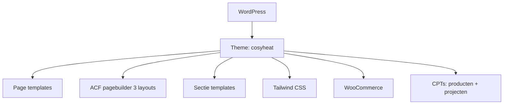

## Project Overzicht

| Detail | Waarde |
|--------|--------|
| **Klant** | CosyHeat |
| **Type** | Bedrijfswebsite + webshop (verwarming / producten) |
| **Status** | Actief |
| **Pad** | `/DEV/cosyheat/wp-content/themes/cosyheat/` |
| **Lokaal** | `cosyheat.local` |
| **Live** | cosyheat.nl |
| **Requires PHP** | 8.0+ |

Website voor CosyHeat met uitgebreide page templates (aanbod, diensten, groen, historie), WooCommerce-shop en een beperkte ACF pagebuilder (3 layouts) plus herbruikbare sectie-templates.

---

## Tech Stack

<Columns cols={3}>
  <Card title="WordPress + ACF Pro" icon="code">
    Page templates + pagebuilder + secties
  </Card>
  <Card title="Tailwind CSS" icon="palette">
    Montserrat, rood/oranje/groen tokens
  </Card>
  <Card title="WooCommerce" icon="shopping-cart">
    Shop met theme overrides + ESLint/Husky
  </Card>
</Columns>

---

## Huisstijl / Design Tokens

<Tabs>
  <Tab title="Kleuren" icon="palette">
    | Token | Hex | Gebruik |
    |-------|-----|---------|
    | `cosyheat-red` | `#E20F13` | Primair rood |
    | `cosyheat-orange` | `#EF722C` | Oranje accent |
    | `green-light` | `#6DAF01` | Licht groen |
    | `green-dark` | `#2E822C` | Donker groen |
    | `dark` | `#1E1E1E` | Donkere tekst |
    | `grey-dark` | `#262529` | Donkergrijs |
    | `grey-medium` | `#B4B4B4` | Middengrijs |
    | `grey-light` | `#F1F1F1` | Lichtgrijs |
    | `black` / `white` | `#000` / `#fff` | Basis |
  </Tab>
  <Tab title="Typografie" icon="file-text">
    | Type | Font | Gebruik |
    |------|------|---------|
    | **Sans / Serif / Title** | Montserrat | Alle typografie (`font-sans`, `font-title`) |
  </Tab>
</Tabs>

---

## Page Templates

| Template | Doel |
|----------|------|
| `home.php` | Homepage |
| `aanbod.php` | Aanbod overzicht |
| `aanbod-type.php` | Aanbod type |
| `aanbod-subcategorie.php` | Aanbod subcategorie |
| `dienst.php` | Dienst detail |
| `service.php` | Service |
| `projecten.php` | Projecten overzicht |
| `about.php` | Over ons |
| `historie.php` | Historie |
| `groen.php` | Groen / duurzaamheid |
| `klantenservice.php` | Klantenservice |
| `contact.php` | Contact |

---

## Pagebuilder & Secties

### Pagebuilder layouts (3) — `templates/pagebuilder/`

| Layout | Beschrijving |
|--------|-------------|
| `text` | Tekstsectie |
| `text-image` | Tekst naast afbeelding |
| `faq` | FAQ |

### Sectie-templates — `templates/blocks/`

| Sectie | Beschrijving |
|--------|-------------|
| `intro` | Intro |
| `banner` | Banner |
| `usps` / `usps-color` | USP's |
| `voordelen` | Voordelen |
| `eigenschappen` | Eigenschappen |
| `mogelijkheden` | Mogelijkheden |
| `brands` | Merken/logos |
| `inspiratie` | Inspiratie |
| `expert-advies` / `expert-service` | Expert secties |
| `service-nav` | Service navigatie |
| `faq` | FAQ (ook als block) |
| `project` | Project (ook ACF Gutenberg block) |

---

## Custom Post Types

Geregistreerd in `inc/acf.php`:

<Expandable title="Producten (producten)" default-open="true">
  | Eigenschap | Waarde |
  |-----------|--------|
  | **Rewrite** | `/product/` |
  | **Archive** | Nee |
  | **Supports** | title, thumbnail |
  | **Doel** | Catalogus/productcontent naast WooCommerce |
</Expandable>

<Expandable title="Projecten (projecten)" default-open="false">
  | Eigenschap | Waarde |
  |-----------|--------|
  | **Rewrite** | `/project/` |
  | **Archive** | Nee |
  | **Supports** | title, thumbnail |
  | **Menu icon** | `dashicons-admin-home` |
</Expandable>

---

## Architectuur



---

## Build & Development

```bash
npm run dev           # Tailwind watch
npm run build         # Tailwind minify
npm run lint          # ESLint + PHP lint
npm run lint:js       # ESLint
npm run lint:js:fix  # ESLint auto-fix
npm run lint:php      # php -l op theme PHP
```

Husky via `npm run prepare` (pre-commit linting).

---

## Bijzonderheden

- WooCommerce-styling uitgeschakeld; theme levert eigen shop-UI
- Options page slug vastgezet op `acf-options-thema` (meertaligheid)
- Meertaligheid via `inc/language.php`
- ACF block `project` registreert Gutenberg-block naar `templates/blocks/project.php`
- Geen moderne CLAUDE.md in de theme-root
