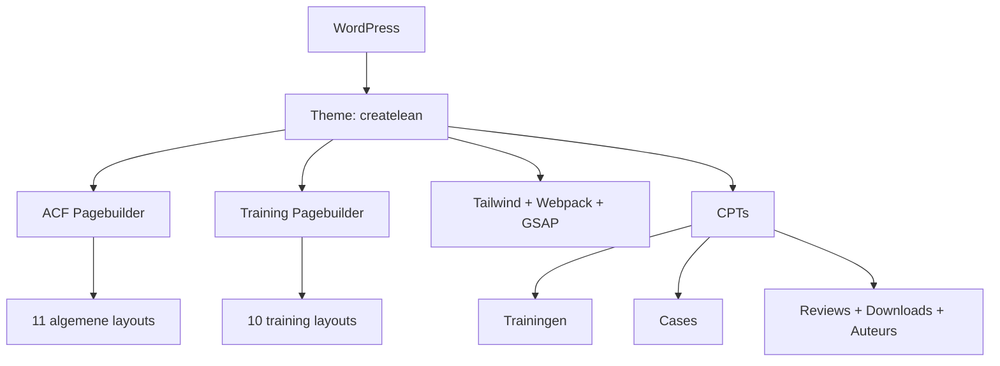

## Project Overzicht

| Detail | Waarde |
|--------|--------|
| **Klant** | Create Lean |
| **Type** | Bedrijfswebsite (lean consultancy & training) |
| **Status** | Actief |
| **Pad** | `/DEV/createlean/wp-content/themes/createlean/` |
| **Lokaal** | `createlean.local` |
| **Live** | createlean.nl |

Website voor lean-consultancy met trainingen (DMAIC-pagebuilder), cases, reviews, downloads en vaste homepage-secties.

---

## Tech Stack

<Columns cols={3}>
  <Card title="WordPress + ACF Pro" icon="code">
    Pagebuilder + aparte training-pagebuilder
  </Card>
  <Card title="Tailwind CSS + Webpack" icon="palette">
    Figtree, brand shadows, GSAP
  </Card>
  <Card title="npm-run-all" icon="terminal">
    Parallel watch: Tailwind + admin CSS + Webpack
  </Card>
</Columns>

---

## Huisstijl / Design Tokens

<Tabs>
  <Tab title="Kleuren" icon="palette">
    | Token | Hex | Gebruik |
    |-------|-----|---------|
    | `dark` | `#05141F` | Donkere achtergronden |
    | `grey-dark` | `#1E1E1E` | Tekst / brand shadow |
    | `red` | `#8E1F2F` | Accent rood |
    | `yellow` | `#F0BC42` | Accent geel |
    | `orange` | `#D6923D` | Accent oranje |
    | `green` | `#3E8D30` | Accent groen |
    | `grey` | `#D1D5DD` | Borders / UI |
    | `grey-light` | `#CACACC` | Lichte grijs |
  </Tab>
  <Tab title="Typografie" icon="file-text">
    | Type | Font | Gebruik |
    |------|------|---------|
    | **Sans** (`font-sans`) | Figtree | Body en UI |
    | **Serif** (`font-serif`) | Figtree | Fallback / headings |
  </Tab>
  <Tab title="Shadows" icon="layout">
    Offset “brand” shadows:

    | Token | Waarde |
    |-------|--------|
    | `shadow-brand` | `6px 6px 0 0 #1E1E1E` |
    | `shadow-brand-sm` | `4px 4px 0 0 #1E1E1E` |
    | `shadow-brand-lg` | `8px 8px 0 0 #1E1E1E` |
  </Tab>
</Tabs>

---

## Pagebuilder Blocks

### Algemene pagebuilder (11)

| Block | Beschrijving |
|-------|-------------|
| `hero` | Hero sectie |
| `text` | Tekstblok |
| `text_image` | Tekst & afbeelding |
| `brand_description` | Merk & beschrijving |
| `full_image` | Volledige afbeelding |
| `blocks` | Blokken grid |
| `partners` | Partners / logos |
| `actie` | Actie-sectie |
| `faq` | Veelgestelde vragen |
| `expert` | Expert-sectie |
| `cta` | Call-to-action |

### Training pagebuilder (10)

Op CPT `trainingen` — dedicated layout-set:

| Block | Beschrijving |
|-------|-------------|
| `hero` | Training hero |
| `dmaic` | DMAIC / wat houdt het in |
| `specs` | Specificaties |
| `resultaat` | Resultaat |
| `accreditatie` | Geaccrediteerd |
| `kosten` | Kosten & opties |
| `faq` | FAQ |
| `formulier` | Aanvraagformulier |
| `cta` | Training CTA (donker) |
| `cta_global` | Globale CTA (hergebruik) |

### Homepage-secties (template blocks)

Vaste secties via `templates/home.php` + partials: hero, diensten, over, waarom, joris, bedrijven, reviews, CTA, trainingen, focus, associate, certificeerd.

---

## Custom Post Types

<Expandable title="Trainingen (trainingen)" default-open="true">
  | Eigenschap | Waarde |
  |-----------|--------|
  | **Rewrite** | `/trainingen/` |
  | **Archive** | Nee |
  | **Hierarchical** | Ja |
  | **Supports** | title, page-attributes, thumbnail |
  | **Pagebuilder** | Eigen flexible content (`group_kj_t_pagebuilder`) |
</Expandable>

<Expandable title="Cases (cases)" default-open="true">
  | Eigenschap | Waarde |
  |-----------|--------|
  | **Rewrite** | `/cases/` |
  | **Archive** | Ja (`archive-cases.php`) |
  | **Single** | `single-cases.php` + case-secties (aanpak, hero, klant, quote, resultaat, uitdaging) |
</Expandable>

<Expandable title="Reviews (Reviews)" default-open="false">
  | Eigenschap | Waarde |
  |-----------|--------|
  | **Rewrite** | `/reviews/` |
  | **Archive** | Nee |
  | **Supports** | title, thumbnail |
</Expandable>

<Expandable title="Downloads (downloads)" default-open="false">
  | Eigenschap | Waarde |
  |-----------|--------|
  | **Publiek queryable** | Nee |
  | **Gutenberg** | Uitgeschakeld |
  | **Supports** | title, thumbnail, page-attributes |
</Expandable>

<Expandable title="Auteurs (authors)" default-open="false">
  | Eigenschap | Waarde |
  |-----------|--------|
  | **Publiek** | Nee (`show_ui` ja) |
  | **Supports** | title, editor, thumbnail |
</Expandable>

---

## Architectuur



---

## Build & Development

```bash
npm run dev      # Parallel: Tailwind + admin CSS + Webpack watch
npm run build    # Tailwind minify → dist/css/style.css
npm run prod     # Webpack production
```

---

## Bijzonderheden

- Twee pagebuilders: algemeen + training-specifiek (DMAIC-flow)
- Brand shadow-tokens voor “offset” kaarten
- Homepage is template-gedreven (niet alleen flexible content)
- Cases hebben eigen sectie-partials onder `templates/case/`
- GSAP + jQuery via Webpack
