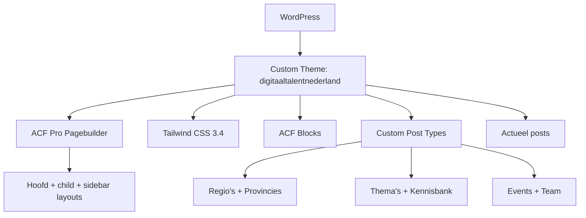

## Project Overzicht

| Detail | Waarde |
|--------|--------|
| **Klant** | Digitaal Talent Nederland |
| **Website** | [digitaaltalentnederland.nl](https://digitaaltalentnederland.nl) |
| **Type** | Platform / kennisnetwerk (ICT-talent) |
| **Status** | Actief |
| **Pad** | `/DEV/digitaaltalentnederland/wp-content/themes/digitaaltalentnederland/` |
| **Lokaal** | `digitaaltalentnederland.local` |

Landelijk platform rond digitaal talent: regio's per provincie, ICT-thema's, kennisbank, events, campagnes en verklaringen. Uitgebreide pagebuilder met aparte child-theme- en sidebar-layouts. Berichten zijn hernoemd naar **Actueel**.

---

## Tech Stack

<Columns cols={3}>
  <Card title="WordPress + ACF Pro" icon="code">
    Pagebuilder + ACF blocks + 5 CPT's
  </Card>
  <Card title="Tailwind CSS 3.4" icon="palette">
    Blauw/neon accenten; darkMode class
  </Card>
  <Card title="ESLint + Husky" icon="terminal">
    Lint + aparte admin/editor CSS builds
  </Card>
</Columns>

---

## Huisstijl / Design Tokens

<Tabs>
  <Tab title="Kleuren" icon="palette">
    | Token | Hex | Gebruik |
    |-------|-----|---------|
    | `primary` / `blue-light` | `#2380FF` | Primair blauw |
    | `secondary` / `blue-dark` | `#121128` | Donkerblauw |
    | `grey` | `#605F6D` | Body / muted |
    | `grey-light` | `#F5F5F8` | Lichte achtergrond |
    | `blue-white` | `#D6D5E0` | Lichtblauw-grijs |
    | `pink` | `#E700FF` | Accent roze |
    | `light-green` | `#9FEE17` | Accent groen |
    | `turquoise` | `#05EDD2` | Accent turquoise |
    | `black` / `white` | `#000` / `#fff` | Basis |
  </Tab>
  <Tab title="Typografie" icon="file-text">
    | Type | Font | Gebruik |
    |------|------|---------|
    | **Sans** (`font-sans`) | Plus Jakarta Sans | Body |
    | **Serif** (`font-serif`) | Lust Sans | Accent / display |
    | **Title** (`font-title`) | DM Sans | Titels |
  </Tab>
</Tabs>

---

## Pagebuilder & Layouts

### Hoofdlayouts

| Layout | Beschrijving |
|--------|-------------|
| `hero` | Hero |
| `textblock` | Tekstblok |
| `text_image` | Tekst + afbeelding |
| `themes` | Thema-overzicht |
| `featured_news` | Uitgelicht nieuws |
| `regions_map` | Regiokaart |
| `actielijnen` | Actielijnen |
| `hca_ict_intro` | HCA/ICT intro |
| `nummered_columns` | Genummerde kolommen |
| `team` | Team / contactpersonen |
| `over-ons-regio` | Over ons regio |
| `featured_events` | Uitgelichte events |
| `campagne_hero` | Campagne-hero |
| `accentkaarten` | Accentkaarten |
| `toolkit` | Toolkit |
| `uitgelichte_artikelen` | Uitgelichte artikelen |
| `formulier` | Formulier |

### Child-theme layouts (thema-subpagina's)

| Layout | Beschrijving |
|--------|-------------|
| `regulation` | Regelgeving |
| `werktafels` | Werktafels |
| `related_articles` | Gerelateerde artikelen |
| `highlighted_data` | Uitgelichte data |
| `upcoming_events` | Aankomende events |
| `provinces_map` | Provinciekaart |
| `themablokken` | Themablokken |
| `textblock` / `text_image` / `regions_map` | Child-varianten |

### Sidebar layouts

| Layout | Beschrijving |
|--------|-------------|
| `contactperson` | Contactpersoon |
| `links` | Links |
| `quote` | Quote |
| `image` | Afbeelding |

### Template-onderdelen (`templates/blocks/`)

Kaarten en herbruikbare stukken: `card-actueel`, `card-event`, `card-post`, `card-theme`, `cta`, `verklaring-*`, `related-articles`, e.a.

---

## Custom Post Types

<Expandable title="Regio's (regions)" default-open="true">
  | Eigenschap | Waarde |
  |-----------|--------|
  | **Rewrite** | `/regio/` |
  | **Archive** | Nee |
  | **Taxonomy** | `regio-category` (Provincies) → `/provincie/` |
  | **Supports** | title, editor, page-attributes, thumbnail |
  | **Hierarchical** | Ja |
</Expandable>

<Expandable title="Thema's (ict-themes)" default-open="false">
  | Eigenschap | Waarde |
  |-----------|--------|
  | **Rewrite** | `/thema/` |
  | **Archive** | Nee |
  | **Hierarchical** | Ja |
</Expandable>

<Expandable title="Kennisbank (knowledge-base)" default-open="false">
  | Eigenschap | Waarde |
  |-----------|--------|
  | **Rewrite** | `/kennisbank/` |
  | **Archive** | Nee |
  | **Hierarchical** | Ja |
</Expandable>

<Expandable title="Contactpersonen (team)" default-open="false">
  | Eigenschap | Waarde |
  |-----------|--------|
  | **Rewrite** | `/team/` |
  | **Publiek queryable** | Nee |
  | **Supports** | title, page-attributes, thumbnail |
</Expandable>

<Expandable title="Events (events)" default-open="false">
  | Eigenschap | Waarde |
  |-----------|--------|
  | **Rewrite** | `/evenementen/` |
  | **Archive** | Ja |
</Expandable>

---

## Pagina-templates

| Template | Doel |
|----------|------|
| `home.php` | Homepage |
| `about.php` | Over ons |
| `campagne.php` | Campagne |
| `contact.php` | Contact |
| `formulier.php` | Formulierpagina |
| `knowledge-base.php` | Kennisbank |
| `regions.php` | Regio's |
| `themes.php` | Thema's |
| `verklaring.php` | Verklaring ondertekenen |
| `template-page-detail.php` | Detailpagina |
| `text.php` | Tekstpagina |

---

## Architectuur



---

## Build & Development

```bash
npm run build          # style + admin + editor (minify → dist/css/)
npm run build:style    # Frontend CSS
npm run build:admin    # Admin CSS
npm run build:editor   # Editor CSS
npm run build:local    # Lokale style zonder minify
npm run dev            # Parallel watch (tailwind + admin + editor)
npm run lint:js        # ESLint op assets/js
```

---

## Bijzonderheden

- Meerdere pagebuilders: algemeen, about, thema-child, sidebar
- ACF blocks geregistreerd vanuit `blocks/` map
- Taxonomy `regio-category` met query-fix voor `provincie` query var
- Campagne-seeder (`inc/campagne-seeder.php`)
- Functieprefix `kj_`, text domain `digitaaltalentnederland`
- ACF `modified`-timestamp altijd updaten bij JSON-wijzigingen
