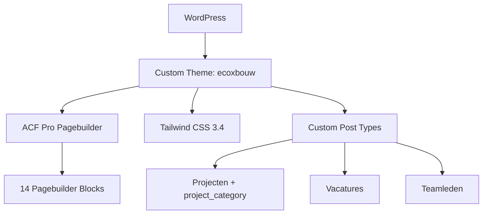

## Project Overzicht

| Detail | Waarde |
|--------|--------|
| **Klant** | ecoXbouw |
| **Type** | Bedrijfswebsite (duurzaam bouwen) |
| **Status** | Actief |
| **Pad** | `/DEV/ecoxbouw/wp-content/themes/ecoxbouw/` |

Website voor een duurzaam bouwbedrijf met projectportfolio, teamoverzicht, dienstenpagina's en een focus op groene/natuurlijke design tokens.

---

## Tech Stack

<Columns cols={3}>
  <Card title="WordPress + ACF Pro" icon="code">
    Pagebuilder met 14 blocks
  </Card>
  <Card title="Tailwind CSS 3.4" icon="palette">
    Groen kleurenpalet met custom border-radius tokens
  </Card>
  <Card title="ESLint + Husky" icon="terminal">
    Code quality met pre-commit linting
  </Card>
</Columns>

---

## Huisstijl / Design Tokens

<Tabs>
  <Tab title="Kleuren" icon="palette">
    | Token | Hex | Gebruik |
    |-------|-----|---------|
    | `primary` | `#216b45` | Primair groen, knoppen |
    | `secondary` | `#8bb4a2` | Secundair sage groen |
    | `beige` | `#f9f9f6` | Lichte achtergrond |
    | `beige-muted` | `#c3bfa2` | Gedempte beige |
    | `dark` | `#061f12` | Donkere tekst |
    | `gold` | `#ccbe54` | Accent goud |
    | `green-light` | `#e9f0ec` | Licht groene achtergrond |
    | `brown` | `#65624b` | Bruine accenten |
  </Tab>
  <Tab title="Typografie" icon="file-text">
    | Type | Font | Gebruik |
    |------|------|---------|
    | **Sans** (`font-sans`) | Lexend | Body tekst |
    | **Title** (`font-title`) | Funnel Display | Koppen en titels |
  </Tab>
  <Tab title="Border Radius" icon="layout">
    Custom border-radius tokens voor afgeronde design:

    | Token | Waarde | Gebruik |
    |-------|--------|---------|
    | `rounded-card` | `32px` | Kaarten en content blokken |
    | `rounded-section` | `64px` | Secties en grote containers |

    ```html
    <div class="rounded-card bg-white p-8">Kaart</div>
    <section class="rounded-section bg-green-light">Sectie</section>
    ```
  </Tab>
</Tabs>

---

## Pagebuilder Blocks (14)

| Block | Beschrijving |
|-------|-------------|
| `hero` | Hero sectie |
| `text-image` | Tekst naast afbeelding |
| `cta` | Call-to-action |
| `cta-achtergrond` | CTA met achtergrondafbeelding |
| `cta-formulier` | CTA met contactformulier |
| `diensten` | Diensten grid overzicht |
| `projecten` | Projecten showcase uit CPT |
| `over` | Over ons sectie |
| `proces` | Werkproces stappen |
| `cijfers` | Statistieken / nummers |
| `voor-wie` | Doelgroep sectie |
| `image` | Afbeelding sectie |
| `logos` | Partner/keurmerk logos |
| `marquee` | Scrollende tekst/logos animatie |

---

## Custom Post Types

<Expandable title="Projecten (project)" default-open="true">
  | Eigenschap | Waarde |
  |-----------|--------|
  | **Rewrite** | `/projecten/` |
  | **Archive** | Nee |
  | **Taxonomy** | `project_category` (hiërarchisch) |
  | **Supports** | title, editor, thumbnail, excerpt, custom-fields |
</Expandable>

<Expandable title="Vacatures (vacature)" default-open="false">
  | Eigenschap | Waarde |
  |-----------|--------|
  | **Rewrite** | `/vacatures/` |
  | **Archive** | Ja |
</Expandable>

<Expandable title="Teamleden (teamlid)" default-open="false">
  | Eigenschap | Waarde |
  |-----------|--------|
  | **Publiek** | Nee (alleen via admin) |
  | **Supports** | title, thumbnail, custom-fields (geen editor) |
  | **Doel** | Teamfoto, functie, contactgegevens via ACF |
</Expandable>

---

## Architectuur



---

## Build & Development

```bash
npm run dev          # Tailwind watch mode
npm run build        # CSS build (geen JS bundeling)
npm run lint:js      # ESLint check
npm run lint:js:fix  # ESLint auto-fix
```

<Callout kind="info" title="Geen JS bundeling">
  Dit project heeft geen `build:js` script — block JavaScript wordt apart geladen (geen bundler).
</Callout>

---

## Bijzonderheden

- Custom `rounded-card` (32px) en `rounded-section` (64px) border-radius tokens
- Groen/natuurlijk kleurenpalet passend bij duurzaam bouwen
- Teamlid CPT is niet publiek — alleen via pagebuilder
- Marquee block voor scrollende animaties
- ESLint + Husky pre-commit hooks
- Versie 2.0.0 (eerder gerefactored)
