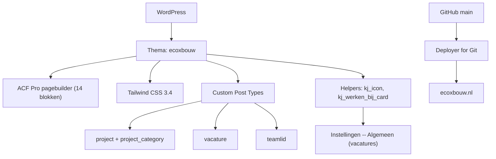

## Project Overzicht

| Detail | Waarde |
|--------|--------|
| **Klant** | ecoXbouw (onderdeel van Hoex Group) |
| **Type** | Bedrijfswebsite (duurzaam bouwen) |
| **Live** | [ecoxbouw.nl](https://ecoxbouw.nl) |
| **Lokaal** | `http://ecoxbouw.local` (MAMP) |
| **Status** | Fase 1 (Homepage) gebouwd, oktober 2026 |
| **Pad** | `/DEV/ecoxbouw/wp-content/themes/ecoxbouw/` |
| **Deploy** | Deployer for Git, branch `main` |

Website voor een duurzaam bouwbedrijf met projectportfolio, vacatures (via Hoex Group), doelgroepen en werkwijze. Het design komt uit Figma en is per sectie 1-op-1 nagebouwd.

---

## Tech Stack

<Columns cols={3}>
  <Card title="WordPress + ACF Pro" icon="code">
    ACF Pro + ACF Extended Pro, pagebuilder met 14 blokken
  </Card>
  <Card title="Tailwind CSS 3.4" icon="palette">
    Groen kleurenpalet, custom radius-tokens, geen JS-bundler
  </Card>
  <Card title="SureForms + SureRank" icon="file-text">
    Formulieren (Pro) en SEO (Pro)
  </Card>
</Columns>

Swiper 10 wordt via unpkg geladen (`inc/scripts.php`) voor de projectenslider. Frontend-JS staat in één bestand: `assets/js/script.js` (header, swiper, zwevende formulierlabels).

---

## Huisstijl / Design Tokens

<Tabs>
  <Tab title="Kleuren" icon="palette">
    | Token | Hex | Gebruik |
    |-------|-----|---------|
    | `primary` | `#216b45` | Primair groen, knoppen, swiper-knoppen |
    | `secondary` | `#8bb4a2` | Secundair saliegroen |
    | `beige` | `#f9f9f6` | Lichte achtergrond |
    | `beige-muted` | `#c3bfa2` | Gedempte beige |
    | `dark` | `#061f12` | Donkere tekst |
    | `gold` | `#ccbe54` | Accent, vacature-teller |
    | `green-light` | `#e9f0ec` | Lichtgroene achtergrond |
    | `brown` | `#65624b` | Bruine accenten |
  </Tab>
  <Tab title="Typografie" icon="file-text">
    | Type | Font | Gebruik |
    |------|------|---------|
    | **Sans** (`font-sans`) | Lexend | Bodytekst en knoppen (font-weight 400) |
    | **Title** (`font-title`) | Funnel Display | Koppen en titels |

    Vaste maten uit het design: hero-subtitel 16px, menu-items 14px, header-CTA 14px.
  </Tab>
  <Tab title="Border Radius" icon="layout">
    | Token | Waarde | Gebruik |
    |-------|--------|---------|
    | `rounded-card` | `32px` | Kaarten en contentblokken |
    | `rounded-section` | `64px` | Secties en grote containers |
  </Tab>
  <Tab title="Iconen" icon="star">
    Lijniconen in Lucide-stijl via `kj_icon( $naam, $class )` in `inc/helpers.php`. Inline SVG, kleur via `currentColor`, `stroke-width` 1.25.

    Beschikbaar: `blad`, `lijst`, `hout`, `woning`, `gebouw`, `ontwerp`, `overleg`, `groep`, `modules`.

    ```php
    <?php echo kj_icon( 'woning', 'w-8 h-8 text-primary' ); ?>
    ```

    In ACF kiest de redacteur het icoon via een keuzeveld (Voor wie-kaarten, pills).
  </Tab>
</Tabs>

---

## Pagebuilder Blocks (14)

Elk blok staat in een eigen map in `templates/pagebuilder/` en wordt gerenderd via `loop.php`.

| Block | Beschrijving |
|-------|-------------|
| `hero` | Inhoud linksonder, gradient van linksonder naar rechtsboven (en bovenin voor het menu), pills met icoon, zwevende Werken bij-kaart vanaf `xl` |
| `text-image` | Tekst naast afbeelding |
| `cta` | Call-to-action |
| `cta-achtergrond` | CTA met achtergrondfoto, overlapt de sectie erboven; footer valt eroverheen |
| `cta-formulier` | CTA met SureForms-formulier |
| `diensten` | Diensten-grid |
| `projecten` | Swiper met liggende projectfoto's, gecentreerde watermerktitel, groene swiper-knoppen; kaarten optioneel zonder link |
| `over` | Over ons |
| `proces` | Werkwijze-stappen, kolomverdeling gelijk aan Voor wie |
| `cijfers` | Statistieken |
| `voor-wie` | Doelgroepkaarten in een raster van twee, icoon per kaart, geen rand of hover |
| `image` | Afbeelding |
| `logos` | Partner- en keurmerklogo's |
| `marquee` | Scrollende tekst, kleiner op mobiel |

<Callout kind="tip" title="Geen dubbele witruimte">
  Staan twee witte secties (`section.section-pd` zonder `bg-`-class) direct onder elkaar, dan vervalt de `padding-top` van de tweede. De regel staat in `assets/css/pagebuilder.css`.
</Callout>

---

## Werken bij-kaart

De vacaturekaart is een herbruikbare helper, `kj_werken_bij_card()` in `inc/helpers.php`. Hij staat in de hero en in de footer.

- Glasstijl: `bg-white/5` met `backdrop-blur`, tekst links, foto rechts, rond pijlknopje rechtsboven
- De link komt uit `kj_vacatures_link()`: de externe vacaturepagina van Hoex Group als die is ingevuld (opent in een nieuw tabblad), anders het `vacature`-archief
- Een goud bolletje toont het aantal open vacatures als dat groter is dan 0

| ACF-optie (Instellingen -- Algemeen) | Doel |
|---|---|
| `vacatures_url` | Externe vacaturepagina |
| `vacatures_label` | Linktekst (standaard "Werken bij") |
| `vacatures_aantal` | Aantal open vacatures voor het bolletje |
| `vacatures_kaart_titel` | Titel op de kaart |

```php
<?php kj_werken_bij_card( array(
    'titel'      => get_field( 'vacatures_kaart_titel', 'option' ),
    'subregel'   => 'Bekijk onze vacatures',
    'afbeelding' => $foto,
) ); ?>
```

---

## Custom Post Types

<Expandable title="Projecten (project)" default-open="true">
  | Eigenschap | Waarde |
  |-----------|--------|
  | **Rewrite** | `/projecten/` |
  | **Archive** | Nee, overzicht via paginatemplate `page-projecten.php` |
  | **Single** | `single-project.php` |
  | **Taxonomy** | `project_category` (hiërarchisch) |
  | **Velden** | CPT -- Project |
</Expandable>

<Expandable title="Vacatures (vacature)" default-open="false">
  | Eigenschap | Waarde |
  |-----------|--------|
  | **Rewrite** | `/vacatures/` |
  | **Archive** | Ja, fallback als er geen externe vacature-URL is ingevuld |
</Expandable>

<Expandable title="Teamleden (teamlid)" default-open="false">
  | Eigenschap | Waarde |
  |-----------|--------|
  | **Publiek** | Nee (alleen via admin) |
  | **Velden** | CPT -- Teamlid |
</Expandable>

---

## ACF-veldgroepen

Titels volgen de naamconventie met ` -- `:

| Groep | Bestand |
|---|---|
| Pagina -- Pagebuilder | `group_pagebuilder.json` |
| Pagina -- Projecten | `group_page_projecten.json` |
| Pagina -- Contact | `group_page_contact.json` |
| Layout -- Text & Image | `group_layout_text-image.json` |
| CPT -- Project | `group_project_fields.json` |
| CPT -- Teamlid | `group_teamlid_fields.json` |
| Instellingen -- Algemeen | `group_algemeen.json` |
| Instellingen -- Footer | `group_footer.json` |
| Component -- Button | `group_button_fields.json` |

---

## Header & Footer

- **Topbar** verdwijnt bij scrollen; de knop "Stuur een bericht" staat in de header
- **Actief menu-item** wit met een streep eronder, niet vet
- **Mobiel menu** compact
- **Footer**: titel over twee regels, kenmerken met logo of icoon, Werken bij-kaart, rustige juridische links
- **Formuliervelden** transparant met zwevende labels (JS in `script.js`)

---

## Build & Deploy

```bash
npm run dev          # Tailwind watch-modus
npm run build        # assets/css/style.css bouwen (geminificeerd)
npm run lint:js      # ESLint
```

<Callout kind="warning" title="Build vóór commit">
  Er draait geen build op de server. Deployer for Git haalt `main` op, inclusief de gebouwde `assets/css/style.css`. Draai dus altijd `npm run build` voordat je commit. De GitHub Actions CI/CD-workflow is bewust verwijderd.
</Callout>

---

## Architectuur


```mermaid
graph TD
    A["WordPress"] --> B["Thema: ecoxbouw"]
    B --> C["ACF Pro pagebuilder (14 blokken)"]
    B --> D["Tailwind CSS 3.4"]
    B --> E["Custom Post Types"]
    E --> F["project + project_category"]
    E --> G["vacature"]
    E --> H["teamlid"]
    B --> I["Helpers: kj_icon, kj_werken_bij_card"]
    I --> J["Instellingen -- Algemeen (vacatures)"]
    K["GitHub main"] --> L["Deployer for Git"] --> M["ecoxbouw.nl"]
```

---

## Bijzonderheden

- Vacatures lopen standaard via de site van Hoex Group; het eigen archief is alleen een fallback
- Geen JS-bundler: `assets/js/script.js` wordt los geladen
- Workflow voor Figma naar thema staat in de repo onder `docs/figma-to-wordpress-theme-workflow.md`
- ESLint + Husky + lint-staged pre-commit hooks
