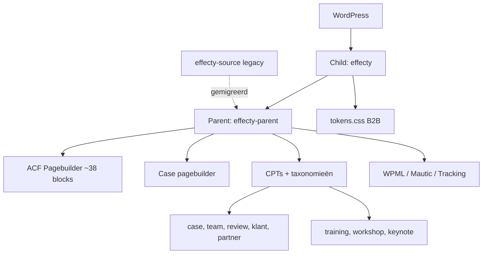

## Project Overzicht

| Detail | Waarde |
|--------|--------|
| **Klant** | Effecty |
| **Type** | Bedrijfswebsite (B2B consultancy / training) |
| **Markt** | B2B (`kj_market()` → `b2b`) |
| **Status** | Actief |
| **Child** | `/DEV/effecty/wp-content/themes/effecty/` |
| **Parent** | `/DEV/effecty/wp-content/themes/effecty-parent/` |
| **Lokaal** | `effecty.local` |
| **Legacy bron** | `/DEV/effecty-source/` (oude monoliet; gemigreerd) |

Effecty is een **dun child-thema**: alleen B2B-kleurtokens + optionele ACF/templates. Alle functionaliteit zit in **effecty-parent** (git-submodule), gedeeld met Affecty (Leisure).

---

## Tech Stack

<Columns cols={3}>
  <Card title="Parent + child" icon="layers">
    effecty-parent + child `effecty`
  </Card>
  <Card title="ACF Pro pagebuilder" icon="code">
    ~38 pagina-layouts + case-pagebuilder
  </Card>
  <Card title="Tailwind + tokens" icon="palette">
    Semantische CSS-variables, light/dark/accent modes
  </Card>
</Columns>

Ook: WPML + ACFML, Mautic-formulieren, Swiper, tracking via Theme Settings.

---

## Huisstijl / Design Tokens

Child overschrijft alleen brand/accent in `assets/css/tokens.css`. Neutrals en mode-swaps komen uit de parent.

<Tabs>
  <Tab title="B2B (child)" icon="palette">
    | Token | Hex | Gebruik |
    |-------|-----|---------|
    | `--color-brand-rgb` | `#21256B` | Merkblauw |
    | `--color-accent-rgb` | `#F6CA45` | Warm geel accent |
    | `--color-brand-contrast-rgb` | `#FFFFFF` | Tekst op brand |
  </Tab>
  <Tab title="Parent neutrals" icon="sun">
    | Token | Hex | Mode |
    |-------|-----|------|
    | `bg` | `#f9f8f4` | Light beige |
    | `fg` / navy | `#070020` | Tekst / dark bg |
    | `surface` | `#f7f6f1` | Oppervlak |
    | `border` | `#bab19d` | Dark beige |
    | `beige` | `#f1ede4` | Vaste neutral |
  </Tab>
  <Tab title="Typografie" icon="file-text">
    | Type | Font | Gebruik |
    |------|------|---------|
    | **Title / Button** | Nexa | Koppen, knoppen |
    | **Sans / Serif** | Old Standard TT | Body |
  </Tab>
</Tabs>

Per blok: `data-mode="light|dark|accent"` op `<section>` voor token-swap. Tailwind `darkMode: ['selector', '[data-mode="dark"]']`.

---

## Pagebuilder (parent)

~38 layouts in `templates/pagebuilder/`, o.a.:

| Categorie | Blocks |
|-----------|--------|
| **Hero** | `hero_1`, `hero_2`, `full_image_title` |
| **Content** | `text`, `text_image`, `text_single`, `banner`, `quote`, `business_goals`, `international`, `specifications`, `navigation`, `navigatieblokken`, `snelle_navigatie`, `oplossingen`, `highlights`, `collaborations`, `systems`, `systems_slider`, `triple_block`, `triple_block_slider`, `success_stories`, `specialisten`, `news`, `related_services`, `examples` |
| **CTA** | `cta_1`–`cta_4`, `contact`, `form` |
| **Media** | `image`, `gallery`, `logos_row`, `swiper`, `faq` |

Case-detail heeft een **aparte** flexible content (`case_content`) met o.a. `beschrijving`, `tekst`, `columns`, `review`, `slider`, fullscreen media, `cta`.

Child-overrides: `archive-*.php`, `single-training/workshop/keynote.php`, `home.php`, `templates/case/`, `templates/single-content.php`.

---

## Custom Post Types (parent)

Gedeeld + B2B-only (alleen als `kj_market_is( 'b2b' )`):

<Expandable title="Cases (case)" default-open="true">
  | Eigenschap | Waarde |
  |-----------|--------|
  | **Rewrite / archive** | `/cases/` |
  | **Supports** | title, thumbnail, excerpt (geen editor) |
  | **Taxonomy** | `dienst` |
</Expandable>

<Expandable title="Training / Workshop / Keynote (B2B)" default-open="true">
  | CPT | Archive slug |
  |-----|--------------|
  | `training` | `/trainingen/` |
  | `workshop` | `/workshops/` |
  | `keynote` | `/keynotes/` |

  Pagebuilder-gedreven; child levert archive- en single-templates.
</Expandable>

<Expandable title="Intern (geen/redirect front-end)" default-open="false">
  | CPT | Gedrag |
  |-----|--------|
  | `review` | Alleen admin — voor blokken |
  | `klant` / `partner` | Logo-grids |
  | `team` | Singles redirecten naar pagina `/team` |
</Expandable>

Taxonomieën: `dienst` (cases, posts, team, trainingen…), `teams` (intern op teamleden).

---

## Architectuur



---

## Build & Development

Build draait in het **parent**-theme:

```bash
cd wp-content/themes/effecty-parent
npm run dev      # Tailwind watch (+ block CSS)
npm run build    # CSS minify + pagebuilder JS
```

Child heeft geen eigen npm-scripts — alleen `tokens.css` enqueue'en.

---

## Bijzonderheden

- Parent **nooit** direct activeren — altijd via child
- Markt uit stylesheet-naam (`effecty` → B2B), geen wp-config-constante
- ACF JSON load: parent + child; save naar child bij bestaande group of titel met "B2B"
- Vertaling via `kj_translated_id()` / `kj_current_lang()` — nooit WPML direct
- Mautic form-ID's via options (`kj_mautic_form()`), tracking via Theme Settings
- `LAYOUT-MAPPING.md` documenteert migratie vanuit `effecty-source`
