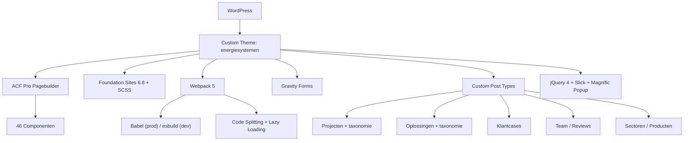

## Project Overzicht

| Detail | Waarde |
|--------|--------|
| **Klant** | CMS Energy |
| **Type** | Bedrijfswebsite (energiesystemen / duurzame energie) |
| **Status** | Actief |
| **Hosting** | xCloud |
| **Domein** | cmsenergy.nl |
| **Pad** | `/DEV/cmsenergy/wp-content/themes/energiesystemen/` |
| **Deploy** | `/var/www/cmsenergy.nl/wp-content/themes/cmsenergy/` |

Uitgebreide bedrijfswebsite voor CMS Energy met oplossingen, projecten, klantcases, teamoverzicht, sectoren, en een blog. Het meest uitgebreide project qua componenten (46 stuks) en custom post types (8 stuks). Gebruikt Foundation Sites als CSS framework in combinatie met SCSS en Webpack als build tool.

---

## Tech Stack

<Columns cols={3}>
  <Card title="WordPress + ACF Pro" icon="code">
    Pagebuilder met 46 componenten, 8 CPTs, JSON field sync
  </Card>
  <Card title="Foundation Sites 6.8 + SCSS" icon="palette">
    CSS framework met custom SCSS variabelen en mixins
  </Card>
  <Card title="Webpack 5 + Babel/esbuild" icon="terminal">
    Dual-mode bundler: esbuild (dev) / Babel (prod) met code splitting
  </Card>
</Columns>

---

## Huisstijl / Design Tokens

<Tabs>
  <Tab title="Kleuren" icon="palette">
    | Token | Hex | Gebruik |
    |-------|-----|---------|
    | `$orange` (primary) | `#DA5A01` | Primaire kleur, knoppen, accenten |
    | `$blue` | `#034EA2` | Links, secundaire accenten |
    | `$gold` | `#B59853` | Decoratieve elementen |
    | `$dark-gray` | `#181F25` | Donkere tekst, headers |
    | `$medium-gray` | `#5D6974` | Subtiele tekst |
    | `$light-gray` | `#E7E3E4` | Lichte achtergronden, borders |
    | `$black` | `#000000` | Zwarte elementen |
    | `$white` | `#FFFFFF` | Witte achtergronden |
  </Tab>
  <Tab title="Typografie" icon="file-text">
    | Type | Font | Gebruik |
    |------|------|---------|
    | **Body** (`$body-font-family`) | DaxlinePro | Alle tekst, koppen, knoppen |
    | **Icons** (`$font-family-icon`) | icomoon | Icon font voor UI-elementen |
    | **Monospace** | Consolas | Code, technische tekst |
  </Tab>
</Tabs>

---

## Pagebuilder Componenten (46)

<Tabs>
  <Tab title="Layout & Structuur" icon="layout">
    | Component | Beschrijving |
    |-----------|-------------|
    | `banner` | Full-width hero banner met afbeelding, tekst, features, reviews |
    | `breadcrumbs` | Breadcrumb navigatie |
    | `columns` | Multi-kolom grid layout |
    | `content` | Generieke content container |
    | `flexible` | Flexible content wrapper |
    | `header` | Site header met navigatie |
    | `footer` | Site footer |
    | `topbar` | Bovenste notificatiebalk |
    | `connect` | Verbinding/relatie weergave |
    | `over` | Afbeelding + tekst blok |
    | `filming` | Video/banner slider |
  </Tab>
  <Tab title="Cards & Lijsten" icon="grid">
    | Component | Beschrijving |
    |-----------|-------------|
    | `card-challenge` | Uitdaging kaart |
    | `card-member` | Teamlid kaart |
    | `card-partner` | Partner logo kaart |
    | `card-project` | Project kaart |
    | `card-solution` | Oplossing kaart |
    | `card-solution-slider` | Oplossingen carousel |
    | `card-step` | Stap/proces kaart |
    | `klant-case` | Klantcase kaart |
    | `logos` | Logo grid / marquee |
    | `partner` | Partner overzicht |
  </Tab>
  <Tab title="Content & Tekst" icon="file-text">
    | Component | Beschrijving |
    |-----------|-------------|
    | `text` | Rich text blok |
    | `text-background-image` | Tekst over achtergrondafbeelding |
    | `text-checks` | Tekst met vinkjes |
    | `text-contact` | Contactinformatie tekst |
    | `text-form` | Tekst met formulier |
    | `text-uitklapitems` | Accordion / inklapbare items |
    | `challenges` | Uitdagingen sectie |
    | `conversion` | CTA / conversieblok |
    | `detail-blog` | Blogpost detail |
    | `help` | Help / support sectie |
    | `news` | Nieuws / blog overzicht |
    | `step` | Stappen sectie |
  </Tab>
  <Tab title="Overig" icon="star">
    | Component | Beschrijving |
    |-----------|-------------|
    | `button` | Herbruikbare button component |
    | `contact-form` | Contactformulier layout |
    | `form` | Generiek formulier |
    | `search-form` | Zoekfunctionaliteit |
    | `gravity-forms-icons` | Gravity Forms icoon integratie |
    | `private-questions` | FAQ / vragenwidget |
    | `filter` | Content filter (blog, projecten) |
    | `pagination` | Paginering |
    | `member` | Teamlid detailpagina |
    | `project` | Projecten overzicht |
    | `solution` | Oplossing detailpagina |
    | `solution-archive` | Oplossingen archief |
    | `solution-slider` | Oplossingen slider |
    | `over` | Over-ons sectie |
  </Tab>
</Tabs>

---

## Custom Post Types

<Expandable title="Projecten (project)" default-open="false">
  | Eigenschap | Waarde |
  |-----------|--------|
  | **Rewrite** | `/project/` |
  | **Archive** | Ja |
  | **Taxonomieën** | `project_cat` (hiërarchisch) |
  | **Supports** | title, editor, thumbnail, revisions |
</Expandable>

<Expandable title="Oplossingen (solution)" default-open="false">
  | Eigenschap | Waarde |
  |-----------|--------|
  | **Rewrite** | `/oplossing/` |
  | **Archive** | Ja |
  | **Taxonomieën** | `solution_cat` (hiërarchisch) |
  | **Supports** | title, editor, thumbnail, excerpt |
</Expandable>

<Expandable title="Klantcases (klantcase)" default-open="false">
  | Eigenschap | Waarde |
  |-----------|--------|
  | **Rewrite** | `/klantcase/` |
  | **Archive** | Ja |
  | **Supports** | title, editor, thumbnail, excerpt |
</Expandable>

<Expandable title="Medewerkers (team)" default-open="false">
  | Eigenschap | Waarde |
  |-----------|--------|
  | **Rewrite** | `/team/` |
  | **Archive** | Nee |
  | **Supports** | title, thumbnail |
</Expandable>

<Expandable title="Uitdagingen (uitdaging)" default-open="false">
  | Eigenschap | Waarde |
  |-----------|--------|
  | **Rewrite** | `/uitdaging/` |
  | **Archive** | Nee |
  | **Supports** | title, editor, thumbnail, excerpt |
</Expandable>

<Expandable title="Sectoren (sector)" default-open="false">
  | Eigenschap | Waarde |
  |-----------|--------|
  | **Rewrite** | `/sector/` |
  | **Archive** | Ja |
  | **Supports** | title, editor, thumbnail, excerpt |
</Expandable>

<Expandable title="Reviews (review)" default-open="false">
  | Eigenschap | Waarde |
  |-----------|--------|
  | **Archive** | Ja |
  | **Supports** | title, thumbnail |
  | **Doel** | Klantbeoordelingen via pagebuilder blocks |
</Expandable>

<Expandable title="Producten (product)" default-open="false">
  | Eigenschap | Waarde |
  |-----------|--------|
  | **Archive** | Ja |
  | **Supports** | title, thumbnail |
</Expandable>

<Expandable title="Conversieblokken (conversion)" default-open="false">
  | Eigenschap | Waarde |
  |-----------|--------|
  | **Publiek** | Nee |
  | **Doel** | CTA/conversieblokken via pagebuilder |
  | **Supports** | title, editor, thumbnail |
</Expandable>

---

## Architectuur



---

## Build & Development

```bash
npm start              # Dev watch mode (JS + SCSS)
npm run dev            # Watch main assets
npm run dev:components # Watch component SCSS
npm run dev:all        # Beide parallel

npm run build          # Production build (minified, Babel)
npm run build:dev      # Dev build zonder watch

npm run lint           # Alle linters
npm run lint:js        # ESLint
npm run lint:css       # Stylelint
npm run lint:php       # PHP syntax check
npm run lint:phpcs     # PHP CodeSniffer
npm run lint:phpstan   # PHPStan static analysis
```

<Callout kind="info">
  De pre-push Git hook draait automatisch `npm run build` voor elke push. GitHub Actions voert CI checks uit (lint + build) op `main` en `staging` branches.
</Callout>

---

## Bijzonderheden

- Meest uitgebreide project qua componenten (46 stuks) en CPTs (8 stuks)
- **Foundation Sites** als CSS framework (niet Tailwind) met uitgebreide SCSS variabelen
- **Dual-mode Webpack**: esbuild-loader voor snelle dev builds, Babel voor production
- **Code splitting**: componenten worden lazy-loaded via webpack chunks
- **jQuery 4** vanuit WordPress (niet gebundeld) — voorkomt duplicatie
- Volledige **CI/CD pipeline** met GitHub Actions, ESLint, Stylelint, PHPCS, PHPStan
- **Husky + lint-staged** pre-commit hooks voor code quality
- Component CSS gebundeld in één `app.css` voor performance
- **ACF Extended (ACFE)** voor admin preview iframes
- 5 geregistreerde menu's (header, part, zak, service, customer)
- icomoon icon font voor UI-elementen
- Gravity Forms integratie met custom styling en icoon-mapping
