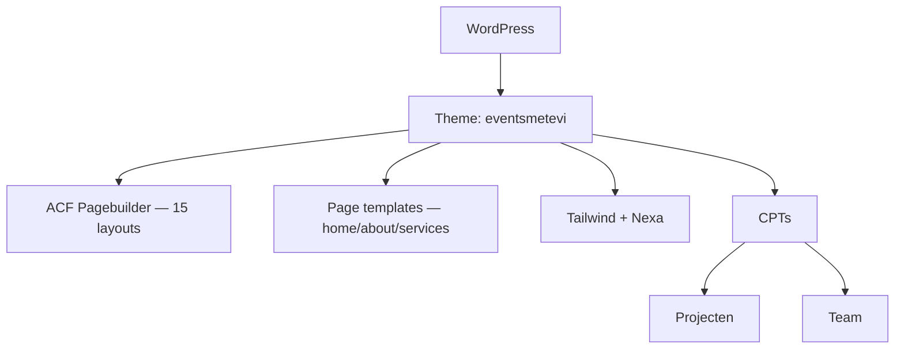

## Project Overzicht

| Detail | Waarde |
|--------|--------|
| **Klant** | Events MetEvi |
| **Type** | Bedrijfswebsite (eventbureau) |
| **Status** | Actief |
| **Pad** | `/DEV/eventsmetevi/wp-content/themes/eventsmetevi/` |
| **Lokaal** | `eventsmetevi.local` |
| **Live** | metevi.nl |

Website voor een eventbureau met felle huisstijl (rood/roze/oranje), projectportfolio, diensten-landingspagina’s, team en uitgebreide pagebuilder (carrousels, video, cases).

---

## Tech Stack

<Columns cols={3}>
  <Card title="WordPress + ACF Pro" icon="code">
    Pagebuilder + dedicated page templates
  </Card>
  <Card title="Tailwind CSS" icon="palette">
    Nexa font, rood/roze/oranje palet
  </Card>
  <Card title="Template partials" icon="layout">
    Cards voor project, team, review, service
  </Card>
</Columns>

---

## Huisstijl / Design Tokens

<Tabs>
  <Tab title="Kleuren" icon="palette">
    | Token | Hex | Gebruik |
    |-------|-----|---------|
    | `red` | `#FF0700` | Primair rood |
    | `pink` | `#E0007A` | Accent roze |
    | `orange` | `#FF7600` | Accent oranje |
    | `purple` | `#5D2744` | Donker paars |
    | `black` | `#000000` | Tekst / dark |
    | `white` | `#ffffff` | Achtergrond |
  </Tab>
  <Tab title="Typografie" icon="file-text">
    | Type | Font | Gebruik |
    |------|------|---------|
    | **Sans** (`font-sans`) | Nexa | Body en UI |
    | **Serif** (`font-serif`) | Nexa | Headings / fallback |
  </Tab>
</Tabs>

---

## Pagebuilder Blocks (15)

| Block | Beschrijving |
|-------|-------------|
| `textblock` | Tekstblok |
| `quote` | Quote |
| `image` | Afbeelding |
| `double_image` | Dubbele afbeelding |
| `triple_image` | Drievoudige afbeelding |
| `carousel` | Carrousel |
| `double_carousel` | Dubbele carrousel |
| `carousel_blocks` | Carrousel met blokken |
| `video` | Video |
| `image_text` | Afbeelding & tekst |
| `text_image` | Tekst & afbeelding |
| `review` | Review |
| `cases` | Cases / projecten |
| `vinkjes` | Checklist / USP’s |
| `download` | Download |

### Page templates & sectie-partials

| Template | Doel |
|----------|------|
| `home.php` | Homepage (hero, about, galleries, diensten, projecten, referenties) |
| `about.php` | Over ons |
| `services.php` / `dienst.php` | Dienstenoverzicht / landingspagina |
| `projecten.php` | Projectenoverzicht |
| `contact.php` | Contact |
| `text.php` | Standaard tekst + pagebuilder |

Partials onder `templates/blocks/`: card-client, card-post, card-project, card-review, card-service, card-team, card-waarom, card-word, cta, project.

---

## Custom Post Types

<Expandable title="Projecten (Projecten)" default-open="true">
  | Eigenschap | Waarde |
  |-----------|--------|
  | **Rewrite** | `/project/` |
  | **Archive** | Nee |
  | **Single** | `single-projecten.php` |
  | **Taxonomies** | native `category` |
  | **Supports** | title, thumbnail |
</Expandable>

<Expandable title="Team (team)" default-open="true">
  | Eigenschap | Waarde |
  |-----------|--------|
  | **Rewrite** | `/team/` |
  | **Archive** | Nee |
  | **Hierarchical** | Ja |
  | **Supports** | title, page-attributes, thumbnail |
</Expandable>

---

## Architectuur



---

## Build & Development

```bash
npm run build    # Tailwind minify → dist/css/style.css
npm run dev      # Tailwind watch → assets/css/style.css
```

Alleen Tailwind — geen Webpack/JS-bundel in package scripts.

---

## Bijzonderheden

- Sterk visuele homepage met hex-rotatie, double carousel en video
- CPT-slug `Projecten` (hoofdletter) — let op bij queries
- Diensten als page template + ACF (niet als apart CPT)
- Fel kleurpalet; font Nexa (self-hosted verwacht in assets)
