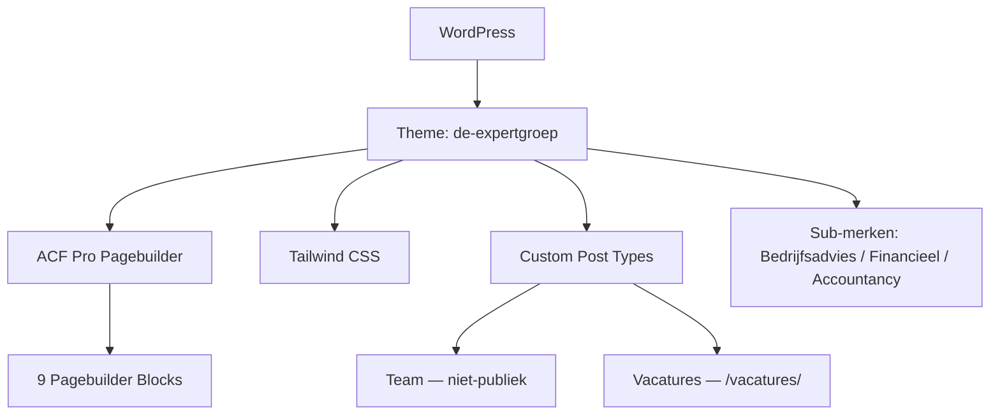

## Project Overzicht

| Detail | Waarde |
|--------|--------|
| **Klant** | De Expertgroep |
| **Type** | Bedrijfswebsite (advies & accountancy) |
| **Status** | Actief |
| **Pad** | `/DEV/expertgroep/wp-content/themes/de-expertgroep/` |
| **Theme map** | `de-expertgroep` |
| **Lokaal** | `expertgroep.local` |

Website voor De Expertgroep met drie sub-merken (Bedrijfsadvies, Financieel, Accountancy), pagebuilder-secties, teamoverzicht en vacatures.

---

## Tech Stack

<Columns cols={3}>
  <Card title="WordPress + ACF Pro" icon="code">
    Pagebuilder met 9 blocks, ACF Extended JSON sync
  </Card>
  <Card title="Tailwind CSS 3" icon="palette">
    Navy + sub-merk gradients, typography plugin
  </Card>
  <Card title="ESLint + Husky + PHPCS" icon="terminal">
    Lint pipeline voor JS, CSS, PHP en PHPStan
  </Card>
</Columns>

---

## Huisstijl / Design Tokens

<Tabs>
  <Tab title="Kleuren" icon="palette">
    | Token | Hex | Gebruik |
    |-------|-----|---------|
    | `navy` | `#14142C` | Primair, tekst, knoppen |
    | `navy-soft` | `#2C2C41` | Soft navy (o.a. contactsectie) |
    | `bedrijfsadvies` | `#C42C7E` | Sub-merk Bedrijfsadvies |
    | `bedrijfsadvies-start` / `-end` | `#D02E7F` / `#9D217F` | Gradient stops |
    | `financieel` | `#4EB1CC` | Sub-merk Financieel |
    | `financieel-start` / `-end` | `#5BCCE2` / `#18466E` | Gradient stops |
    | `accountancy` | `#8DC446` | Sub-merk Accountancy |
    | `accountancy-start` / `-end` | `#91C846` / `#33613A` | Gradient stops |
    | `grey-bg` | `#F5F5F7` | Lichte achtergrond |
    | `grey-line` | `#E5E5EA` | Randen / separators |
    | `grey-text` | `#6B6B7A` | Secundaire tekst |
  </Tab>
  <Tab title="Typografie" icon="file-text">
    | Type | Font | Gebruik |
    |------|------|---------|
    | **Display** (`font-display`) | Gilroy | Koppen |
    | **Sans / Body** (`font-sans`, `font-body`) | Cairo | Body tekst |
    | **UI** (`font-ui`) | Poppins | Labels / UI |
  </Tab>
</Tabs>

---

## Pagebuilder Blocks (9)

| Block | Beschrijving |
|-------|-------------|
| `hero-image` | Hero met afbeelding |
| `band` | Band / strip sectie |
| `image-content` | Afbeelding naast content |
| `dienst` | Enkele dienst-sectie |
| `image-full` | Afbeelding volle breedte |
| `services-cards` | Diensten cards grid |
| `usp-cards` | USP cards |
| `team` | Teamoverzicht (uit CPT `team`) |
| `contact` | Contactsectie |

---

## Custom Post Types

<Expandable title="Team (team)" default-open="true">
  | Eigenschap | Waarde |
  |-----------|--------|
  | **Publiek** | Nee (alleen via admin / pagebuilder) |
  | **Supports** | title, thumbnail, page-attributes |
  | **ACF** | `job_title`, `description`, `linkedin`, `email` |
  | **Doel** | Teamleden tonen via Team-blok |
</Expandable>

<Expandable title="Vacatures (vacature)" default-open="true">
  | Eigenschap | Waarde |
  |-----------|--------|
  | **Rewrite** | `/vacatures/` |
  | **Archive** | Ja (`archive-vacature.php`) |
  | **Single** | `single-vacature.php` |
  | **Supports** | title, thumbnail, page-attributes, revisions |
  | **ACF** | intro, content, brand, location, hours, employment_type, education_level, salary, form_shortcode |
</Expandable>

---

## Architectuur



---

## Build & Development

```bash
npm run dev          # Tailwind watch
npm run build        # CSS + pagebuilder JS
npm run build:css    # Alleen Tailwind
npm run build:js     # Pagebuilder JS bundel
npm run lint         # JS + CSS + PHP + PHPCS + PHPStan
```

<Callout kind="info" title="Theme map ≠ slug">
  Projectmap is `expertgroep`, theme-directory is `de-expertgroep` (text domain `de-expertgroep`).
</Callout>

---

## Bijzonderheden

- Drie sub-merk kleuren met gradient-tokens (`-start` / `-end`)
- Team-CPT is niet publiek — alleen via pagebuilder Team-blok
- Vacatures met sollicitatieformulier (shortcode) op de detailpagina
- Button-component met navy/white primary & secondary pills + text-variant
- Volledige lint-stack: ESLint, Stylelint, PHPCS, PHPStan, Husky
- Versie 2.0.0
