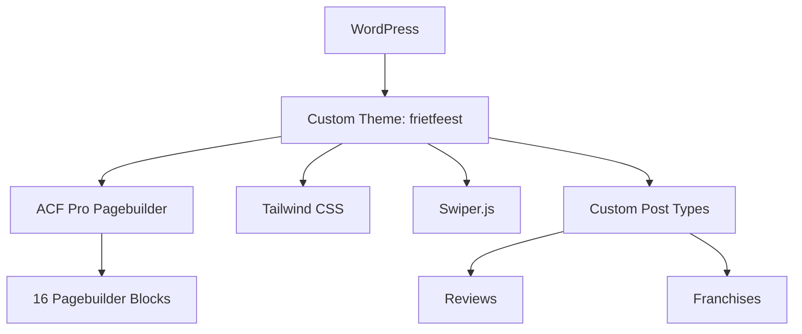

## Project Overzicht

| Detail | Waarde |
|--------|--------|
| **Klant** | Frietfeest |
| **Type** | Bedrijfswebsite (horeca / frietwagen) |
| **Status** | Actief |
| **Pad** | `/DEV/frietfeest/wp-content/themes/frietfeest/` |
| **Lokaal** | `frietfeest.local` |

Website voor Frietfeest met aanbod, pakketten, verhuur, franchise-locaties en reviews — gebouwd met ACF pagebuilder, Tailwind en Swiper.

---

## Tech Stack

<Columns cols={3}>
  <Card title="WordPress + ACF Pro" icon="code">
    Pagebuilder met 16 blocks
  </Card>
  <Card title="Tailwind CSS" icon="palette">
    Geel/rood/oranje huisstijl
  </Card>
  <Card title="Swiper.js" icon="layout">
    Carrousels en sliders
  </Card>
</Columns>

---

## Huisstijl / Design Tokens

<Tabs>
  <Tab title="Kleuren" icon="palette">
    | Token | Hex | Gebruik |
    |-------|-----|---------|
    | `primary` / `yellow` | `#FFD204` | Primair geel, highlights |
    | `secondary` / `brown` / `grey-dark` | `#1F1A04` | Donkere tekst/achtergrond |
    | `orange` | `#F8981D` | Oranje accent |
    | `red` | `#ED1C24` | Rood accent |
    | `blue` | `#004E64` | Blauw accent |
    | `grey` | `#414039` | Neutraal grijs |
    | `grey-light` | `#F7F7F7` | Lichte achtergrond |
    | `grey-text` | `#8A8A8A` | Subtiele tekst |
    | `yellow-light` | `#F2F1EB` | Lichte gele tint |
    | `beige` | `#F7F7F2` | Beige achtergrond |
    | `beige-darker` | `#F0F0EC` | Donkerder beige |
    | `grey-card` | `#6C6C6C` | Kaartgrijs |
  </Tab>
  <Tab title="Typografie" icon="file-text">
    | Type | Font | Gebruik |
    |------|------|---------|
    | **Sans / Button** (`font-sans`, `font-button`) | Instrument Sans | Body en knoppen |
    | **Title** (`font-title`) | Anton SC | Koppen |
  </Tab>
</Tabs>

---

## Pagebuilder Blocks (16)

| Block | Beschrijving |
|-------|-------------|
| `hero` | Hero sectie |
| `pagina-titel` | Donkere paginatitel-banner |
| `text` | Tekstsectie |
| `text-image` | Tekst naast afbeelding |
| `aanbod` | Aanbod / producten overzicht |
| `pakketten` | Pakketten (meerdere varianten) |
| `aanvullingen` | Extra's / aanvullingen |
| `verhuur` | Verhuur sectie |
| `frietwagen-teaser` | Frietwagen teaser |
| `banner` | Banner / promo |
| `waarom` | Waarom Frietfeest (defaults via opties) |
| `reviews` | Reviews uit CPT |
| `franchise` | Franchise informatie |
| `offerte` | Offerte / aanvraag |
| `contact` | Contactsectie |
| `veelgestelde-vragen` | FAQ accordion |

---

## Custom Post Types

<Expandable title="Reviews (review)" default-open="true">
  | Eigenschap | Waarde |
  |-----------|--------|
  | **Slug** | `review` |
  | **Rewrite** | `/reviews/` |
  | **Archive** | Ja |
  | **Supports** | title, thumbnail, custom-fields |
  | **Menu icon** | `dashicons-star-filled` |
</Expandable>

<Expandable title="Franchises (franchise)" default-open="false">
  | Eigenschap | Waarde |
  |-----------|--------|
  | **Slug** | `franchise` |
  | **Rewrite** | Intern `franchise`; publieke URL zonder slug (bijv. `/liessel`) |
  | **Archive** | Nee |
  | **Supports** | title, editor, thumbnail, excerpt, custom-fields |
  | **Menu icon** | `dashicons-store` |

  Permalink-slug wordt verwijderd via `kj_franchise_remove_slug`; `pre_get_posts` lost root-URL's op naar het franchise CPT.
</Expandable>

---

## Architectuur



---

## Build & Development

```bash
npm run dev          # Tailwind watch
npm run build        # CSS + pagebuilder JS
npm run build:css    # Alleen CSS
npm run build:js     # Pagebuilder JS bundeling
```

---

## Bijzonderheden

- Titels met highlight: `<strong>` in één title-veld → gele underline via CSS `::after`
- Pagebuilder defaults via ACF options (`use_defaults` op o.a. Waarom / Reviews)
- Franchise-URL's op root-niveau (geen `/franchise/` in de publieke URL)
- Versie 1.0.0
