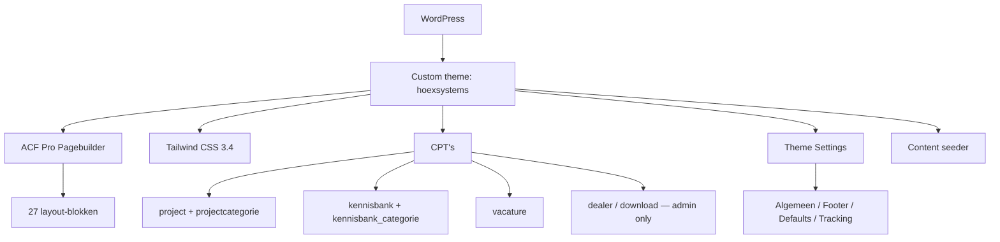

## Project Overzicht

| Detail | Waarde |
|--------|--------|
| **Klant** | Hoex Systems BV |
| **Website** | [hoexsystems.nl](https://hoexsystems.nl) |
| **Type** | Bedrijfswebsite (biobased prefab bouw) |
| **Status** | In ontwikkeling |
| **Pad** | `/DEV/hoexsystems/wp-content/themes/hoexsystems/` |
| **Lokaal** | `hoexsystems.local` |

Familiebedrijf uit Oostrum (Hoex Group) dat de biobased keten in eigen hand houdt: hennepteelt op eigen akkers, productie van prefab HSB- en steelframe-elementen, tot montage van complete gebouwcasco's. De site richt zich op professionele bouwers en ontwikkelaars — projecten, producten, kennisbank, dealers, downloads en vacatures.

Gebouwd vanaf de [KJ-Boilerplate](/client-projects/kj-boilerplate), met Figma als bron voor de pagebuilder-blokken en een content seeder voor de eerste invulling.

<Callout kind="info" title="Geen www">
  Productie draait op het apex-domein `hoexsystems.nl`. Staging-subdomeinen (`staging.hoexsystems.nl` e.d.) tellen via `kj_is_live_domain()` niet als live.
</Callout>

---

## Tech Stack

<Columns cols={3}>
  <Card title="WordPress + ACF Pro" icon="code">
    Custom theme met pagebuilder (27 layouts) + 5 CPT's
  </Card>
  <Card title="Tailwind CSS 3.4" icon="palette">
    Groen/beige huisstijl, container max 1200px
  </Card>
  <Card title="SureForms" icon="file-text">
    Formulieren via shortcode in het formulier-blok
  </Card>
</Columns>

---

## Huisstijl / Design Tokens

Gebruik **nooit hex in templates** — altijd de Tailwind-tokens uit `tailwind.config.js`.

<Tabs>
  <Tab title="Kleuren" icon="palette">
    | Token | Hex | Gebruik |
    |-------|-----|---------|
    | `primary` | `#216b45` | Primaire merkkleur (donkergroen) |
    | `secondary` | `#8bb4a2` | Secundaire merkkleur (zachtgroen) |
    | `dark` | `#061f12` | Donkere tekst / overlays |
    | `beige-light` | `#f9f9f6` | Lichte achtergrond |
    | `beige-medium` | `#edece3` | Medium achtergrond |
    | `beige-dark` | `#c3bfa2` | Gedempte beige |
    | `green-light` | `#e9f0ec` | Lichte groene sectie-achtergrond |

    Extra tokens: `rounded-card` (24px), `rounded-block` (32px), `shadow-card`, plus button-gradients (`bg-btn-primary`, `bg-btn-secondary`, …).
  </Tab>
  <Tab title="Typografie" icon="file-text">
    | Type | Font | Gebruik |
    |------|------|---------|
    | **Sans** (`font-sans`) | Lexend | Body, navigatie (weights 300–600) |
    | **Title** (`font-title`) | Funnel Display | Koppen, buttons, labels (weights 400–700) |

    Beide fonts zijn self-hosted als variable woff2 in `assets/fonts/` met `@font-face` in `assets/css/fonts.css`. Geen requests naar Google Fonts.
  </Tab>
</Tabs>

---

## Pagebuilder Blocks (27)

Elk layout-blok heeft een eigen field group (`acf-json/group_layout_{slug}.json`) die via clone in `group_pagebuilder.json` hangt. Padding via `spacing_top` / `spacing_bottom` op het blok (standaard aan: `pt-12 md:pt-16 lg:pt-[88px]` en dezelfde `pb-*`). Heroes zijn full-bleed.

| Block | Beschrijving |
|-------|-------------|
| `hero_home` | Hero (home) |
| `hero` | Hero (subpagina) |
| `usps` | USP-balk |
| `text_image` | Tekst & afbeelding |
| `tekst` | Alleen tekst |
| `producten` | Productenoverzicht |
| `doelgroepen` | Doelgroepen |
| `eigenschappen` | Eigenschappen |
| `specificaties` | Specificaties |
| `proces` | Proces / stappen |
| `voordelen` | Voordelen |
| `toepassingen` | Toepassingen |
| `beeldband` | Beeldband / image strip |
| `projecten` | Uitgelichte projecten (CPT) |
| `kennis_nieuws` | Kennis & nieuws (CPT) |
| `succesverhaal` | Succesverhaal / case |
| `keten` | De keten |
| `geschiedenis` | Geschiedenis |
| `team` | Team |
| `certificering` | Certificering |
| `hoex_group` | Hoex Group |
| `faq` | FAQ |
| `vacatures` | Vacatures (CPT) |
| `dealers` | Dealers (CPT, admin-only) |
| `downloads` | Downloads (CPT, admin-only) |
| `formulier` | Contactformulier (SureForms-shortcode) |
| `cta` | Call-to-action |

Nieuwe blocks: zie [Pagebuilder Systeem](/wordpress/pagebuilder-blocks) en de conventies in `CLAUDE.md` van het theme.

---

## Custom Post Types

<Expandable title="Projecten (project)" default-open="true">
  | Eigenschap | Waarde |
  |-----------|--------|
  | **Slug** | `project` |
  | **Rewrite** | `/projecten/` |
  | **Archive** | Ja (`projecten`) |
  | **Supports** | title, editor, thumbnail, excerpt, custom-fields |
  | **Taxonomie** | `projectcategorie` → `/projecten/categorie/` |
  | **Menu icon** | `dashicons-portfolio` |
  | **ACF** | `group_cpt_project` (o.a. factsheet, opdrachtgever) |
</Expandable>

<Expandable title="Kennisbank (kennisbank)" default-open="false">
  | Eigenschap | Waarde |
  |-----------|--------|
  | **Slug** | `kennisbank` |
  | **Rewrite** | `/kennisbank/` |
  | **Archive** | Ja (`kennisbank`) |
  | **Taxonomie** | `kennisbank_categorie` → `/kennisbank/categorie/` |
  | **ACF** | `group_cpt_kennisbank` |
</Expandable>

<Expandable title="Vacatures (vacature)" default-open="false">
  | Eigenschap | Waarde |
  |-----------|--------|
  | **Slug** | `vacature` |
  | **Rewrite** | `/vacatures/` |
  | **Archive** | Nee (enkelvoudige URL's) |
  | **Supports** | title, editor, thumbnail, excerpt, custom-fields |
  | **Menu icon** | `dashicons-groups` |
</Expandable>

<Expandable title="Dealers (dealer)" default-open="false">
  | Eigenschap | Waarde |
  |-----------|--------|
  | **Publiek** | Nee — alleen admin-UI, geen front-end URL |
  | **Supports** | title, thumbnail, custom-fields |
  | **Menu icon** | `dashicons-store` |
  | **ACF** | `group_cpt_dealer` |

  Getoond via het `dealers`-pagebuilderblok.
</Expandable>

<Expandable title="Downloads (download)" default-open="false">
  | Eigenschap | Waarde |
  |-----------|--------|
  | **Publiek** | Nee — alleen admin-UI, geen front-end URL |
  | **Supports** | title, thumbnail, custom-fields |
  | **Menu icon** | `dashicons-download` |
  | **ACF** | `group_cpt_download` |

  Getoond via het `downloads`-pagebuilderblok.
</Expandable>

---

## Architectuur



---

## ACF Options

Parent **Theme Settings** (`theme-settings`) met subpagina's:

| Slug | Doel |
|------|------|
| `theme-settings-algemeen` | Logo, contact, topbar |
| `theme-settings-footer` | Footer-content en buttons |
| `theme-settings-defaults` | Fallback-waarden |
| `theme-settings-tracking` | GA-ID + head/body/footer script-rows |

Veldgroepen: `group_options_algemeen`, `_footer`, `_defaults`, `_tracking`.

---

## Custom Development

<Expandable title="Content seeder" default-open="true">
  `scripts/seed-content.php` vult pagina's, CPT's, menu's en theme settings vanuit de Figma-copy. Idempotent op slug; de pagebuilder van een pagina wordt bij een run volledig overschreven.

  ```bash
  wp eval 'require get_template_directory() . "/scripts/seed-content.php"; kj_seed_run_all();'
  ```

  Of via **WP-admin → Hulpmiddelen → Content seeder**.
</Expandable>

<Expandable title="Componenten" default-open="false">
  | Bestand | Doel |
  |---------|------|
  | `templates/components/button.php` | Buttons via `kj_render_buttons()` / `group_button_fields` |
  | `card-project.php` | Projectkaart |
  | `card-kennisbank.php` | Kennisbankkaart |
  | `breadcrumb.php` | Breadcrumb |
  | `cta-contact.php` | Contact-CTA |
</Expandable>

<Expandable title="Helpers" default-open="false">
  - `kj_is_live_domain()` — lokaal (`.local` / localhost), lege host en `*.hoexsystems.nl` zijn niet-live; `www.` wordt gestript
  - `kj_acf()` / `kj_image()` / `kj_component()` — output-helpers in `inc/acf.php`
  - Prefix overal: `kj_`
</Expandable>

---

## Build & Development

```bash
npm install
npm run dev      # Tailwind watch
npm run build    # minified CSS
npm run lint     # eslint + php -l
```

Husky + lint-staged draaien ESLint op JS bij commit (`prepare`: `husky`).

---

## Onderhoud Notities

<Callout kind="tip" title="Pagebuilder-architectuur">
  Zet nooit velden direct in `group_pagebuilder.json`. Nieuw blok = eigen `group_layout_{slug}.json` (`active: false`) + clone in de flexible content. Bij elke ACF JSON-wijziging: verse `modified` via `date +%s`.
</Callout>

<Callout kind="info" title="Spacing">
  Padding zit per layout (`spacing_top` / `spacing_bottom`), nog niet via de gedeelde `group_section_styling`-clone uit de boilerplate. Default classes komen overeen met die clone.
</Callout>

---

## Inloggegevens & Toegang

<Callout kind="warning" title="Gevoelige informatie">
  Sla geen wachtwoorden op in de documentatie. Verwijs naar de wachtwoordmanager.
</Callout>

- **WordPress admin**: [hoexsystems.nl/wp-admin](https://hoexsystems.nl/wp-admin)
- **Lokaal**: `https://hoexsystems.local/wp-admin`
- **Inloggegevens**: wachtwoordmanager
