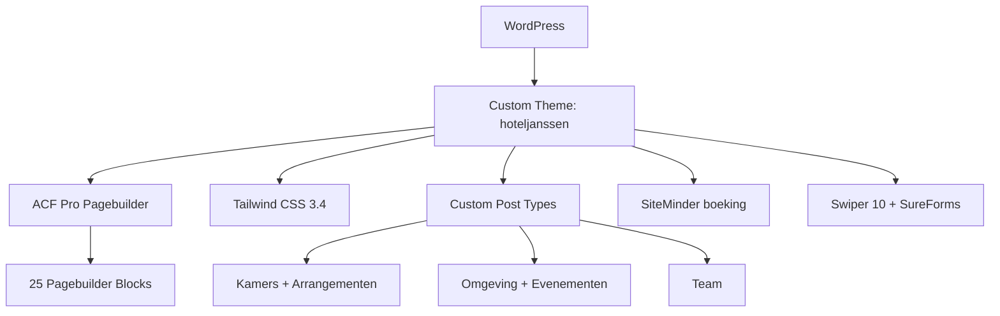

## Project Overzicht

| Detail | Waarde |
|--------|--------|
| **Klant** | Hotel Janssen |
| **Website** | [hoteljanssen.nl](https://www.hoteljanssen.nl) |
| **Type** | Hotelwebsite (familiehotel Valkenburg) |
| **Status** | Actief |
| **Pad** | `/DEV/hoteljanssen/wp-content/themes/hoteljanssen/` |
| **Lokaal** | `hoteljanssen.local` |

Website voor een familiehotel in Valkenburg: kamers, arrangementen, omgevingstips, evenementen en team. Pixelnauwkeurig op 1920px (desktop) en 430px (mobiel). Boeken via eigen UI die doorstuurt naar SiteMinder.

---

## Tech Stack

<Columns cols={3}>
  <Card title="WordPress + ACF Pro" icon="code">
    Pagebuilder met 25 blocks + ACF Extended
  </Card>
  <Card title="Tailwind CSS 3.4" icon="palette">
    Bruin/cream/goud design tokens uit Figma
  </Card>
  <Card title="Swiper 10 + SureForms" icon="layers">
    Sliders en formulieren; jQuery voor UI
  </Card>
</Columns>

---

## Huisstijl / Design Tokens

<Tabs>
  <Tab title="Kleuren" icon="palette">
    | Token | Hex | Gebruik |
    |-------|-----|---------|
    | `bruin` | `#3f362f` | Secundaire balk, donkere secties, footer |
    | `bruin-tekst` | `#3b3431` | Koppen & body op licht |
    | `bruin-diep` | `#302a29` | Donkerste tekst, outline-labels |
    | `beige` | `#e9e3d9` | Lichte sectiebanden |
    | `cream` | `#f5f1e9` | Tekst op donker, bookingbar, kaarten |
    | `cream-licht` | `#fbf7ef` | Paginabasis |
    | `goud` | `#cf9d3b` | Primaire knop |
    | `goud-label` | `#cbae60` | Eyebrows, veldlabels |
    | `goud-helder` | `#cfbf97` | Prijzen, hairlines, pijlranden |

    <Callout kind="info" title="Niet samenvoegen">
      De drie goudtinten en cream/beige-varianten worden naast elkaar gebruikt — niet mergen tot één token.
    </Callout>
  </Tab>
  <Tab title="Typografie" icon="file-text">
    | Type | Font | Gebruik |
    |------|------|---------|
    | **Display** (`font-display`) | Bw Vivant (tijdelijk Fraunces) | Koppen |
    | **UI** (`font-ui`) | Alan Sans | Knoppen, topbar |
    | **Label** (`font-label`) | Inter | Eyebrows, kapitalen |

    Koppen mengen twee gewichten: basis Medium + nadruk Black via veldenpaar `titel` + `titel_nadruk`.
  </Tab>
  <Tab title="Layout" icon="layout">
    - `.container` = 1510px content; gutter 36/48/64px → op 1920px exact **205px** zijmarge
    - Knop: pill `radius 48px`
    - Slider-pijlen 52px (mobiel 41px), voortgangsbalk 146.5px
  </Tab>
</Tabs>

---

## Pagebuilder Blocks (25)

| Block | Beschrijving |
|-------|-------------|
| `hero` | Hero sectie |
| `usp-balk` | USP-balk |
| `kamers` | Kameroverzicht uit CPT |
| `kamer-specs` | Specificaties van een kamer |
| `fotocollage-5` | Fotocollage (5 beelden) |
| `fotogalerij` | Fotogalerij |
| `fotogrid` | Fotogrid |
| `beschikbaarheid` | Beschikbaarheid / boeking |
| `impressie` | Impressie-sectie |
| `tekst-collage` | Tekst met collage |
| `tekst-afbeelding` | Tekst naast afbeelding |
| `genummerde-lijst` | Genummerde stappen |
| `arrangementen` | Arrangementen uit CPT |
| `omgeving-carrousel` | Omgevingstips carrousel |
| `evenementen` | Evenementen showcase |
| `plattegrond` | Plattegrond / kaart |
| `beeldband` | Beeldband |
| `reviews` | Reviews |
| `quote` | Quote-blok |
| `team` | Teamslider uit CPT |
| `faq` | Veelgestelde vragen |
| `formulier` | Formulier (SureForms) |
| `contactkaarten` | Contactkaarten |
| `contact-blok` | Contactblok |
| `cta-kaarten` | CTA-kaarten |

---

## Custom Post Types

<Expandable title="Kamers (kamers)" default-open="true">
  | Eigenschap | Waarde |
  |-----------|--------|
  | **Rewrite** | `/kamers/` |
  | **Archive** | Nee (overzicht via pagebuilder) |
  | **Supports** | title, thumbnail, page-attributes |
  | **Boeken** | `booking_room_code` per kamer voor SiteMinder |
</Expandable>

<Expandable title="Arrangementen (arrangementen)" default-open="false">
  | Eigenschap | Waarde |
  |-----------|--------|
  | **Rewrite** | `/arrangementen/` |
  | **Archive** | Nee |
</Expandable>

<Expandable title="Omgeving (omgeving)" default-open="false">
  | Eigenschap | Waarde |
  |-----------|--------|
  | **Rewrite** | `/omgeving/` |
  | **Archive** | Nee |
  | **Taxonomy** | `omgeving-categorie` (hiërarchisch, niet publiek) |
</Expandable>

<Expandable title="Evenementen (evenementen)" default-open="false">
  | Eigenschap | Waarde |
  |-----------|--------|
  | **Rewrite** | `/evenementen/` |
  | **Archive** | Nee |
</Expandable>

<Expandable title="Team (team)" default-open="false">
  | Eigenschap | Waarde |
  |-----------|--------|
  | **Publiek** | Nee (alleen admin + pagebuilder) |
  | **Supports** | title, thumbnail, page-attributes |
</Expandable>

---

## Architectuur



---

## Build & Development

```bash
npm run prebuild   # Blok-CSS verzamelen
npm run build      # Tailwind minify → assets/css/style.css
npm run predev     # Blok-CSS vóór watch
npm run dev        # Tailwind watch
npm run blocks     # Alleen blocks-build
```

<Callout kind="info" title="Block CSS">
  Per blok: `templates/pagebuilder/<naam>/<naam>.css` — `scripts/build-blocks.js` bundelt naar `assets/css/blocks.css`.
</Callout>

---

## Bijzonderheden

- SiteMinder-boeking: `kj_boeking_url()` vult placeholders `{checkin} {checkout} {adults} {kinderen} {room}`
- Options page **Thema instellingen** (Gegevens, Huisstijl, Socials, Boeken, 404)
- Gedeelde clones: `group_button_fields` + `group_section_styling` (cream · beige · donker · foto)
- Bw Vivant commercieel — tijdelijk Fraunces in `assets/css/fonts.css`
- Functieprefix `kj_`, text domain `hoteljanssen`
- Figma: "Hotel Janssen – V1" (`zJo3ekmbbk35jodT0vC54S`)
