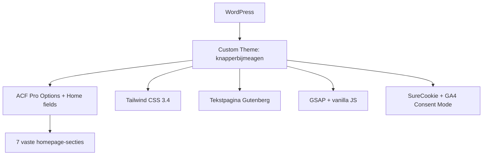

## Project Overzicht

| Detail | Waarde |
|--------|--------|
| **Klant** | Knapper bij Meagen |
| **Type** | One-pager (kapsalon Venray) |
| **Status** | Actief |
| **Pad** | `/DEV/knapperbijmeagen/wp-content/themes/knapperbijmeagen/` |
| **Lokaal** | `knapperbijmeagen.local` |

One-pager voor een kapsalon: de homepage *is* de site. Geen blog, geen CPT's, geen pagebuilder. Inhoud via ACF op de homepage + options. Ankernavigatie met scrollspy.

---

## Tech Stack

<Columns cols={3}>
  <Card title="WordPress + ACF Pro" icon="code">
    Vaste homepage-secties via ACF (geen flexible content)
  </Card>
  <Card title="Tailwind CSS 3.4" icon="palette">
    Zalm/bordeaux tokens, self-hosted fonts
  </Card>
  <Card title="GSAP + Vanilla JS" icon="zap">
    Scroll-animaties; geen jQuery in eigen script
  </Card>
</Columns>

---

## Huisstijl / Design Tokens

<Tabs>
  <Tab title="Kleuren" icon="palette">
    | Token | Hex | Gebruik |
    |-------|-----|---------|
    | `primary` | `#EF9387` | Zalm — accent, knoppen, decoratie |
    | `primary-soft` | `#FADFDB` | Zachte zalm achtergrond |
    | `dark` | `#3B0000` | Bordeaux — donkere secties |
    | `ink` | `#050402` | Sterkste tekst |
    | `body` | `#1E1E1E` | Bodytekst |
    | `muted` | `#433426` | Footerlijnen, kleine lettertjes |
  </Tab>
  <Tab title="Typografie" icon="file-text">
    | Type | Font | Gebruik |
    |------|------|---------|
    | **Title** (`font-title`) | Prata | Koppen |
    | **Sans** (`font-sans`) | Commissioner | Body |

    Beide fonts self-hosted als woff2 in `assets/fonts/`.
  </Tab>
</Tabs>

---

## Homepage-secties (7)

Vaste volgorde in `front-page.php`. Over → banner → salon zitten in één `.bg-dark.is-dark`-wrapper.

| # | Sectie | Bestand | Anker |
|---|--------|---------|-------|
| 1 | Hero | `templates/sections/hero.php` | — |
| 2 | Over Meagen | `templates/sections/over.php` | `#over` |
| 3 | Beeldbanner | `templates/sections/banner.php` | — |
| 4 | De Salon | `templates/sections/salon.php` | `#salon` |
| 5 | Tarieven | `templates/sections/tarieven.php` | `#tarieven` |
| 6 | Ervaringen | `templates/sections/ervaringen.php` | `#ervaringen` |
| 7 | Bezoek ons | `templates/sections/bezoek.php` | `#bezoek` |

---

## Pagina-templates

| Template | Doel |
|----------|------|
| `templates/text.php` | Tekstpagina (Gutenberg) — cookies, AV, privacy |
| `page.php` | Fallback met dezelfde opmaak |

Bij theme-activatie maakt `inc/settings.php` de juridische pagina's aan. Berichten, archieven en zoeken redirecten 301 naar home.

---

## Custom Post Types

Geen CPT's. Geen blog, geen zoekfunctie, geen breadcrumbs, geen ACF blocks.

---

## Architectuur



---

## Build & Development

```bash
npm run build       # copy:gsap + Tailwind minify
npm run dev         # Tailwind watch
npm run copy:gsap   # GSAP vendor-bestanden naar assets/js/vendor/
```

<Callout kind="info" title="CSS in repo">
  `assets/css/style.css` wordt meegecommit — geen buildstap op de server nodig.
</Callout>

---

## Bijzonderheden

- Afspraak-CTA via `kj_afspraak_*` helpers (extern boekingssysteem)
- SureCookie-palet + footer cookie-dropdown; GA4 met Consent Mode v2
- Ankerlinks: `current-menu-item` wordt van fragment-links gehaald (anders alles actief op home)
- `kj_nav()` zet locatie als modifier (`menu--mobile-menu`) om klasse-botsing met overlay te vermijden
- Functieprefix `kj_`, text domain `knapperbijmeagen`
- Figma: [Design \| K(n)apper bij Meagen](https://www.figma.com/design/fOaqf3e7ezdCkJlwVLklON/Design-%7C-K-n-apper-bij-Meagen)
