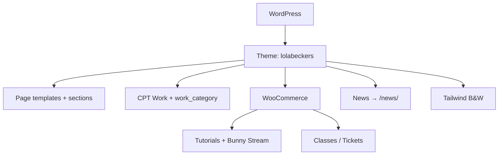

## Project Overzicht

| Detail | Waarde |
|--------|--------|
| **Klant** | Lola Beckers |
| **Type** | Portfolio + shop (performer / choreograaf / director) |
| **Status** | Actief |
| **Pad** | `/DEV/lolabeckers/wp-content/themes/lolabeckers/` |
| **Lokaal** | `lolabeckers.local` |
| **Live** | lolabeckers.com |
| **Taal** | Engels (text domain `lolabeckers`, locale `en_US`) |

Portfolio-site met work-grid, nieuws (`/news/`), WooCommerce tutorials (Bunny.net Stream) en classes/tickets.

---

## Tech Stack

<Columns cols={3}>
  <Card title="WordPress + ACF Pro" icon="code">
    Page templates + CPT Work, geen classic pagebuilder
  </Card>
  <Card title="WooCommerce + Bunny" icon="shopping-cart">
    Tutorials & tickets; signed Stream embeds
  </Card>
  <Card title="Tailwind CSS 3" icon="palette">
    Zwart-wit design, Schibsted Grotesk
  </Card>
</Columns>

---

## Huisstijl / Design Tokens

<Tabs>
  <Tab title="Kleuren" icon="palette">
    Puur zwart-wit — geen gekleurde accenten.

    | Token | Hex | Gebruik |
    |-------|-----|---------|
    | `primary` / `dark` | `#000000` | Tekst, knoppen, hero |
    | `light` | `#F5F5F5` | Lichte achtergrond |
    | `muted` | `#737373` | Secundaire tekst |
    | `border` | `#E5E5E5` | Randen |
  </Tab>
  <Tab title="Typografie" icon="file-text">
    | Type | Font | Gebruik |
    |------|------|---------|
    | **Title / Sans / Expanded / Menu** | Schibsted Grotesk | Enige theme-font (Tailwind) |

    <Callout kind="info" title="Fonts">
      CLAUDE.md noemt nog Zalando Sans / Host Grotesk (Figma). Actuele `tailwind.config.js` gebruikt Schibsted Grotesk.
    </Callout>
  </Tab>
</Tabs>

---

## Site Structuur (geen classic pagebuilder)

Geen ACF flexible content pagebuilder. Content via page templates + secties:

| Template / sectie | Pad | Doel |
|-------------------|-----|------|
| Home | `front-page.php` | Full-bleed B&W hero (`mix-blend-difference`) |
| Work | `templates/work.php` | Filterbare portfolio-grid |
| Tutorials | `templates/tutorials.php` | Woo producten cat. `tutorials` |
| Classes | `templates/classes.php` | Woo producten cat. `tickets` |
| Bio / Contact | `templates/bio.php`, `contact.php` | Pagina’s |
| Components | `templates/components/` | card-work, card-tutorial, card-class, card-news, button |

---

## Custom Post Types

<Expandable title="Work (work)" default-open="true">
  | Eigenschap | Waarde |
  |-----------|--------|
  | **Rewrite** | `/work/` (landing = Page met template; CPT `has_archive => false`) |
  | **Taxonomy** | `work_category` (`/work-category/`) |
  | **Supports** | title, thumbnail, page-attributes |
  | **ACF** | year, role, location, cover, gallery, video_url, external_link |
  | **Filter** | Pretty URLs `/work/{term-slug}/` via rewrite + `work_filter` |
</Expandable>

<Expandable title="News (native post)" default-open="false">
  | Eigenschap | Waarde |
  |-----------|--------|
  | **Rewrite** | `/news/` (post-slug herschreven) |
  | **Labels** | News / News article |
</Expandable>

<Expandable title="Tutorials (WooCommerce)" default-open="true">
  | Eigenschap | Waarde |
  |-----------|--------|
  | **Type** | Virtual products in categorie `tutorials` |
  | **Video** | Bunny.net Stream, signed URLs (TTL 6u) |
  | **Toegang** | `/my-account/tutorials/` + e-mailblok |
  | **ACF** | bunny_video_id, preview_video_id, duration, level, chapters, what_you_learn |
  | **Helpers** | `inc/bunny.php`, `inc/woo-tutorials.php` |
</Expandable>

<Expandable title="Classes / Tickets (WooCommerce)" default-open="true">
  | Eigenschap | Waarde |
  |-----------|--------|
  | **Type** | Simple products in categorie `tickets` |
  | **Stock** | = capaciteit |
  | **Filter** | Past events verborgen via `event_date` meta_query |
  | **ACF** | event_date, duration, location, address, map_url, description, what_to_bring |
  | **Extras** | Attendance-lijst + mailto attendees in admin |
  | **Helpers** | `inc/woo-tickets.php` |
</Expandable>

---

## Architectuur



---

## Build & Development

```bash
npm run dev      # Tailwind watch
npm run build    # Minified CSS
```

Geen aparte JS-bundler — `assets/js/script.js` (mobile menu, copy-link).

---

## Bijzonderheden

- Geen classic pagebuilder: page templates + ACF page/CPT groups
- Zwart-wit design zonder kleuraccenten
- Bunny.net credentials via Theme options (library ID, CDN hostname, token key) — geen secrets in de repo
- Single product router: `woocommerce/single-product.php` → tutorial of ticket template
- Work-filter via pretty URLs i.p.v. querystrings
- Open items in CLAUDE.md: Bio/Contact afronden, cookie consent, SEO, newsletter
