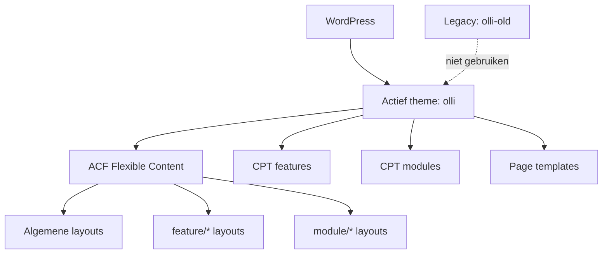

## Project Overzicht

| Detail | Waarde |
|--------|--------|
| **Klant** | Olli |
| **Type** | Product / SaaS marketing website |
| **Status** | Actief |
| **Domein** | olliworks.nl |
| **Pad** | `/DEV/olli/wp-content/themes/olli/` |
| **Lokaal** | `olli.local` |

Huidige theme map: **`olli`**. Er staat ook een legacy theme `olli-old` (Theme Name “Olli - Old”, domein ollisoftware.nl) — documenteer en ontwikkel alleen tegen `olli`.

Marketing site voor de Olli-software: features, modules, pricing, downloads, blog en sign-up. ACF Flexible Content pagebuilder met speciale layouts voor feature- en module-singles.

---

## Tech Stack

<Columns cols={3}>
  <Card title="WordPress + ACF Pro" icon="code">
    Pagebuilder + features/modules CPT’s + options
  </Card>
  <Card title="Tailwind CSS 3.4" icon="palette">
    Blauw/turquoise/oranje palet, Plus Jakarta Sans
  </Card>
  <Card title="Swiper + jQuery" icon="layers">
    Carousels en interactie in theme JS
  </Card>
</Columns>

---

## Huisstijl / Design Tokens

<Tabs>
  <Tab title="Kleuren" icon="palette">
    | Token | Hex | Gebruik |
    |-------|-----|---------|
    | `blue` | `#2F64EA` | Primair blauw, knoppen |
    | `blue-light` | `#51A0ED` | Lichter blauw accent |
    | `blue-dark` | `#050B18` | Donkere achtergronden |
    | `grey` | `#1B1B1C` | Donkergrijs |
    | `turquoise` | `#06DB91` | Accent turquoise |
    | `orange` | `#FF932E` | Accent oranje |
    | `black` / `white` | `#000` / `#fff` | Basis |
  </Tab>
  <Tab title="Typografie" icon="file-text">
    | Type | Font | Gebruik |
    |------|------|---------|
    | **Sans** / **Serif** | Plus Jakarta Sans | Alle UI-tekst |
  </Tab>
</Tabs>

---

## Pagebuilder Layouts

Flexible Content field `content` → files in `pagebuilder/` (underscore → dash of nested pad):

### Algemene layouts

| Layout | Bestand | Beschrijving |
|--------|---------|-------------|
| `hero` | `hero.php` | Hero |
| `text_image` | `text-image.php` | Tekst & afbeelding |
| `video` | `video.php` | Video |
| `clients` | `clients.php` | Klantlogo’s |
| `features` | `features.php` | Features grid |
| `modules` | `modules.php` | Modules overzicht |
| `cta` | `cta.php` | Call-to-action |

### Feature-single layouts (`pagebuilder/feature/`)

| Layout | Beschrijving |
|--------|-------------|
| `feature_hero` | Feature hero |
| `feature_examples` | Voorbeelden |
| `feature_explanation` | Uitleg |
| `feature_other_features` / `feature_other-features` | Andere features |

### Module-single layouts (`pagebuilder/module/`)

| Layout | Beschrijving |
|--------|-------------|
| `module_hero` | Module hero |
| `module_usps` | USP’s |
| `module_text-image` | Tekst & afbeelding |
| `module_integrations` | Integraties |
| `module_all-features` | Alle features |

Cards in `templates/blocks/`: `card-feature`, `card-feature-color`, `card-feature-white`, `card-client`, `card-integration`, `card-post`, `cta`, `grid-content`, `project`.

---

## Page Templates

| Template | Bestand | Doel |
|----------|---------|------|
| Home | `page-home.php` | Homepage |
| Features | `page-features.php` | Features overzicht |
| Pricing | `page-pricing.php` | Prijstabel(len) |
| Sign up | `page-sign-up.php` | Aanmelden |
| Download | `page-download.php` | Downloads |
| Blogs | `page-blogs.php` | Blog overzicht |
| Contact | `page-contact.php` | Contact |
| Text | `page-text.php` | Tekstpagina |

Singles: `single-features.php`, `single-modules.php`, plus standaard `single.php` voor blog.

---

## Custom Post Types

<Expandable title="Features (features)" default-open="true">
  | Eigenschap | Waarde |
  |-----------|--------|
  | **Rewrite** | `/features/` |
  | **Archive** | Nee |
  | **Supports** | title, thumbnail, custom-fields |
  | **REST** | Ja |
</Expandable>

<Expandable title="Modules (modules)" default-open="false">
  | Eigenschap | Waarde |
  |-----------|--------|
  | **Rewrite** | `/module/` |
  | **Archive** | Nee |
  | **Supports** | title, thumbnail, custom-fields |
  | **REST** | Ja |
</Expandable>

ACF options-pagina **Thema** voor globale settings (footer links, default clients/integraties, e.a.).

---

## Architectuur



---

## Build & Development

```bash
npm run build   # Tailwind minify → dist/css/style.css
npm run dev     # Tailwind watch → assets/css/style.css
```

---

## Bijzonderheden

- **Gebruik `olli`, niet `olli-old`** — old is legacy (andere Theme URI)
- Nested pagebuilder-paden: `feature_explanation` → `pagebuilder/feature/explanation.php`
- Pricing-template met complexe ACF repeaters (`tables`, `feature_tables`)
- `inc/woocommerce.php` aanwezig voor hooks indien nodig
- Custom pagination helper in `functions.php`
- Versie 1.0
