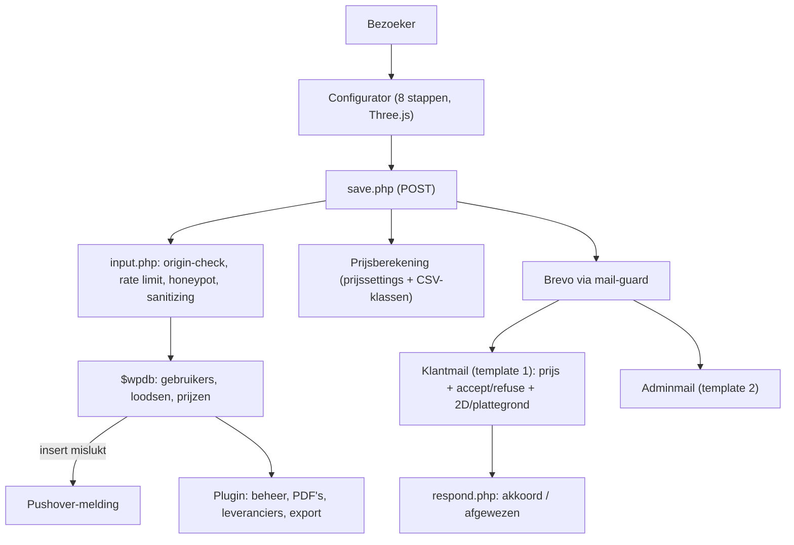

## Project Overzicht

| Detail | Waarde |
|--------|--------|
| **Klant** | Online Loods Bouwen |
| **Type** | Lead-site met loodsconfigurator en prijsindicatie |
| **Live** | [onlineloodsbouwen.nl](https://onlineloodsbouwen.nl) |
| **Status** | Live na livegang (oktober 2026), voorbereiding op verkoop van de site |
| **Gestart** | September 2024 |
| **Pad** | `/DEV/onlineloodsbouwen/wp-content/` |
| **Repo's** | `kayjilesen/onlineloodsbouwen` (thema), `kayjilesen/online-loods-bouwen` (plugin) |
| **Deploy** | Deployer for Git, branch `main` (thema en plugin apart) |

Bezoekers stellen in een 3D-configurator hun eigen loods samen (afmetingen, dak, gevel, vloer, deuren, ramen). Na het invullen van hun gegevens krijgen ze direct een prijsindicatie per mail, met links om te accepteren of af te wijzen en om de 2D-tekening en plattegrond te bekijken. De eigenaar beheert aanvragen, prijzen en leveranciers in WP-admin via een eigen plugin.

---

## Tech Stack

<Columns cols={3}>
  <Card title="WordPress + eigen thema" icon="code">
    Gebaseerd op HTML5 Blank, Bootstrap 4.3 + Font Awesome 5 via CDN (met SRI), SCSS
  </Card>
  <Card title="Configurator" icon="box">
    Three.js (3D), jQuery UI (slepen in 2D), losse JS-modules
  </Card>
  <Card title="Plugin: Online Loods Bouwen" icon="package">
    Aanvragenbeheer, prijzen, leveranciers, Dompdf 3.1-PDF's
  </Card>
</Columns>

Verder: **Brevo** (voorheen SendInBlue) voor transactiemails en contacten, **Pushover** voor foutmeldingen, **SureCookie** + **GA4** voor consent en analytics, ACF Pro, Ninja Forms, FluentSMTP / WP Mail SMTP.

---

## Architectuur



---

## Configurator

De configurator staat in `configurator/` in het thema en laadt alleen op de pagina **Configurator** (eigen stylesheet `css/configurator.min.css`).

<Steps>
  <Step title="Afmetingen" icon="ruler">
    Lengte, breedte, goothoogte en dakhelling (in graden)
  </Step>
  <Step title="Dak" icon="home">
    Materiaal, kleur en isolatiedikte
  </Step>
  <Step title="Gevel" icon="layout">
    Kleur en isolatie (standaard `gevel_isolatie = ja` als het veld ontbreekt)
  </Step>
  <Step title="Vloer" icon="square">
    Wel of geen betonvloer, plus dikte
  </Step>
  <Step title="Deuren" icon="door-open">
    Loopdeuren en overheaddeuren, te plaatsen per gevel (slepen in 2D)
  </Step>
  <Step title="Ramen" icon="app-window">
    Ramen per gevel, met kleur en afwerking
  </Step>
  <Step title="Contact" icon="user">
    Contactgegevens van de klant
  </Step>
  <Step title="Overzicht" icon="check">
    Samenvatting en versturen
  </Step>
</Steps>

| Onderdeel | Bestand |
|---|---|
| Stappen (markup) | `configurator/steps/step1.php` … `step8.php` |
| Stapnavigatie + GA4-events | `configurator/assets/js/config.js` |
| 3D-weergave | `configurator/assets/js/visual.js`, `assets/build/three.min.js` |
| 2D-tekening | `configurator/assets/js/2d.js` |
| Opslaan + mails | `configurator/calculation/save.php` |
| Validatie en beveiliging | `configurator/calculation/input.php` |
| Prijslogica | `configurator/calculation/class/` (staal, overhead, loopdeur, window) |
| Prijs-CSV's | `configurator/calculation/files/*.csv.php` (als `.php`, dus niet meer openbaar) |

<Callout kind="warning" title="Prijs op drie plekken gelijk houden">
  De prijs wordt berekend in `save.php`, `calculation/price.php` én zichtbaar gemaakt in de 2D-PDF. Wijzig je een rekenregel (bijvoorbeeld de dakhelling), test dan alle drie.
</Callout>

### Opslaan (`save.php`)

- Alleen `POST`, anders HTTP 405
- Origin-check als cache-veilig alternatief voor een nonce
- Rate limit op productie: 10 per IP, 3 per e-mailadres (testadressen uitgezonderd)
- Honeypot-veld tegen bots
- Schrijft via `$wpdb` (met `$wpdb->prefix`) naar `gebruikers`, `loodsen` en `prijzen`; prijsinstellingen komen uit `prijssettings`
- Mislukt een insert, dan gaat er een melding via Pushover (`OLB_PUSHOVER_TOKEN` / `OLB_PUSHOVER_USER`)

---

## Mail-guard (test- vs productiemail)

`inc/mail-guard.php` voorkomt dat testaanvragen bij klanten of de eigenaar terechtkomen.

- **Productie** = `WP_ENVIRONMENT_TYPE` is `production` **én** host is `onlineloodsbouwen.nl`. Anders geldt altijd testmodus.
- **Testmodus**: alle Brevo-mails gaan naar het testadres, geen contacten in Brevo, `wp_mail()` wordt omgeleid met `[TEST -> origineel]` in het onderwerp, Cc/Bcc verwijderd.
- **Testadressen op productie** (`OLB_TEST_EMAILS`: `test@kayjilesen.nl`, `dev@kayjilesen.nl`): mails gaan alleen naar dat adres zelf, geen adminmail naar de eigenaar.

```php
// wp-config.php (alleen lokaal/staging)
define( 'OLB_MAIL_REDIRECT', 'test@kayjilesen.nl' );
```

<Callout kind="tip" title="Testen op productie">
  Doorloop de configurator met `test@kayjilesen.nl`. De aanvraag komt in de database, klant- en adminmail komen alleen bij het testadres binnen en er wordt geen Brevo-contact aangemaakt.
</Callout>

---

## Plugin: Online Loods Bouwen

`wp-content/plugins/online-loods-bouwen/`

| Bestand | Functie |
|---|---|
| `online-loods-bouwen.php` | Hooks, AJAX (status wijzigen, verwijderen), menu's, exports |
| `manage.php` | Overzicht van aanvragen (zoeken, sorteren, pagineren) |
| `loods.php` | Detailpagina per aanvraag |
| `prijzen.php` | Prijsinstellingen |
| `respond.php` | Publiek endpoint voor accepteren/afwijzen uit de klantmail |
| `leveranciers/` | Eigen views en prijzen per leverancier: HEAD, FALK, H2R, PMC |
| `pdf/` + `pdf/templates/` | Dompdf-PDF's: overzicht, prijzen (admin/klant), plattegrond, 2D |

**Statussen**: Nieuw, Akkoord, Afgewezen, Verlopen, Gerealiseerd.

<Expandable title="respond.php (accepteren / afwijzen)" default-open="false">
  `respond.php?id={loods_id}&action=accept|refuse&string={respondString}`

  - Valideert id (cijfers), action (`accept`/`refuse`) en string (20–64 alfanumeriek)
  - Alleen de eerste klik telt; een tweede klik geeft "al verwerkt"
  - Stuurt adminmail `adminAccepted` of `adminRefused`
  - `noindex` en no-cache headers
</Expandable>

<Expandable title="Exports" default-open="false">
  - **Staalexport** via `admin_post_olb_download_staal`
  - **Geanonimiseerde CSV van alle aanvragen** via `admin_post_olb_export_leads` (alleen `manage_options`, met nonce). Bevat geen naam, bedrijf, e-mail, telefoon, huisnummer of vrije tekst; postcode alleen de 4 cijfers.
</Expandable>

<Callout kind="warning" title="vendor/ zit in de repo">
  Op de server draait geen `composer install`. `vendor/` (Dompdf) wordt daarom mee gecommit.
</Callout>

---

## Cookies & GA4

`inc/cookie-consent.php`

- **SureCookie** regelt Consent Mode v2, script blocking, consent logs en de site scanner
- GA4 laadt via `wp_enqueue_script`; zolang SureCookie actief is laat het thema zijn eigen consent-default weg
- GA-ID standaard `G-R7RWQ0X6HL`, aan te passen met `define( 'OLB_GA_ID', '...' )` (lege string = GA uit)
- Footer-dropdown met cookie-instellingen: `templates/components/cookie-dropdown.php`; vindt `/cookiebeleid/` automatisch

| Event | Parameters |
|---|---|
| `configurator_start` | — |
| `configurator_step` | `step_number`, `step_name` |
| `generate_lead` | key event |
| `contact_click` | `method` (`phone` / `email`) |
| `configurator_cta_click` | — |

---

## wp-config.php (productie)

| Constante | Waarde |
|---|---|
| `WP_ENVIRONMENT_TYPE` | `production` (nooit `local`/`staging`) |
| `OLB_BREVO_API_KEY` | Brevo API-key |
| `OLB_PUSHOVER_TOKEN` / `OLB_PUSHOVER_USER` | Pushover-meldingen |
| `OLB_MAIL_REDIRECT` | **Niet** zetten op productie |
| `WP_DEBUG_DISPLAY` | `false` |
| `DISALLOW_FILE_EDIT` | `true` |
| `OLB_GA_ID` | Optioneel |

<Callout kind="info" title="Brevo Authorised IPs">
  Het IP van de productieserver moet in Brevo bij "Authorised IPs" staan, anders gaan er geen offertemails uit.
</Callout>

---

## Templates

Paginatemplates in `templates/`: `home`, `over`, `projecten`, `vragen`, `contact`, `text`, `pdf`. Blokken in `templates/blocks/`: `pageHero`, `usps`, `partners`, `ctaBar`. Per paginatemplate wordt automatisch `js/{template}.js` geladen als dat bestand bestaat.

---

## Hosting & Deployment

| Item | Details |
|------|---------|
| **Deployment** | Deployer for Git: push naar `main` = deploy (thema en plugin los, direct na elkaar pushen) |
| **Lokaal** | MAMP, `WP_ENVIRONMENT_TYPE = local` |
| **Build** | SCSS in `css/sass/` → `css/main.min.css` en `css/configurator.min.css` (gebouwde CSS wordt mee gecommit) |

<Callout kind="warning" title="Plugin-mapnaam">
  Deployer noemt de pluginmap naar de repo. De plugin-repo heet daarom `online-loods-bouwen`, gelijk aan de mapnaam.
</Callout>

---

## Onderhoud & verkoop

De volledige livegang-checklist staat in `LIVEGANG.md` in de theme-root. Open punten voor de verkoop van de site:

- WordPress hardening: users-endpoint en `?author=1` afschermen, `xmlrpc.php` uit
- Admin-account voor de koper; eigen account en application passwords weg
- Alle credentials roteren (WP, database, SFTP, Brevo); Pushover-keys vervangen
- Deployer-token intrekken of koper koppelt eigen repo
- ACF Pro-licentie overdragen; één SMTP-plugin kiezen (FluentSMTP óf WP Mail SMTP)
- GA4-eigendom overdragen
- Repo's **zonder git-historie** overdragen (oude Brevo-key staat in de historie)
- `OLB_TEST_EMAILS` laten aanpassen door de koper
- Lokale kopieën met klantdata verwijderen, AVG-afspraken vastleggen
- Koper informeren: prijs-CSV's waren jarenlang openbaar, accept/refuse werkt via GET-link (eerste klik telt), spamlimiet werkt per IP

## Inloggegevens & Toegang

<Callout kind="warning" title="Gevoelige informatie">
  Sla geen wachtwoorden of API-keys op in de documentatie. Ze staan in `wp-config.php` op de server en in de wachtwoordmanager.
</Callout>

- **WordPress admin**: onlineloodsbouwen.nl/wp-admin
- **Aanvragen**: WP-admin → Loodsen
