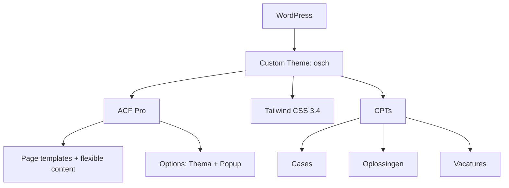

## Project Overzicht

| Detail | Waarde |
|--------|--------|
| **Klant** | Osch |
| **Type** | Bedrijfswebsite (energieoplossingen) |
| **Status** | Actief |
| **Pad** | `/DEV/osch/wp-content/themes/osch/` |
| **Lokaal** | `osch.local` |

Website voor Osch Energy Solutions met trajecten voor thuis en bedrijven, cases, kennisbank-achtige content, vacatures en een globale popup.

---

## Tech Stack

<Columns cols={3}>
  <Card title="WordPress + ACF Pro" icon="code">
    Page templates + flexible content pagebuilder
  </Card>
  <Card title="Tailwind CSS 3.4" icon="palette">
    Groen/geel energypalet, darkMode class
  </Card>
  <Card title="Custom components" icon="layout">
    Hero, FAQ, CTA, kaarten in templates/blocks
  </Card>
</Columns>

---

## Huisstijl / Design Tokens

<Tabs>
  <Tab title="Kleuren" icon="palette">
    | Token | Hex | Gebruik |
    |-------|-----|---------|
    | `green` | `#2D3B29` | Primair donkergroen |
    | `green-light` | `#95F075` | Accent lichtgroen |
    | `green-white` | `#F4FDF1` | Zeer lichte groene achtergrond |
    | `yellow` | `#FFD338` | Geel accent |
    | `grey` | `#F1F1F1` | Neutrale achtergrond |
    | `black` / `white` | `#000` / `#fff` | Basis |
  </Tab>
  <Tab title="Typografie" icon="file-text">
    | Type | Font | Gebruik |
    |------|------|---------|
    | **Sans** (`font-sans`) | Sora | Body tekst |
    | **Serif / Title** (`font-serif`, `font-title`) | Roc Grotesk | Koppen |
  </Tab>
</Tabs>

---

## Page Templates

| Template | Doel |
|----------|------|
| `home.php` | Homepage |
| `thuis.php` | Traject particulieren |
| `bedrijven.php` | Traject zakelijk |
| `about.php` | Over ons |
| `cases.php` | Cases-overzicht |
| `kennis.php` | Kennis / content |
| `jobs.php` | Vacatures-overzicht |
| `contact.php` | Contact |
| `inschrijven.php` | Inschrijfflow |
| `popup.php` | Popup-gerelateerde pagina |
| `text.php` | Generieke tekst + pagebuilder |

---

## Pagebuilder Layouts

Flexible content (`pagebuilder_content`) plus vaste component-blocks:

| Layout / Block | Beschrijving |
|----------------|-------------|
| `textblock` | Enkel tekstblok |
| `double_textblock` | Dubbel tekstblok |
| `quote` | Quote |
| `image` / `double_image` / `triple_image` | Afbeeldingscomposities |
| `video` | Video |
| `image_text` / `text_image` | Tekst ↔ afbeelding |
| `hero` | Hero component |
| `faq` | Veelgestelde vragen |
| `cta` | Call-to-action |
| `card-post` / `card-solution` | Kaartcomponenten |

---

## Custom Post Types

<Expandable title="Cases (Cases)" default-open="true">
  | Eigenschap | Waarde |
  |-----------|--------|
  | **Rewrite** | `/case/` |
  | **Archive** | Nee |
  | **Taxonomy** | Native `category` |
  | **Supports** | title, thumbnail |
</Expandable>

<Expandable title="Oplossingen (Oplossingen)" default-open="false">
  | Eigenschap | Waarde |
  |-----------|--------|
  | **Rewrite** | `/oplossing/` |
  | **Archive** | Nee |
  | **Single** | `single-oplossingen.php` |
  | **Supports** | title, thumbnail |
</Expandable>

<Expandable title="Vacatures (Vacatures)" default-open="false">
  | Eigenschap | Waarde |
  |-----------|--------|
  | **Rewrite** | `/vacatures/` |
  | **Archive** | Nee |
  | **Hierarchical** | Ja |
  | **Single** | `single-vacatures.php` |
</Expandable>

---

## Architectuur



---

## Build & Development

```bash
npm run dev      # Tailwind watch → assets/css/style.css
npm run build    # Minified CSS → dist/css/style.css
```

<Callout kind="info" title="Build vs watch output">
  `dev` schrijft naar `assets/css/style.css`; `build` naar `dist/css/style.css`. Controleer welk pad `inc/scripts.php` enqueue't.
</Callout>

---

## Bijzonderheden

- Functieprefix `kj_`; package-beschrijving: "Osch Energy Solutions - Website"
- Options: **Thema** + subpagina **Popup** (delay, knoppen, styling)
- Footer/USP's, solutions-links voor thuis/bedrijven en Gravity Form-ID's via ACF options
- CPT-registratie staat in `inc/acf.php` (niet in een apart `post-types.php`)
- Geen CLAUDE.md in het theme — structuur is ouder/template-gedreven
