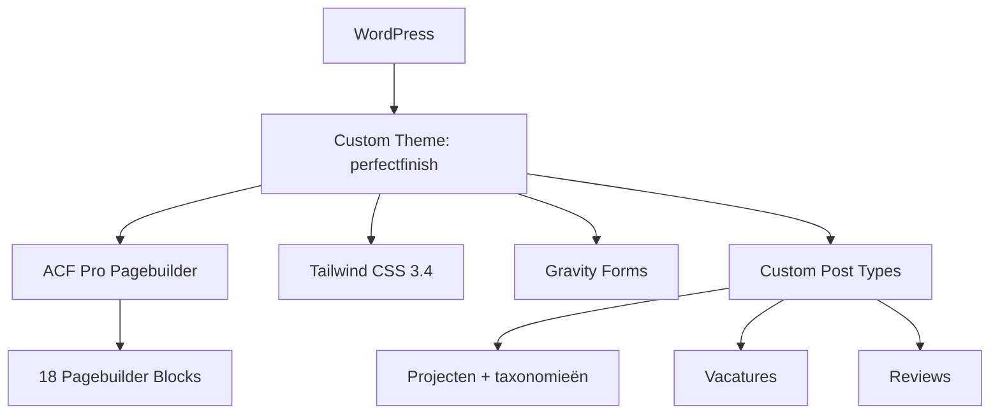

## Project Overzicht

| Detail | Waarde |
|--------|--------|
| **Klant** | Perfect Finish |
| **Type** | Bedrijfswebsite (schilders & afwerking) |
| **Status** | Actief |
| **Pad** | `/DEV/perfectfinish/wp-content/themes/perfectfinish/` |

Website voor een schilders- en afwerkingsbedrijf met een uitgebreide projectportfolio, vacaturesectie, klantreviews, en uitleg over diensten en werkprocessen.

<Callout kind="info" title="Referentieproject">
  Perfect Finish heeft de meest uitgebreide CLAUDE.md met alle conventies en regels. Dit project dient als referentie voor de standaard werkwijze.
</Callout>

---

## Tech Stack

<Columns cols={3}>
  <Card title="WordPress + ACF Pro" icon="code">
    Custom theme met ACF Flexible Content pagebuilder
  </Card>
  <Card title="Tailwind CSS 3.4" icon="palette">
    Utility-first CSS met custom kleuren en fonts
  </Card>
  <Card title="Gravity Forms" icon="file-text">
    Contactformulieren met custom styling
  </Card>
</Columns>

---

## Huisstijl / Design Tokens

<Tabs>
  <Tab title="Kleuren" icon="palette">
    | Token | Hex | Gebruik |
    |-------|-----|---------|
    | `primary` / `yellow` | `#FFD500` | Primaire kleur, knoppen, accenten |
    | `secondary` / `grey-dark` | `#1A1603` | Donkere tekst, achtergronden |
    | `grey-surface` | `#454545` | Oppervlakte elementen |
    | `grey-decor` | `#DADADA` | Decoratieve elementen, borders |
    | `grey` | `#414039` | Standaard grijstint |
    | `grey-light` | `#F7F7F7` | Lichte achtergronden |
    | `grey-text` | `#8A8A8A` | Subtiele tekst |
    | `yellow-light` | `#F2F1EB` | Lichte gele achtergrond |
  </Tab>
  <Tab title="Typografie" icon="file-text">
    | Type | Font | Gebruik |
    |------|------|---------|
    | **Sans** (`font-sans`) | Karla | Body tekst, standaard |
    | **Button** (`font-button`) | Karla | Knoppen |
    | **Title** (`font-title`) | TGS | Koppen en titels |
  </Tab>
</Tabs>

---

## Pagebuilder Blocks (18)

| Block | Beschrijving |
|-------|-------------|
| `hero` | Hero sectie met titel, content, buttons |
| `text-image` | Tekst naast afbeelding (wisselbaar) |
| `call-to-action` | CTA met achtergrondkleur en buttons |
| `reviews` | Klantbeoordelingen slider/grid |
| `projecten-cases` | Projecten showcase uit CPT |
| `vacatures` | Vacature listings |
| `veelgestelde-vragen` | FAQ accordion |
| `proces` | Werkproces uitleg in stappen |
| `route` | Route/locatie informatie |
| `waar` | "Waar werken wij" sectie |
| `waarom` | "Waarom kiezen voor ons" sectie |
| `werken-bij` | Werken-bij sectie met USPs |
| `text-services` | Diensten overzicht met tekst |
| `content-usps` | USP's / kenmerken grid |
| `highlights` | Uitgelichte items |
| `info-cards` | Informatiekaarten grid |
| `uitdagingen` | Uitdagingen/problemen sectie |
| `certificeringen` | Certificeringen en keurmerken |

---

## Custom Post Types

<Expandable title="Projecten (project)" default-open="true">
  | Eigenschap | Waarde |
  |-----------|--------|
  | **Slug** | `project` |
  | **Rewrite** | `/projecten/` |
  | **Archive** | Ja |
  | **Supports** | title, editor, thumbnail, excerpt, custom-fields |
  | **Taxonomieën** | `project_dienst`, `project_doelgroep` |
  | **Menu icon** | `dashicons-portfolio` |

  **Taxonomieën:**
  - `project_dienst` — Filtert op type dienst (schilderwerk, behangen, etc.)
  - `project_doelgroep` — Filtert op doelgroep (particulier, zakelijk)

  Rewrite slugs: `projecten/dienst/`, `projecten/doelgroep/`
</Expandable>

<Expandable title="Vacatures (vacature)" default-open="false">
  | Eigenschap | Waarde |
  |-----------|--------|
  | **Slug** | `vacature` |
  | **Rewrite** | `/vacatures/` |
  | **Archive** | Nee |
  | **Supports** | title, editor, thumbnail, excerpt, custom-fields |
  | **Menu icon** | `dashicons-groups` |
</Expandable>

<Expandable title="Reviews (review)" default-open="false">
  | Eigenschap | Waarde |
  |-----------|--------|
  | **Slug** | `review` |
  | **Publiek** | Nee (alleen via admin) |
  | **Supports** | title, thumbnail, custom-fields |
  | **Menu icon** | `dashicons-star-filled` |

  Reviews worden niet publiekelijk getoond als losse pagina's maar via het `reviews` pagebuilder block.
</Expandable>

---

## Essentiële Plugins

| Plugin | Doel | Vereist |
|--------|------|---------|
| **ACF Pro** | Pagebuilder + alle custom velden | Ja |
| **Gravity Forms** | Contactformulieren | Ja |
| **Yoast SEO** | SEO management | Aanbevolen |

<Callout kind="tip" title="Gravity Forms">
  Gravity Forms standaard CSS is uitgeschakeld. Custom styling wordt toegepast via `inc/gravity-forms.php` met de KJ button component.
</Callout>

---

## Architectuur



---

## Includes Overzicht

| Bestand | Beschrijving |
|---------|-------------|
| `inc/helpers.php` | `kj_acf()`, `kj_image()`, `kj_sub_image()`, utilities |
| `inc/remove.php` | WordPress cleanup (emoji, oembed, etc.) |
| `inc/settings.php` | Theme support, menu's, image sizes |
| `inc/post-types.php` | Projecten, Vacatures, Reviews CPTs + taxonomieën |
| `inc/acf.php` | ACF optiepagina's en hooks |
| `inc/scripts.php` | CSS/JS enqueuing met cache busting |
| `inc/gravity-forms.php` | GF custom styling en button component |
| `inc/template-functions.php` | Template helpers |

---

## Build & Development

```bash
# Development
npm run dev        # Tailwind watch mode

# Productie
npm run build      # CSS (minified) + JS bundeling
npm run build:css  # Alleen CSS
npm run build:js   # Alleen JS (pagebuilder blocks)
```

---

## Bijzonderheden

- Post revisies gelimiteerd tot maximaal 5 (`kj_limit_revisions`)
- Gravity Forms default CSS uitgeschakeld, custom button component
- Project archief met dubbele taxonomy filtering (dienst + doelgroep)
- Reviews CPT is niet publiek — alleen via pagebuilder block
