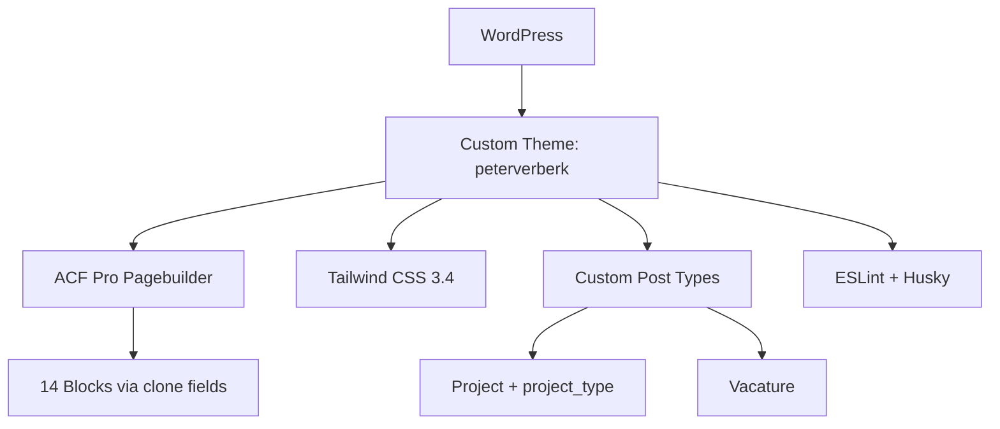

## Project Overzicht

| Detail | Waarde |
|--------|--------|
| **Klant** | Peter Verberk |
| **Type** | Bedrijfswebsite (projecten & vacatures) |
| **Status** | Actief |
| **Pad** | `/DEV/peterverberk/wp-content/themes/peterverberk/` |
| **Lokaal** | `peterverberk.local` |

Donkerblauwe bedrijfswebsite met pagebuilder, projectportfolio (filterbaar op type) en vacatures. Fonts self-hosted; ESLint + Husky voor code quality.

---

## Tech Stack

<Columns cols={3}>
  <Card title="WordPress + ACF Pro" icon="code">
    Pagebuilder met 14 blocks (clone-pattern)
  </Card>
  <Card title="Tailwind CSS 3.4" icon="palette">
    Navy/primary palette, container max 1200px
  </Card>
  <Card title="ESLint + Husky" icon="terminal">
    Lint JS/PHP + pre-commit hooks
  </Card>
</Columns>

---

## Huisstijl / Design Tokens

<Tabs>
  <Tab title="Kleuren" icon="palette">
    | Token | Hex | Gebruik |
    |-------|-----|---------|
    | `primary` | `#004273` | Accent, knoppen, links |
    | `dark` | `#041725` | Hoofdachtergrond |
    | `dark-alt` | `#051826` | Iets lichtere band |
  </Tab>
  <Tab title="Typografie" icon="file-text">
    | Type | Font | Gebruik |
    |------|------|---------|
    | **Sans** (`font-sans`) | Zalando Sans | Body |
    | **Serif / Title** (`font-serif`, `font-title`) | Baskerville (Libre Baskerville) | Koppen, accent |
    | **Mono** (`font-mono`) | ui-monospace | Mono |

    Fonts als woff2 in `assets/fonts/` via `assets/css/fonts.css`.
  </Tab>
</Tabs>

---

## Pagebuilder Blocks (14)

| Block | Beschrijving |
|-------|-------------|
| `hero` | Homepage hero |
| `page-hero` | Pagina-hero |
| `cta` | Call-to-action |
| `over` | Over-sectie |
| `diensten` | Dienstenoverzicht |
| `stappen-cta` | Stappenproces + CTA |
| `projecten` | Projecten uit CPT |
| `tekst-media` | Tekst met media |
| `proces` | Werkproces |
| `afbeelding` | Afbeeldingsectie |
| `werken-bij` | Werken-bij sectie |
| `contact` | Contactsectie |
| `vacature-banner` | Vacature-banner |
| `maps` | Kaart / Maps |

<Callout kind="tip" title="ACF clone-pattern">
  Velden nooit direct in `group_pagebuilder.json`. Elk blok heeft `group_layout_{blok}.json` (`active: false`); de pagebuilder laadt via seamless clone.
</Callout>

---

## Custom Post Types

<Expandable title="Projecten (project)" default-open="true">
  | Eigenschap | Waarde |
  |-----------|--------|
  | **Rewrite** | `/projecten/` |
  | **Archive** | Ja (`archive-project.php`) |
  | **Taxonomy** | `project_type` → `/projecten/type/` (hiërarchisch) |
  | **Supports** | title, thumbnail, page-attributes |
  | **Templates** | `single-project.php`, `taxonomy-project_type.php` |
</Expandable>

<Expandable title="Vacatures (vacature)" default-open="false">
  | Eigenschap | Waarde |
  |-----------|--------|
  | **Rewrite** | `/vacatures/` |
  | **Archive** | Ja (`archive-vacature.php`) |
  | **Supports** | title, thumbnail, page-attributes |
  | **Templates** | `single-vacature.php` |
</Expandable>

---

## Architectuur



---

## Build & Development

```bash
npm run build         # CSS build (minify)
npm run build:css     # Tailwind → assets/css/style.css
npm run dev           # CSS watch
npm run dev:css       # Tailwind watch
npm run lint          # ESLint + PHP lint
npm run lint:js       # ESLint check
npm run lint:js:fix  # ESLint auto-fix
npm run lint:php      # php -l op alle PHP-bestanden
```

---

## Bijzonderheden

- ACF-labels Nederlands; code comments/variabelen Engels
- Herbruikbare button-component: `group_button_fields.json`
- Cookie consent + tracking helpers in `inc/`
- Seeder beschikbaar (`inc/seeder.php`)
- Functieprefix `kj_`, text domain `peterverberk`
- Templates: `templates/pagebuilder/{blok}/{blok}.php`
