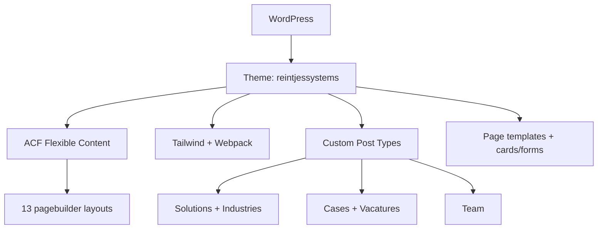

## Project Overzicht

| Detail | Waarde |
|--------|--------|
| **Klant** | Reintjes Systems |
| **Type** | Bedrijfswebsite (machines / industrie) |
| **Status** | Actief |
| **Domein** | reintjessystems.nl |
| **Pad** | `/DEV/reintjessystems/wp-content/themes/reintjessystems/` |
| **Lokaal** | `reintjessystems.local` |

Engelstalige/internationale bedrijfswebsite voor machine- en industriële oplossingen: solutions, industries, success stories (cases), vacatures, insights en contactformulieren. ACF Flexible Content pagebuilder op o.a. about- en solutions-pagina’s.

---

## Tech Stack

<Columns cols={3}>
  <Card title="WordPress + ACF Pro" icon="code">
    Pagebuilder + 5 CPT’s + options
  </Card>
  <Card title="Tailwind + Webpack" icon="palette">
    CSS via Tailwind; JS via Webpack (Swiper, Vimeo, jQuery)
  </Card>
  <Card title="ESLint + Husky" icon="terminal">
    Lint-staged pre-commit, CI via GitHub Actions
  </Card>
</Columns>

---

## Huisstijl / Design Tokens

<Tabs>
  <Tab title="Kleuren" icon="palette">
    | Token | Hex | Gebruik |
    |-------|-----|---------|
    | `blue` / primary | `#007CB0` | Primair blauw, knoppen |
    | `blue-dark` / secondary | `#284053` | Donkerblauw |
    | `blue-light` | `#E8F2FA` | Lichte blauwe vlakken |
    | `blue-white` | `#F2F6F8` | Zeer lichte achtergrond |
    | `dark` | `#05141F` | Donkere tekst / vlakken |
    | `grey` | `#D1D5DD` | Borders / grijs |
    | `grey-light` | `#F3F3F3` | Lichtgrijs |
    | `black` / `white` | `#000` / `#fff` | Basis |
  </Tab>
  <Tab title="Typografie" icon="file-text">
    | Type | Font | Gebruik |
    |------|------|---------|
    | **Sans** (`font-sans`) | Sora | Body tekst |
    | **Serif** (`font-serif`) | Syne | Koppen / display |
  </Tab>
</Tabs>

---

## Pagebuilder Blocks (13)

Flexible Content field `content` → templates in `templates/pagebuilder/`:

| Block | Beschrijving |
|-------|-------------|
| `hero` | Hero sectie |
| `text` | Tekstblok |
| `text_image` | Tekst & afbeelding |
| `cta` | Call-to-action |
| `faq` | FAQ accordion |
| `cases` | Cases showcase |
| `modules` | Modules overzicht |
| `submachines` | Submachines / machine-onderdelen |
| `specifications` | Specificatietabel |
| `highlights` | Highlights |
| `clients` | Klantlogo’s |
| `youtube-video` | YouTube video |
| `full_image_title` | Full-bleed afbeelding + titel |

---

## Page Templates & Partials

| Template | Doel |
|----------|------|
| `home.php` | Homepage (featured solutions, clients, insights) |
| `about.php` | Over ons (+ pagebuilder loop) |
| `solutions.php` | Solutions overzicht (+ pagebuilder) |
| `industries.php` | Industries |
| `cases.php` | Cases overzicht |
| `jobs.php` | Vacatures / werken-bij |
| `contact.php` | Contact |
| `text.php` | Generieke tekstpagina |

Herbruikbare cards/forms in `templates/blocks/` (o.a. `card-case`, `card-job`, `form-demo`, `form-offerte`, `form-apply`, `newsletter-jobs`).

---

## Custom Post Types

<Expandable title="Solutions (solutions)" default-open="true">
  | Eigenschap | Waarde |
  |-----------|--------|
  | **Rewrite** | `/solution/` |
  | **Archive** | Nee |
  | **Hierarchical** | Ja |
  | **Supports** | title, page-attributes, thumbnail |
</Expandable>

<Expandable title="Industries (industries)" default-open="false">
  | Eigenschap | Waarde |
  |-----------|--------|
  | **Rewrite** | `/industries/` |
  | **Archive** | Nee |
  | **Hierarchical** | Ja |
</Expandable>

<Expandable title="Cases (Cases)" default-open="false">
  | Eigenschap | Waarde |
  |-----------|--------|
  | **Rewrite** | `/case/` |
  | **Archive** | Nee |
  | **Taxonomy** | standaard `category` |
</Expandable>

<Expandable title="Vacatures (Vacatures)" default-open="false">
  | Eigenschap | Waarde |
  |-----------|--------|
  | **Rewrite** | `/jobs/` |
  | **Archive** | Nee |
  | **Taxonomy** | standaard `category` |
  | **Single** | `single-vacatures.php` |
</Expandable>

<Expandable title="Team (team)" default-open="false">
  | Eigenschap | Waarde |
  |-----------|--------|
  | **Rewrite** | `/team/` |
  | **Archive** | Nee |
</Expandable>

Insights op de homepage komen uit standaard posts (`index.php` / blog-loop), geen aparte insights-CPT.

---

## Architectuur



---

## Build & Development

```bash
npm run build            # Tailwind minify → dist/css/style.css
npm run dev              # Parallel: Tailwind + admin CSS + Webpack watch
npm run prod             # Webpack production
npm run lint             # ESLint + PHP lint
npm run lint:js:fix     # ESLint auto-fix
```

<Callout kind="tip" title="Husky">
  `prepare` activeert Husky; `lint-staged` runt ESLint op staged JS.
</Callout>

---

## Bijzonderheden

- `inc/woocommerce.php` aanwezig (WooCommerce hooks klaar; shop niet core van de site)
- Single templates: `single-solutions.php`, `single-cases.php`, `single-industries.php`, `single-vacatures.php`
- Vimeo Player + Swiper in de JS-bundel
- CI workflow in `.github/workflows/ci.yml`
- Versie 1.0.0
