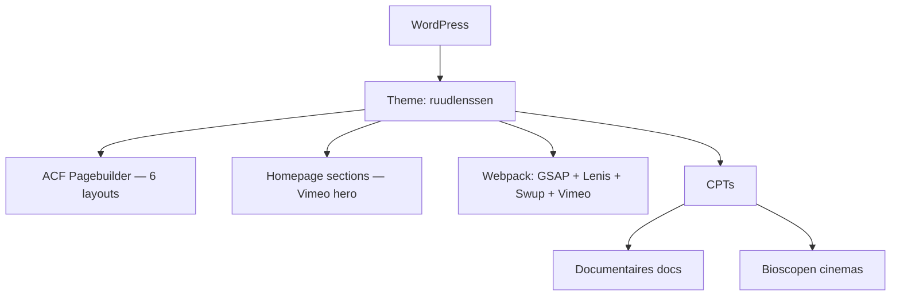

## Project Overzicht

| Detail | Waarde |
|--------|--------|
| **Klant** | Ruud Lenssen |
| **Type** | Portfolio / filmmaker (documentaires) |
| **Status** | Actief |
| **Pad** | `/DEV/ruudlenssen/wp-content/themes/ruudlenssen/` |
| **Lokaal** | `ruudlenssen.local` |
| **Live** | ruudlenssen.com |

Website voor documentairemaker Ruud Lenssen: featured docs, Vimeo-hero, screenings/bioscopen, reviews en pagebuilder voor tekst/media.

---

## Tech Stack

<Columns cols={3}>
  <Card title="WordPress + ACF Pro" icon="code">
    Pagebuilder + docs/cinemas CPT’s
  </Card>
  <Card title="Tailwind + Webpack" icon="palette">
    Figtree, GSAP, Lenis, Swup, Vimeo Player
  </Card>
  <Card title="npm-run-all" icon="terminal">
    Parallel watch: Tailwind + admin + Webpack
  </Card>
</Columns>

---

## Huisstijl / Design Tokens

<Tabs>
  <Tab title="Kleuren" icon="palette">
    Minimal zwart-wit / grijs palet.

    | Token | Hex | Gebruik |
    |-------|-----|---------|
    | `black` / `primary` | `#000000` | Tekst, dark UI |
    | `white` / `secondary` | `#ffffff` | Achtergrond |
    | `grey` | `#D1D5DD` | Borders / UI |
    | `grey-light` | `#F3F3F3` | Lichte vlakken |
    | `grey-socials` | `#D5D6DB` | Social icons |
  </Tab>
  <Tab title="Typografie" icon="file-text">
    | Type | Font | Gebruik |
    |------|------|---------|
    | **Sans** (`font-sans`) | Figtree | Body en UI |
    | **Serif** (`font-serif`) | Figtree | Headings / fallback |
  </Tab>
</Tabs>

---

## Pagebuilder Blocks (6)

| Block | Beschrijving |
|-------|-------------|
| `text` | Tekst |
| `reviews` | Reviews |
| `full_image` | Volledige afbeelding |
| `images` | Afbeeldingen-grid |
| `text_image` | Tekst & afbeelding |
| `youtube_video` | YouTube video |

### Homepage & sectie-partials

Homepage (`templates/home.php`) met ACF-secties: hero (Vimeo/video + featured doc), about, inspiring posters, screened logos.

Partials onder `templates/blocks/`: hero, card-doc, card-doc-in-production, card-logo, item-doc, reviews, schedule.

Page templates: `home.php`, `about.php`, `docs.php`, `text.php`.

---

## Custom Post Types

<Expandable title="Documentaires (docs)" default-open="true">
  | Eigenschap | Waarde |
  |-----------|--------|
  | **Rewrite** | `/docs/` |
  | **Archive** | Nee |
  | **Single** | `single-docs.php` |
  | **Hierarchical** | Ja |
  | **Supports** | title, page-attributes, thumbnail |
  | **ACF** | Documentaire-velden (`group_67bf2b12d8420`) |
</Expandable>

<Expandable title="Bioscopen (cinemas)" default-open="true">
  | Eigenschap | Waarde |
  |-----------|--------|
  | **Labels** | Bioscopen / Bioscoop |
  | **Rewrite** | `/docs/` (zelfde slug als docs — let op) |
  | **Archive** | Nee |
  | **Supports** | title |
  | **Doel** | Screenings / bioscoopvermeldingen |
</Expandable>

---

## Architectuur



---

## Build & Development

```bash
npm run dev      # Parallel: Tailwind + admin CSS + Webpack watch
npm run build    # Tailwind minify → dist/css/style.css
npm run prod     # Webpack production
```

---

## Bijzonderheden

- Rijke front-end stack: GSAP, Lenis (smooth scroll), Swup (page transitions), Vimeo Player
- Hero ondersteunt upload-video én Vimeo-link
- Docs in productie via aparte card-partial (`card-doc-in-production`)
- CPT `cinemas` deelt rewrite-slug `/docs/` met `docs` — bij URL-issues eerst hier kijken
- Vertalingen-opties via ACF (`Vertalingen` field group)
- Minimal grijs/zwart-wit palet, Figtree
