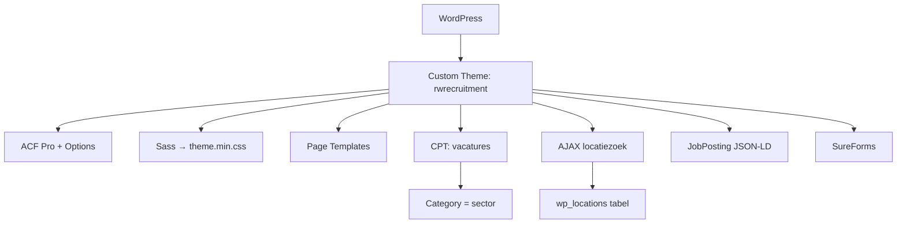

## Project Overzicht

| Detail | Waarde |
|--------|--------|
| **Klant** | RW Recruitment |
| **Type** | Recruitment / vacaturewebsite |
| **Status** | Actief |
| **Pad** | `/DEV/rwrecruitment/wp-content/themes/rwrecruitment/` |
| **Lokaal** | `rwrecruitment.local` |

Recruitmentsite met vacature-CPT, zoeken op term/regio/radius/sector, AJAX-locatieautocomplete (custom `wp_locations`-tabel) en JSON-LD JobPosting op vacaturedetail. Styling via Sass (geen Tailwind); page templates i.p.v. pagebuilder.

---

## Tech Stack

<Columns cols={3}>
  <Card title="WordPress + ACF Pro" icon="code">
    Page templates + flexible content op vacatures
  </Card>
  <Card title="Sass" icon="palette">
    `css/sass/` → `theme.min.css` (geen Tailwind)
  </Card>
  <Card title="jQuery + SureForms" icon="terminal">
    Filters, locatie-AJAX; formulieren via SureForms
  </Card>
</Columns>

---

## Huisstijl / Design Tokens

<Tabs>
  <Tab title="Kleuren" icon="palette">
    Tokens in `css/sass/_variables.scss`:

    | Token / var | Hex | Gebruik |
    |-------------|-----|---------|
    | `$darkblue` / `$priColor` | `#263F65` | Primair donkerblauw |
    | `$lightblue` / `$subColor` | `#22A9DB` | Accent lichtblauw |
    | `$grey` | `#1D1D1B` | Donkergrijs tekst |
    | `$subGrey` | `#EBEBEB` | Lichte ondergrond |
    | `$subLight` | `#E3E9F2` | Lichtblauw-grijs |
    | `$subDark` | `#1D1C1C` | Donkere variant |
    | `$white` / `$black` | `#fff` / `#000` | Basis |
  </Tab>
  <Tab title="Typografie" icon="file-text">
    | Type | Font | Gebruik |
    |------|------|---------|
    | **Primary** (`$font`) | Soleil | Alles (self-hosted woff2) |

    Gewichten: regular, semibold italic, bold — `@font-face` in `style.css`.
  </Tab>
</Tabs>

---

## Pagina-templates

| Template | Doel |
|----------|------|
| `home.php` | Homepage — intro, filters, over, sectoren, vacatures |
| `vacatures.php` | Vacatureoverzicht + filterformulier |
| `vacature.php` | (Legacy) vacature-template |
| `over.php` | Over ons |
| `contact.php` | Contact |
| `content.php` | Contentpagina met flexible layouts |
| `form.php` | Formulierpagina |
| `text.php` | Tekstpagina |

### Flexible content

**Vacature (`content` field):**

| Layout | Label |
|--------|-------|
| `tekstblok` | Tekstblok |
| `list_blue` | Lijst (blauwe bolletjes) |
| `list_green` | Lijst (groene bolletjes) |

**Content-template:**

| Layout | Label |
|--------|-------|
| `text_image` | Tekstblok – Afbeelding |
| `image_text` | Afbeelding – Tekstblok |

### Blocks

| Block | Bestand |
|-------|---------|
| `cta` | `templates/blocks/cta.php` |

---

## Custom Post Types

<Expandable title="Vacatures (vacatures)" default-open="true">
  | Eigenschap | Waarde |
  |-----------|--------|
  | **Rewrite** | `/vacature/` (enkelvoud) |
  | **Archive** | Nee |
  | **Taxonomies** | Native `category` (sectoren) |
  | **Supports** | title, thumbnail |
  | **Admin kolom** | Locatie (`locatie` ACF-veld) |
  | **Filter rewrite** | `/vacatures/{categorie}` → `vaccat` query var |
</Expandable>

---

## Architectuur



---

## Build & Development

```bash
npm run build   # sass compressed → css/theme.min.css
npm run dev     # sass --watch
```

Sass-entry: `css/sass/theme.scss` (importeert `_variables`, `_basics`, `_home`, `_vacatures`, `_vacature`, `_sureforms`, e.a.).

---

## Bijzonderheden

- Locatiezoeker: AJAX `rwrecruitment_location_search` tegen custom tabel `{$wpdb->prefix}locations` (woonplaats + lat/long + alternatieve schrijfwijzen)
- Vacaturefilters: zoekterm, regio, radius (km), sector — op home én vacatures-pagina
- JobPosting schema in `<head>`: titel, omschrijving (tekst + lijsten), employmentType, locatie, salaris
- Menu's: `header-menu`, `sidebar-menu`, `extra-menu`
- Image sizes: extra, large, medium, small, logo, container, fullscreen + responsive `sizes`-helper
- Text domain `rw` (niet `rwrecruitment`); functies: `rwrecruitment_*` / `rw_*`
- Admin bar uit; comments-menu verborgen
- Libs aanwezig: Slick, Locomotive Scroll (legacy; check of actief enqueued)
