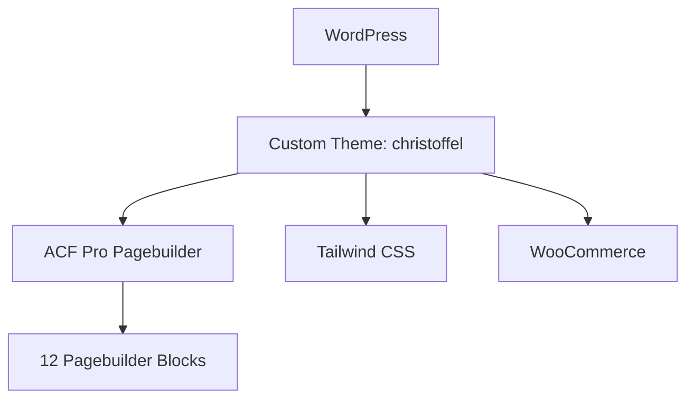

## Project Overzicht

| Detail | Waarde |
|--------|--------|
| **Klant** | St. Christoffel |
| **Type** | Bedrijfs-/organisatiesite (met shop) |
| **Status** | Actief |
| **Pad** | `/DEV/stchristoffel/wp-content/themes/christoffel/` |
| **Lokaal** | `stchristoffel.local` |
| **Theme map** | `christoffel` (text domain) |

Website met ACF Flexible Content pagebuilder, blauw huisstijlpalet en WooCommerce-ondersteuning.

---

## Tech Stack

<Columns cols={3}>
  <Card title="WordPress + ACF Pro" icon="code">
    Pagebuilder met 12 blocks
  </Card>
  <Card title="Tailwind CSS" icon="palette">
    Utility-first CSS met Figtree + Anton SC
  </Card>
  <Card title="WooCommerce" icon="shopping-cart">
    Shop-integratie in het theme
  </Card>
</Columns>

---

## Huisstijl / Design Tokens

<Tabs>
  <Tab title="Kleuren" icon="palette">
    | Token | Hex | Gebruik |
    |-------|-----|---------|
    | `primary` | `#006EB8` | Primair blauw, accenten |
    | `secondary` | `#020E15` | Donkere tekst/achtergrond |
    | `lightblue` | `#F2F8FB` | Lichte achtergrond |
    | `white` | `#FFFFFF` | Wit |
    | `gray` | `#374151` | Neutrale tekst |
  </Tab>
  <Tab title="Typografie" icon="file-text">
    | Type | Font | Gebruik |
    |------|------|---------|
    | **Sans** (`font-sans`) | Figtree | Body tekst |
    | **Serif / Display** (`font-serif`, `font-display`) | Anton SC | Koppen en display |
  </Tab>
</Tabs>

---

## Pagebuilder Blocks (12)

| Block | Beschrijving |
|-------|-------------|
| `hero` | Hero met titel en optionele achtergrondafbeelding |
| `navigation-block` | Navigatiekaarten in grid (tot 4 kolommen) |
| `section-nav` | Sectienavigatie met optionele overlap |
| `page-title` | Paginatitel (licht / afbeelding) |
| `text` | Tekstsectie met achtergrondkleur |
| `text-image` | Tekst naast afbeelding |
| `image-carousel` | Afbeeldingencarrousel |
| `statistics-bar` | Statistiekenbalk |
| `faq` | FAQ accordion |
| `pricing-table` | Prijstabellen |
| `team-grid` | Teamleden in grid |
| `contact-form` | Contactsectie met formulier-shortcode |

---

## Architectuur



---

## Build & Development

```bash
npm run dev          # Tailwind watch (dev:css)
npm run build        # CSS minify + pagebuilder JS bundeling
npm run build:css    # Alleen CSS
npm run build:js     # Pagebuilder JS via scripts/build-pagebuilder-js.js
```

<Callout kind="info" title="Geen CPT's">
  Dit theme registreert geen custom post types. Content loopt via pagina's + pagebuilder (team via velden in `team-grid`).
</Callout>

---

## Bijzonderheden

- Theme-map heet `christoffel`, projectmap `stchristoffel`
- Functieprefix `kj_`
- Cookie consent + analytics includes aanwezig
- Versie 1.0.0
