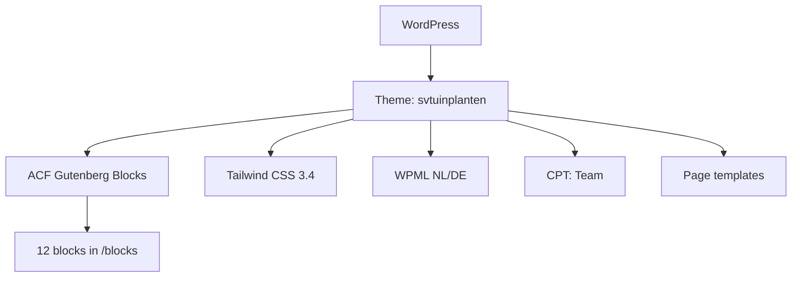

## Project Overzicht

| Detail | Waarde |
|--------|--------|
| **Klant** | SV Tuinplanten |
| **Type** | Bedrijfswebsite (tuinplantenkwekerij) |
| **Status** | Actief |
| **Domein** | svtuinplanten.nl |
| **Pad** | `/DEV/svtuinplanten/wp-content/themes/svtuinplanten/` |
| **Lokaal** | `svtuinplanten.local` |

Website voor een tuinplantenkwekerij met assortiment, vestigingen, team, video en vacaturepagina’s. Contentblokken zijn ACF Gutenberg-blocks (geen classic pagebuilder). Meertalig via WPML (Nederlands / Duits).

---

## Tech Stack

<Columns cols={3}>
  <Card title="WordPress + ACF Blocks" icon="code">
    12 native Gutenberg-blocks via `block.json`
  </Card>
  <Card title="Tailwind CSS 3.4" icon="palette">
    Groen huisstijlpalet, Ubuntu typografie
  </Card>
  <Card title="WPML" icon="globe">
    NL/DE language switcher in header-menu
  </Card>
</Columns>

---

## Huisstijl / Design Tokens

<Tabs>
  <Tab title="Kleuren" icon="palette">
    | Token | Hex | Gebruik |
    |-------|-----|---------|
    | `primary` / `green-dark` | `#154E37` | Primair donkergroen, headers |
    | `secondary` / `green-medium` | `#00AB66` | Accentgroen, knoppen |
    | `tertiary` / `green-light` | `#9BE86C` | Lichtgroen accent |
    | `green-black` | `#1A2018` | Zeer donkere groentint |
    | `black` | `#000000` | Zwart |
    | `white` | `#ffffff` | Wit |
  </Tab>
  <Tab title="Typografie" icon="file-text">
    | Type | Font | Gebruik |
    |------|------|---------|
    | **Sans** / **Serif** | Ubuntu | Body én koppen |
  </Tab>
</Tabs>

---

## ACF Gutenberg Blocks (12)

| Block | Beschrijving |
|-------|-------------|
| `hero` | Hero sectie |
| `banner` | Banner / spotlight |
| `text-image` | Tekst naast afbeelding |
| `info` | Informatieblok |
| `usps` | USP’s |
| `video` | Video sectie |
| `assortiment` | Assortiment overzicht |
| `assortiment-info` | Extra assortiment-info |
| `locations` | Vestigingen / locaties |
| `map` | Kaart |
| `team` | Team grid (CPT) |
| `license-types` | Licentiesoorten |

Blocks worden automatisch geregistreerd vanuit `blocks/*/block.json` via `kj_get_custom_blocks()` in `functions.php`.

---

## Page Templates

| Template | Bestand | Doel |
|----------|---------|------|
| Home | `templates/home.php` | Homepage |
| Content | `templates/content.php` | Contentpagina |
| Contact | `templates/contact.php` | Contact |
| Text | `templates/text.php` | Tekstpagina |
| Vacature | `templates/vacature.php` | Vacature (mailto sollicitatie, NL/DE copy) |

---

## Custom Post Types

<Expandable title="Team (Team)" default-open="true">
  | Eigenschap | Waarde |
  |-----------|--------|
  | **Rewrite** | `/team/` |
  | **Archive** | Ja |
  | **Supports** | title, thumbnail |
  | **Doel** | Teamleden voor het `team`-block |
</Expandable>

Vacatures zijn **pagina’s** met template `Vacature` (geen CPT).

---

## Architectuur



---

## Build & Development

```bash
npm run build   # Tailwind minify → dist/css/style.css
npm run dev     # Tailwind watch → assets/css/style.css
```

<Callout kind="info" title="Geen JS bundeling">
  Alleen Tailwind build/watch — geen Webpack of aparte `build:js`.
</Callout>

---

## Bijzonderheden

- WPML language switcher als menu-item (`wpml_ls_menu_item`); Duitse paden onder `/de`
- Vacaturetemplate schakelt teksten op `ICL_LANGUAGE_CODE` (nl ↔ de)
- Custom image sizes: `extra`, `container`, `fullscreen`, `ultra`, e.a.
- Oudere HTML5 Blank-stijl bootstrap in `functions.php` naast ACF-blocks
- Versie 1.0
