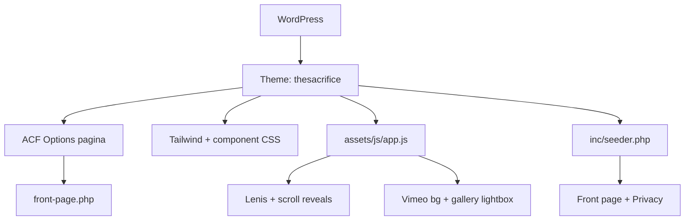

## Project Overzicht

| Detail | Waarde |
|--------|--------|
| **Klant** | The Sacrifice |
| **Type** | One-pager (documentaire / film) |
| **Status** | Actief |
| **Pad** | `/DEV/thesacrifice/wp-content/themes/thesacrifice/` |
| **Lokaal** | `thesacrifice.local` |

Engelstalige one-pager over de documentaire *The Sacrifice*. Geen navigatie, geen CPT’s, geen pagebuilder: de hele site wordt aangestuurd via één ACF options-pagina en gerenderd in `front-page.php`.

---

## Tech Stack

<Columns cols={3}>
  <Card title="WordPress + ACF Pro" icon="code">
    Options-pagina stuurt de volledige one-pager
  </Card>
  <Card title="Tailwind CSS 3.4" icon="palette">
    Utility classes + fluid tokens + component-CSS
  </Card>
  <Card title="Lenis + Vimeo Player" icon="play">
    Smooth scroll, Vimeo background-hero, gallery lightbox
  </Card>
</Columns>

---

## Huisstijl / Design Tokens

<Tabs>
  <Tab title="Kleuren" icon="palette">
    | Token | Hex | Gebruik |
    |-------|-----|---------|
    | `ink` | `#0f0f0f` | Achtergrond, donkere tekst |
    | wit | `#ffffff` | Credits-band, contactbox, tekst op donker |
    | goud (accent) | `#c3bfa2` | Accentkleur in design (niet als Tailwind-token) |
  </Tab>
  <Tab title="Typografie" icon="file-text">
    | Type | Font | Gebruik |
    |------|------|---------|
    | **Sans** (`font-sans`) | Manrope (self-hosted variable woff2) | Alle UI-tekst |
  </Tab>
  <Tab title="Layout tokens" icon="layout">
    Fluid spacing/type in `tailwind.config.js`, o.a. `py-section`, `gap-maingap`, `p-box`, `text-name`, `lg:grid-cols-main`. Max-breedte 1920px met `--gutter` (clamp tot 140px).
  </Tab>
</Tabs>

---

## Secties (geen pagebuilder)

| Sectie | Beschrijving |
|--------|-------------|
| **Hero** | Vimeo background-preview (muted/loop), titel, play = geluid aan |
| **Credits** | A film by / Year / Produced by (witte band, 3 kolommen) |
| **Main** | Description + awards links, gallery (4-koloms grid) rechts |
| **Contact-CTA** | Get in touch + e-mail + socials (witte box in footer) |
| **Copyright** | © / Privacystatement / Cookies + “by Kay” |

Content komt uit ACF options (`The Sacrifice — Pagina`): hero, credits, description, awards, gallery, PDF-download, socials, Getterms- en GA4-IDs.

---

## Custom Post Types

Geen CPT’s. Alleen de front page + een Privacystatement-pagina (via `inc/seeder.php` bij theme-activatie).

---

## Architectuur



---

## Build & Development

```bash
npm run build   # Tailwind minify → assets/css/style.css
npm run dev     # Tailwind watch
```

<Callout kind="info" title="Geen JS bundeling">
  Vendor scripts (Lenis, Vimeo Player) liggen in `assets/js/vendor/`; app-logica in `assets/js/app.js` zonder Webpack.
</Callout>

---

## Bijzonderheden

- Minimale `header.php`: alleen `<head>` + Getterms — geen site-navigatie
- Template-labels via `__()/_e()` (text-domain `thesacrifice`); front-end UI Engels
- Component-CSS gesplitst: `base.css`, `hero.css`, `components.css`, `lightbox.css`, `legal.css`
- Fallbacks in PHP zodat de pagina blijft renderen als ACF uitstaat
- Versie 1.0.0
