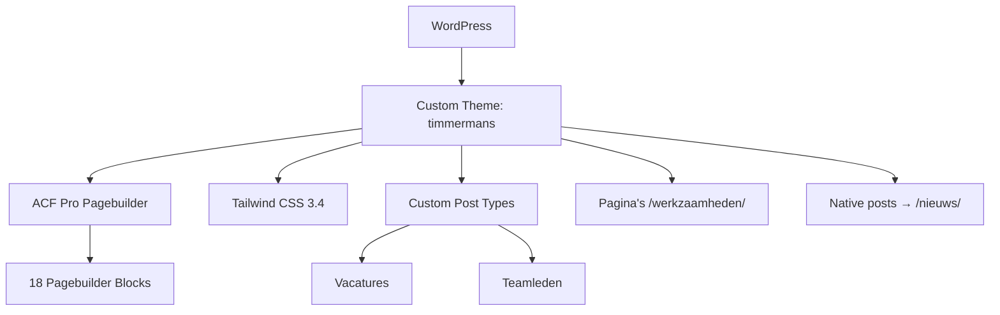

## Project Overzicht

| Detail | Waarde |
|--------|--------|
| **Klant** | Timmermans Agri Service |
| **Type** | Bedrijfswebsite (agrarische dienstverlening) |
| **Status** | Actief |
| **Pad** | `/DEV/timmermans/wp-content/themes/timmermans/` |
| **Lokaal** | `timmermans.local` |

Website voor een agrarisch dienstverlener met werkzaamheden-pagina's, nieuws, vacatures, teamoverzicht en machinepark — opgebouwd met ACF Pro pagebuilder.

---

## Tech Stack

<Columns cols={3}>
  <Card title="WordPress + ACF Pro" icon="code">
    Pagebuilder met 18 layouts
  </Card>
  <Card title="Tailwind CSS 3.4" icon="palette">
    Blauw/rood huisstijlpalet
  </Card>
  <Card title="jQuery + build:js" icon="terminal">
    Pagebuilder-JS gebundeld via Node-script
  </Card>
</Columns>

---

## Huisstijl / Design Tokens

<Tabs>
  <Tab title="Kleuren" icon="palette">
    | Token | Hex | Gebruik |
    |-------|-----|---------|
    | `primary` | `#004A99` | Primair blauw, knoppen |
    | `primary-light` | `#5B9BD5` | Lichtblauw accent |
    | `primary-dark` / `dark` | `#042140` | Donkere tekst / achtergrond |
    | `secondary` | `#E63027` | Rood accent (CTA's) |
    | `light` | `#F7F7F7` | Lichte sectie-achtergrond |
  </Tab>
  <Tab title="Typografie" icon="file-text">
    | Type | Font | Gebruik |
    |------|------|---------|
    | **Title** (`font-title`) | Titillium Web | Koppen |
    | **Sans** (`font-sans`) | Oxygen | Body tekst |
  </Tab>
</Tabs>

---

## Pagebuilder Blocks (18)

| Block | Beschrijving |
|-------|-------------|
| `hero` | Hero sectie |
| `usps` | USP-rij |
| `text-image` | Tekst naast afbeelding |
| `werkzaamheden` | Overzicht werkzaamheden |
| `werkzaamheid-detail` | Detailblok per werkzaamheid |
| `image-banner` | Afbeeldingsbanner |
| `nieuws` | Nieuwsuitgelicht uit posts |
| `vacature-cta` | CTA naar vacatures |
| `accordion` | Uitklapbare content |
| `cta-section` | Call-to-action sectie |
| `callout` | Uitgelichte melding |
| `process-steps` | Processtappen |
| `downloads` | Downloadlijst |
| `timeline` | Tijdlijn |
| `team` | Teamgrid uit CPT |
| `machinepark` | Machinepark showcase |
| `table` | Tabel |
| `gallery` | Galerij |

---

## Page Templates

| Template | Doel |
|----------|------|
| `over.php` | Over ons |
| `werkzaamheden.php` | Werkzaamheden-overzicht |
| `vacatures.php` | Vacature-overzichtspagina |
| `nieuws.php` | Nieuws-archiefpagina |
| `contact.php` | Contact |
| `in-memoriam.php` | In memoriam |
| `text.php` | Generieke tekstpagina + pagebuilder |

Werkzaamheden zijn **gewone pagina's** onder `/werkzaamheden/` (geen CPT) — o.a. Gewasverzorging, Grondbewerking, Precisie Farming.

---

## Custom Post Types

<Expandable title="Vacatures (vacatures)" default-open="true">
  | Eigenschap | Waarde |
  |-----------|--------|
  | **Rewrite** | `/vacatures/` |
  | **Archive** | Nee (overzicht = WP-pagina met `vacatures.php`) |
  | **Supports** | title, thumbnail (geen editor — inhoud via ACF) |
  | **Single** | `single-vacatures.php` |
</Expandable>

<Expandable title="Teamleden (team)" default-open="false">
  | Eigenschap | Waarde |
  |-----------|--------|
  | **Publiek** | Nee (alleen admin + pagebuilder) |
  | **Supports** | title, thumbnail, page-attributes (`menu_order`) |
  | **Doel** | Teamfoto's via het `team`-block |
</Expandable>

Native `post` is herschreven naar `/nieuws/`.

---

## Architectuur



---

## Build & Development

```bash
npm run dev          # Tailwind watch mode
npm run build        # CSS minify + pagebuilder JS bundle
npm run build:css    # Alleen CSS
npm run build:js     # Alleen JS (scripts/build-pagebuilder-js.js)
```

---

## Bijzonderheden

- Functieprefix `kj_`; text domain `timmermans`
- Globale options page **Thema instellingen** (gegevens, huisstijl, socials, topbar, vacature-bar, 404)
- Menu-highlight-fix op vacature-singles: "Vacatures" actief i.p.v. "Nieuws"
- Content seeder voor pagina's en werkzaamheden (`inc/seed-admin.php`)
- Figma: "TEST | Timmermans Agri-Service (Copy)"
