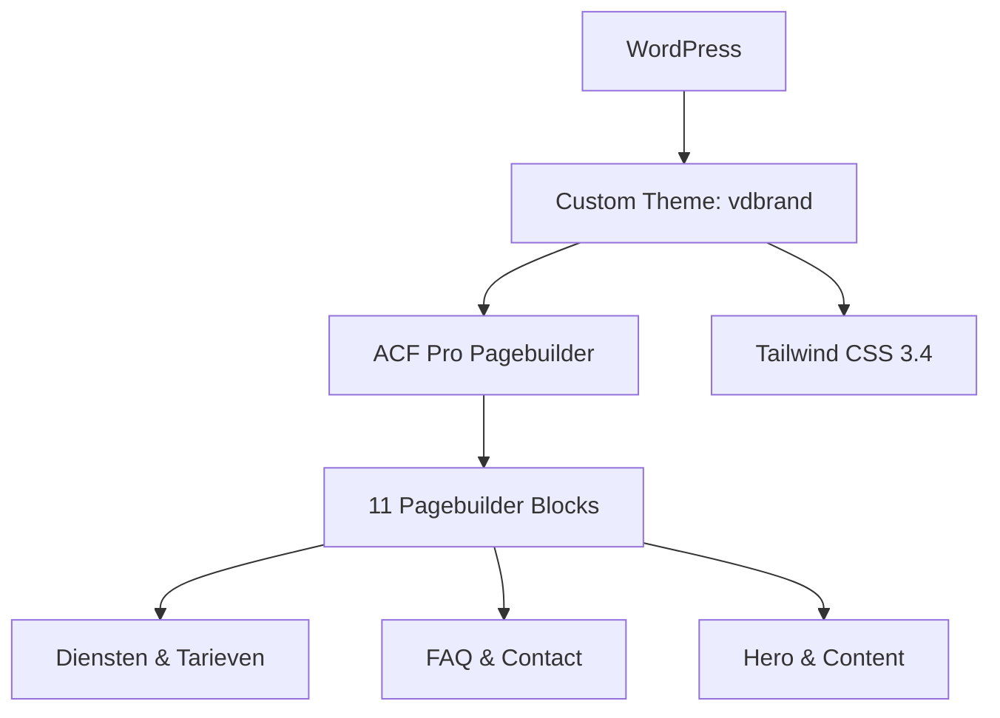

## Project Overzicht

| Detail | Waarde |
|--------|--------|
| **Klant** | Van den Brand Fysio en Training |
| **Type** | Bedrijfswebsite (fysiotherapie) |
| **Status** | Actief |
| **Pad** | `/DEV/vdbrand/wp-content/themes/vdbrand/` |

Compacte website voor een fysiotherapiepraktijk. Opgebouwd als een single-page site zonder Custom Post Types — alle content wordt beheerd via pagebuilder blocks met focus op diensten, tarieven en contactinformatie.

---

## Tech Stack

<Columns cols={3}>
  <Card title="WordPress + ACF Pro" icon="code">
    Pagebuilder met 11 blocks
  </Card>
  <Card title="Tailwind CSS 3.4" icon="palette">
    Teal/turquoise kleurenpalet
  </Card>
  <Card title="Lichtgewicht" icon="zap">
    Geen CPTs, geen extra plugins
  </Card>
</Columns>

---

## Huisstijl / Design Tokens

<Tabs>
  <Tab title="Kleuren" icon="palette">
    | Token | Hex | Gebruik |
    |-------|-----|---------|
    | `primary` | `#1DB19B` | Primair teal |
    | `primary-dark` | `#147D6D` | Donker teal (hover) |
    | `primary-light` | `#E0F7F5` | Licht teal achtergrond |
    | `secondary` | `#147D6D` | Secundaire kleur |
    | `orange` | `#ff9c00` | Accent oranje |
    | `orange-dark` | `#e68900` | Donker oranje (hover) |
    | `grey-dark` | `#191919` | Donkere tekst |
    | `grey` | `#4A4A4A` | Standaard tekst |
    | `grey-light` | `#F4F7F7` | Lichte achtergrond |
    | `grey-text` | `#6D6D6D` | Subtiele tekst |
  </Tab>
  <Tab title="Typografie" icon="file-text">
    | Type | Font | Gebruik |
    |------|------|---------|
    | **Sans** (`font-sans`) | Open Sans | Body tekst |
    | **Button** (`font-button`) | Montserrat | Knoppen |
    | **Title** (`font-title`) | Montserrat | Koppen en titels |
  </Tab>
</Tabs>

---

## Pagebuilder Blocks (11)

| Block | Beschrijving |
|-------|-------------|
| `hero` | Hero sectie |
| `text-image` | Tekst naast afbeelding |
| `text` | Tekst-only sectie |
| `call-to-action` | CTA met buttons |
| `page-title` | Pagina titel / sectie header |
| `services-grid` | Diensten overzicht in grid |
| `pricing` | Prijstabel |
| `tarieven` | Tarieven overzicht |
| `text-faq` | FAQ accordion met tekst |
| `afbeeldingen` | Afbeeldingen galerij |
| `contact` | Contact sectie met formulier |

---

## Custom Post Types

<Callout kind="info" title="Geen CPTs actief">
  Dit is een single-page site. De post-types.php bevat template code voor projecten, vacatures en reviews, maar alle CPTs zijn **uitgeschakeld** (early return in de registratie functie).
</Callout>

---

## Architectuur



---

## Build & Development

```bash
npm run dev          # Tailwind watch mode
npm run build        # CSS + JS build
npm run build:css    # Alleen CSS
npm run build:js     # Alleen JS (pagebuilder blocks)
```

---

## Bijzonderheden

- Single-page site — geen Custom Post Types
- Prijzen/tarieven blocks (`pricing` + `tarieven`) specifiek voor fysiotherapie
- Dubbel kleurenpalet: teal (primair) + oranje (accent)
- Montserrat voor koppen en knoppen, Open Sans voor body
- FAQ block (`text-faq`) combineert tekst met accordion
- Compacte, gestroomlijnde site zonder extra complexiteit
