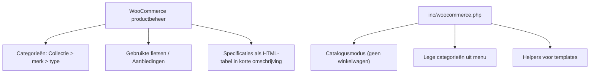

## Project Overzicht

| Detail | Waarde |
|--------|--------|
| **Klant** | Verbong Tweewielers (Grubbenvorst) |
| **Type** | Redesign: volledige herbouw, Avada eruit |
| **Website** | [verbongtweewielers.nl](https://verbongtweewielers.nl) (nog de oude site) |
| **Status** | Bouw: lokaal gevuld en werkend, nog niet op staging |
| **Gestart** | September 2026 |
| **Lokaal** | `verbongtweewielers.local` |
| **Code** | `/DEV/verbongtweewielers/wp-content/themes/verbongtweewielers/` |
| **Repo** | [github.com/kayjilesen/verbongtweewielers](https://github.com/kayjilesen/verbongtweewielers) (privé) |
| **Klantdossier** | `Dropbox/Projects/Verbong Tweewielers/` |

De bestaande site draaide op Avada met Fusion Builder, Slider Revolution en een handvol losse plugins. Die is opnieuw gebouwd in een eigen thema. Uitgangspunt: **de site ziet er hetzelfde uit en werkt hetzelfde**, en het beheer van de fietsen verandert niet voor de klant.

<Callout kind="info" title="Uitgangspunten">
  - Kleuren, fonts en maten komen uit de Avada-instellingen van de oude site.
  - WooCommerce blijft voor de producten, zonder extra velden of eigen post type.
  - Adressen `/product/...` en `/categorie/...` blijven gelijk aan de oude site.
  - Oude plugins worden waar mogelijk vervangen door simpele themacode.
</Callout>

---

## Tech Stack

<Columns cols={3}>
  <Card title="WordPress + ACF" icon="code">
    Eigen thema, ACF Pro + ACF Extended Pro pagebuilder (JSON sync)
  </Card>
  <Card title="Frontend" icon="palette">
    Tailwind CSS 3, gebundelde blok-JS, zelf gehoste fonts
  </Card>
  <Card title="Plugins" icon="package">
    WooCommerce (catalogus), SureForms, SureRank Pro, FluentSMTP, Smush Pro, WPvivid
  </Card>
</Columns>

---

## Huisstijl

<Tabs>
  <Tab title="Kleuren" icon="palette">
    | Tailwind | Hex | Gebruik |
    |----------|-----|---------|
    | `primary` | `#000000` | Topbalk, footer, knoppen, koppen |
    | `secondary` | `#E74131` | Rood accent: links, actief menu-item, aanbiedingslabel |
    | `light` | `#F9F9FB` | Lichte secties, formuliervelden |
    | `dark` | `#111111` | Lopende tekst, copyrightbalk |
    | `line` | `#E0DEDE` | Randen en scheidingslijnen |
    | `muted` | `#8C8989` | Footertekst, bijschriften |
  </Tab>
  <Tab title="Typografie" icon="file-text">
    | Rol | Font |
    |-----|------|
    | Koppen en menu | Montserrat 400–700 |
    | Broodtekst | Open Sans 400–700 |

    Maten van de oude site: tekst 14px / 1.8, H1 30px, H2 18px, H3 16px, menu 15px in hoofdletters, inhoudsbreedte 1100px.
  </Tab>
</Tabs>

---

## Blokken & Templates

Pagebuilder-blokken in `templates/pagebuilder/`, elk met een eigen `group_layout_*`:

| Blok | Doel |
|------|------|
| `slider` | Homepage-slider (vervangt Slider Revolution), verhouding breedte × 0,637, max 800px |
| `tekst`, `tekst-beeld` | Tekstsecties, met of zonder afbeelding |
| `fietsoverzicht` | Productoverzicht uit WooCommerce |
| `formulier` | SureForms-formulier via `kj_formulier( $id )` |
| `kaart` | Locatiekaart (vervangt de kaartplugin) |
| `openingstijden` | Openingstijden uit de optiepagina Algemeen |
| `reviews`, `faq`, `logo-grid`, `cta` | Overige contentblokken |

Daarnaast:

- **Titelbalk** op elke pagina (240px, mobiel 140px, parallax-foto). Per pagina een eigen achtergrond via `group_page_titelbalk`; leeg = standaardfoto.
- **WooCommerce-templates** `woocommerce/archive-product.php` en `single-product.php` met eigen markup, zonder WooCommerce-hooks. Overzicht filtert zonder herladen.

---

## WooCommerce als catalogus



- **Catalogusmodus** in themacode vervangt YITH Catalog Mode: geen winkelwagen of afrekenen.
- **Lege categorieën** vallen automatisch uit de menu's (filter op `wp_nav_menu_objects`) en komen terug zodra er een gepubliceerde fiets in staat.
- Het merk in het Product-schema komt uit `inc/surerank.php`.

---

## Import via WP-CLI

De volledige inhoud van de oude site staat als data in `data/import/` (`inhoud.json`, `producten.json`, `categorieen.json`, `seo.json`, `media/`). Het commando is idempotent: opnieuw draaien werkt bestaande items bij.

```bash
# Alles: instellingen, formulieren, producten, inhoud, SEO
wp verbong alles --media=<map met uploads>

# Losse onderdelen
wp verbong instellingen
wp verbong formulieren
wp verbong producten
wp verbong inhoud
wp verbong seo

# Gebruikers met wachtwoord-hash (zit niet in 'alles')
wp verbong gebruikers <export.json>
```

<Callout kind="warning" title="Gebruikersexport">
  De export met wachtwoord-hashes hoort niet in het thema of in Git. Bewaar hem buiten de repo.
</Callout>

<Expandable title="Details producten-import" default-open="false">
  - Bron is de WooCommerce-export van de live site; die is leidend boven eerder gescrapete data.
  - Producten worden gekoppeld via `_kj_oud_id`. Bronpad van afbeeldingen staat in `_kj_bron_pad`.
  - `wp verbong producten` laat de status van bestaande producten met rust en publiceert alleen nieuwe.
  - Kalkhoff-modellen (oud_id 9101–9134) worden als concept aangemaakt.
  - Productslugs zijn opgeschoond; de redirects staan in een SureRank-importbestand.
</Expandable>

---

## Formulieren, SEO en redirects

| Onderdeel | Oplossing |
|-----------|-----------|
| **Formulieren** | SureForms (vervangt Contact Form 7). Definities in `inc/formulieren.php`, aangemaakt met `wp verbong formulieren`. |
| **SEO** | SureRank Pro. Titels, omschrijvingen, schema's en redirects in `data/import/seo.json`, gezet met `wp verbong seo`. |
| **Winkelschema** | Adres, telefoon en openingstijden uit de optiepagina Algemeen. Na een wijziging daar `wp verbong seo` opnieuw draaien. |
| **Redirects** | Gewone regels via SureRank-import; wildcard-regels (`/afrekenen/*`, `/mijn-account/*`, `/element_category/*`) in `inc/redirects.php`. |

---

## Hosting & Deployment

| Item | Details |
|------|---------|
| **Hosting** | Hetzner via xCloud |
| **CDN** | Bunny.net |
| **Staging** | Nog niet ingericht |
| **Deployment** | Geen CI/CD in dit thema (bewuste keuze) |

<Callout kind="tip" title="Livegang-aanpak">
  De live site draait al op xCloud. Het nieuwe thema kan in de bestaande installatie, zodat de producten van de klant blijven staan. Daarna `wp verbong` draaien voor inhoud, formulieren en SEO.
</Callout>

---

## Build & Development

```bash
cd wp-content/themes/verbongtweewielers
npm run dev     # Tailwind watch
npm run build   # CSS + blok-JS
```

`wp-cli.yml` (`path: ../../..`) staat in de theme-map, dus `wp` werkt daar direct.

---

## Bijzonderheden

- Functieprefix `kj_`, BEM + Tailwind, geen media queries in CSS.
- Nieuw ten opzichte van de oude site: pagina Fiets leasen, merk Kalkhoff, "Volg ons" (Instagram) in de footer.
- Batavus, Sparta en Loekie zijn uit menu en Fietsmerken gehaald; producten en categorieën bestaan nog.
- Besluiten en klantfeedback staan in `00 Project/logboek.md` van het klantdossier, open punten in `todo.md`.

## Inloggegevens & Toegang

<Callout kind="warning" title="Gevoelige informatie">
  Sla geen wachtwoorden op in de documentatie. Verwijs naar de wachtwoordmanager.
</Callout>

- **WordPress admin**: verbongtweewielers.nl/wp-admin
- **Hosting**: xCloud-dashboard
