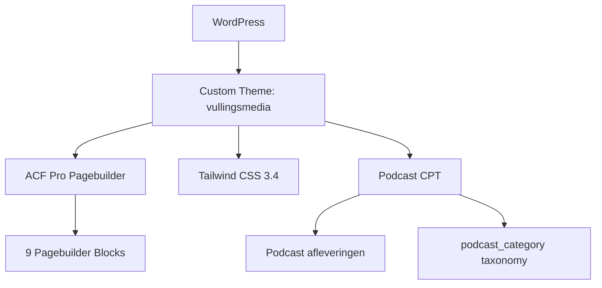

## Project Overzicht

| Detail | Waarde |
|--------|--------|
| **Klant** | Vullings Media |
| **Type** | Agency website (media / marketing) |
| **Status** | Actief |
| **Pad** | `/DEV/vullingsmedia/wp-content/themes/vullingsmedia/` |

Website voor een media-agency met een prominente podcast sectie, diensten overzicht, en bedrijfsinformatie. Gebruikt een opvallend geel/zwart kleurenpalet met drie verschillende fonts.

---

## Tech Stack

<Columns cols={3}>
  <Card title="WordPress + ACF Pro" icon="code">
    Pagebuilder met 9 blocks + Podcast CPT
  </Card>
  <Card title="Tailwind CSS 3.4" icon="palette">
    Minimaal kleurenpalet (bright yellow)
  </Card>
  <Card title="ESLint + Husky" icon="terminal">
    Code quality met pre-commit hooks
  </Card>
</Columns>

---

## Huisstijl / Design Tokens

<Tabs>
  <Tab title="Kleuren" icon="palette">
    | Token | Hex | Gebruik |
    |-------|-----|---------|
    | `primary` | `#DDDD47` | Bright yellow — primaire kleur |

    <Callout kind="info" title="Minimaal kleurenpalet">
      Dit project gebruikt slechts één custom kleur. Overige kleuren komen uit Tailwind's standaard palette (black, white, grey).
    </Callout>
  </Tab>
  <Tab title="Typografie" icon="file-text">
    | Type | Font | Gebruik |
    |------|------|---------|
    | **Sans** (`font-sans`) | Figtree | Body tekst |
    | **Title** (`font-title`) | Anton | Grote koppen (bold, impactvol) |
    | **Mono** (`font-mono`) | Azeret Mono | Code, labels, accenten |

    Drie fonts geven een sterk visueel contrast — Anton voor impact, Figtree voor leesbaarheid, Azeret Mono voor technische uitstraling.
  </Tab>
</Tabs>

---

## Pagebuilder Blocks (9)

| Block | Beschrijving |
|-------|-------------|
| `hero` | Hero sectie |
| `text-image` | Tekst naast afbeelding |
| `cta` | Call-to-action |
| `diensten` | Diensten grid |
| `over` | Over ons sectie |
| `cijfers` | Statistieken / nummers |
| `logos` | Partner logos |
| `image` | Afbeelding sectie |
| `podcasts` | Podcast afleveringen overzicht |

---

## Custom Post Types

<Expandable title="Podcasts (podcast)" default-open="true">
  | Eigenschap | Waarde |
  |-----------|--------|
  | **Slug** | `podcast` |
  | **Rewrite** | `/podcasts/` |
  | **Archive** | Nee |
  | **Supports** | title, editor, thumbnail, excerpt, custom-fields |
  | **Taxonomy** | `podcast_category` |
  | **Menu icon** | `dashicons-microphone` |

  **Taxonomy:**
  - `podcast_category` — Categorisering van afleveringen
  - Rewrite: `podcasts/categorie/`
</Expandable>

---

## Architectuur



---

## Build & Development

```bash
npm run dev          # Tailwind watch mode
npm run build        # CSS + JS build
npm run lint:js      # ESLint check
npm run lint:js:fix  # ESLint auto-fix
```

---

## Bijzonderheden

- Podcast als centraal content type met eigen taxonomy
- Minimaal kleurenpalet — slechts 1 custom kleur (#DDDD47)
- Drie contrasterende fonts (Anton, Figtree, Azeret Mono)
- ESLint + Husky pre-commit hooks
- Compacte site met 9 blocks — gericht op agency presentatie
