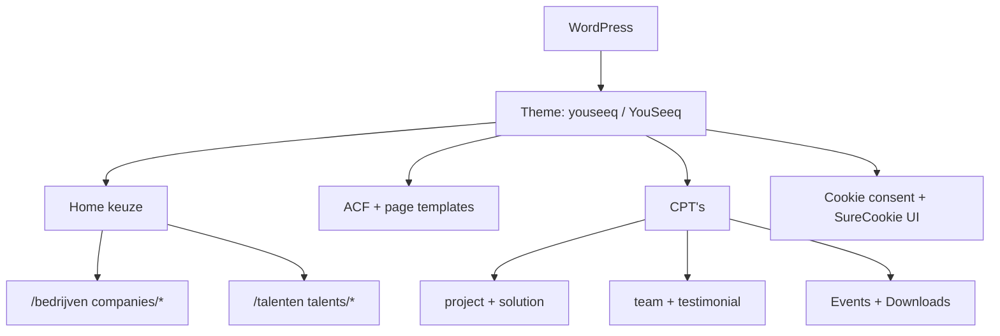

## Project Overzicht

| Detail | Waarde |
|--------|--------|
| **Klant** | YouSeeq |
| **Type** | Dual-audience bedrijfswebsite (recruitment / matching) |
| **Status** | Actief |
| **Domein** | youseeq.nl |
| **Pad** | `/DEV/youseeq/wp-content/themes/youseeq/` |
| **Lokaal** | `youseeq.local` |

Theme Name in `style.css`: **YouSeeq**. Bezoekers kiezen op de home tussen **Bedrijf** en **Talent**; daarna sessie-redirect naar `/bedrijven` of `/talenten`. Aparte template-sets onder `templates/companies/` en `templates/talents/`.

---

## Tech Stack

<Columns cols={3}>
  <Card title="WordPress + ACF Pro" icon="code">
    Page templates, CPT’s, options + cookie consent
  </Card>
  <Card title="Tailwind CSS 3.4" icon="palette">
    Pink/blue palet, Avenir typografie
  </Card>
  <Card title="Swiper" icon="layers">
    Carousels in frontend JS
  </Card>
</Columns>

---

## Huisstijl / Design Tokens

<Tabs>
  <Tab title="Kleuren" icon="palette">
    | Token | Hex | Gebruik |
    |-------|-----|---------|
    | `pink` | `#E9A685` | Primair accent, titels |
    | `pink-light` | `#FFF3ED` | Lichte roze achtergrond |
    | `blue` | `#133247` | Donkerblauw, contrast |
    | `black` | `#000000` | Hero / dark sections |
    | `white` | `#ffffff` | Lichte vlakken, tekst |
  </Tab>
  <Tab title="Typografie" icon="file-text">
    | Type | Font | Gebruik |
    |------|------|---------|
    | **Sans** (`font-sans`) | Avenir | Body en koppen |
    | **Serif** | ui-serif stack | Fallback serif |
  </Tab>
</Tabs>

---

## Page Templates & Audience Split

| Template | Pad | Doel |
|----------|-----|------|
| Home (Keuze) | `templates/home.php` | Keuze Bedrijf / Talent + sessie |
| Companies home | `templates/companies/home.php` | Bedrijven-landingspagina |
| Companies solutions | `templates/companies/solutions.php` | Oplossingen voor bedrijven |
| Companies insights | `templates/companies/insights.php` | Insights voor bedrijven |
| Talents home | `templates/talents/home.php` | Talent-landingspagina (+ jobs) |
| Studenten Yup | `templates/talents/studenten-yup.php` | Studentenprogramma |
| SOS | `templates/talents/sos.php` | SOS-sectie talenten |
| Team / Cultuur / Verhaal | `team.php`, `cultuur.php`, `verhaal.php` | Over YouSeeq |
| Projecten / Oplossingen | `projecten.php`, `oplossingen.php`, singles | Portfolio & product |
| Blog / Contact | `blog.php`, `contact.php` | Content & contact |

Herbruikbare partials in `templates/blocks/`: `card-event`, `card-insight`, `card-job`, `card-sos`, `geboden`, `hexagon-image`, e.a.

---

## Custom Post Types

<Expandable title="Projecten (project)" default-open="true">
  | Eigenschap | Waarde |
  |-----------|--------|
  | **Rewrite** | `/project/` |
  | **Archive** | Nee |
</Expandable>

<Expandable title="Oplossingen (solution)" default-open="false">
  | Eigenschap | Waarde |
  |-----------|--------|
  | **Rewrite** | `/oplossing/` |
  | **Archive** | Nee |
</Expandable>

<Expandable title="Team (team)" default-open="false">
  | Eigenschap | Waarde |
  |-----------|--------|
  | **Rewrite** | `/team/` |
  | **Archive** | Nee |
</Expandable>

<Expandable title="Klantervaringen (testimonial)" default-open="false">
  | Eigenschap | Waarde |
  |-----------|--------|
  | **Rewrite** | `/testimonial/` |
  | **Archive** | Nee |
</Expandable>

<Expandable title="Events (Events)" default-open="false">
  | Eigenschap | Waarde |
  |-----------|--------|
  | **Rewrite** | `/events/` |
  | **Archive** | Ja (`archive-events.php`) |
  | **Taxonomy** | `event-category` → `/events-category/` |
</Expandable>

<Expandable title="Downloads (Downloads)" default-open="false">
  | Eigenschap | Waarde |
  |-----------|--------|
  | **Rewrite** | `/downloads/` |
  | **Archive** | Ja |
  | **Single** | `single-downloads.php` |
</Expandable>

Vacatures gebruiken post type `job` (template `archive-job.php`); registratie zit buiten de theme-CPT files (CPT UI / elders) maar wordt in talents-templates bevraagd.

---

## Architectuur



---

## Build & Development

```bash
npm run build   # Tailwind minify → dist/css/style.css
npm run dev     # Tailwind watch → assets/css/style.css
```

---

## Bijzonderheden

- Dual-audience via `$_SESSION['user_type']` (`bedrijven` / `talent`) op de keuzepagina
- Hexagon-beeldtaal (`hexagon-image` block) als herkenbaar UI-element
- Theme cookie consent (`inc/cookie-consent.php` + `templates/components/cookie-dropdown.php`)
- `inc/woocommerce.php` aanwezig voor eventuele shop-hooks
- Font Awesome chevrons in keuze-CTA’s
- Versie 1.0
