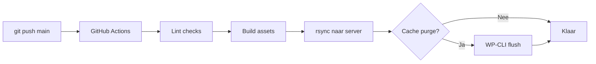

## Overzicht

Een CI/CD pipeline automatiseert code quality checks, builds en deployment bij elke push naar `main`. De setup bestaat uit GitHub Actions voor de pipeline, ESLint voor JavaScript linting, Husky voor pre-commit hooks, en rsync over SSH voor deployment.

<Callout kind="info" title="Vereisten">
  - GitHub repository gekoppeld aan het project
  - SSH toegang tot de productieserver
  - Node.js project met build setup (Tailwind CSS)
</Callout>

---

## Pipeline Flow



---

## Setup Stappen

<Steps>
  <Step title="SSH key genereren" icon="key">
    Genereer een dedicated deploy key per project. Gebruik de projectnaam in de bestandsnaam zodat keys overzichtelijk blijven.

    ```bash
    ssh-keygen -t rsa -b 4096 -C "github-deploy" -f ~/.ssh/github_deploy_PROJECTNAAM -N ""
    ```

    Dit maakt twee bestanden:
    - `~/.ssh/github_deploy_PROJECTNAAM` — Private key (voor GitHub)
    - `~/.ssh/github_deploy_PROJECTNAAM.pub` — Public key (voor server)

    <Callout kind="warning" title="Beveiliging">
      Deel de private key nooit. Gebruik per project een unieke key zodat je toegang per site kunt intrekken.
    </Callout>
  </Step>

  <Step title="Public key op server plaatsen" icon="server">
    Voeg de public key toe aan de server zodat GitHub Actions via SSH kan verbinden.

    Kopieer eerst de public key:
    ```bash
    cat ~/.ssh/github_deploy_PROJECTNAAM.pub
    ```

    <Tabs>
      <Tab title="Via SSH" icon="terminal">
        ```bash
        # Voeg toe aan authorized_keys op de server
        ssh user@server.nl "echo 'PLAK_PUBLIC_KEY_HIER' >> ~/.ssh/authorized_keys"
        ```
      </Tab>
      <Tab title="Via hosting panel" icon="globe">
        De meeste hosting panels (DirectAdmin, cPanel, Plesk) hebben een **SSH Keys** sectie waar je de public key kunt uploaden.
      </Tab>
    </Tabs>
  </Step>

  <Step title="GitHub Secrets configureren" icon="shield">
    Ga naar je repository: **Settings → Secrets and variables → Actions** en voeg deze secrets toe:

    | Secret | Waarde | Voorbeeld |
    |--------|--------|-----------|
    | `SSH_PRIVATE_KEY` | Volledige inhoud van de private key | `cat ~/.ssh/github_deploy_PROJECTNAAM` |
    | `FTP_SERVER` | Server hostname | `server.hosting.nl` |
    | `FTP_USER` | SSH/SFTP username | `projectnaam` |

    <Callout kind="tip" title="Private key kopiëren">
      Kopieer de **volledige** inhoud inclusief `-----BEGIN` en `-----END` regels:
      ```bash
      cat ~/.ssh/github_deploy_PROJECTNAAM | pbcopy
      ```
    </Callout>
  </Step>

  <Step title="GitHub Actions workflow aanmaken" icon="git-branch">
    Maak het bestand `.github/workflows/ci.yml` aan:

    ```yaml
    name: CI/CD Pipeline

    on:
      push:
        branches: [main]

    jobs:
      deploy:
        runs-on: ubuntu-latest

        steps:
          - name: Checkout code
            uses: actions/checkout@v4

          - name: Setup Node.js
            uses: actions/setup-node@v4
            with:
              node-version: "20"
              cache: "npm"

          - name: Install dependencies
            run: npm ci

          - name: Lint JavaScript
            run: npm run lint:js

          - name: Build assets
            run: npm run build

          - name: Deploy via rsync
            uses: burnett01/rsync-deployments@7.0.1
            with:
              switches: -avz --delete
                --exclude=".git/"
                --exclude=".github/"
                --exclude="node_modules/"
                --exclude=".DS_Store"
                --exclude="package.json"
                --exclude="package-lock.json"
                --exclude="tailwind.config.js"
                --exclude="postcss.config.js"
                --exclude=".eslintrc.json"
                --exclude=".gitignore"
              path: ./
              remote_path: /pad/naar/wp-content/themes/theme-naam/
              remote_host: ${{ secrets.FTP_SERVER }}
              remote_user: ${{ secrets.FTP_USER }}
              remote_key: ${{ secrets.SSH_PRIVATE_KEY }}
    ```

    <Callout kind="warning" title="Paden aanpassen">
      Pas `remote_path` aan naar het juiste pad op de server. Dit is het volledige pad naar de theme directory.
    </Callout>
  </Step>

  <Step title="ESLint configureren" icon="check-circle">
    Maak `.eslintrc.json` aan in de projectroot:

    ```json
    {
      "env": {
        "browser": true,
        "es2021": true,
        "jquery": true
      },
      "extends": "eslint:recommended",
      "parserOptions": {
        "ecmaVersion": "latest",
        "sourceType": "module"
      },
      "globals": {
        "wp": "readonly"
      },
      "rules": {
        "no-unused-vars": "warn",
        "no-console": "warn"
      }
    }
    ```
  </Step>

  <Step title="Package.json scripts toevoegen" icon="file-text">
    Voeg de volgende scripts toe aan `package.json`:

    ```json
    {
      "scripts": {
        "lint:js": "eslint 'assets/js/**/*.js'",
        "lint:js:fix": "eslint 'assets/js/**/*.js' --fix",
        "lint:php": "find . -name '*.php' -not -path './vendor/*' -not -path './node_modules/*' -exec php -l {} \\;",
        "lint": "npm-run-all lint:js lint:php",
        "prepare": "husky"
      },
      "lint-staged": {
        "*.php": "php -l",
        "*.js": "eslint --no-warn-ignored"
      }
    }
    ```
  </Step>

  <Step title="NPM packages installeren" icon="package">
    ```bash
    npm install --save-dev eslint husky lint-staged
    npx husky init
    ```

    Dit installeert de tools en maakt de `.husky/` directory aan met een standaard pre-commit hook.
  </Step>

  <Step title="Husky pre-commit hook instellen" icon="zap">
    Pas `.husky/pre-commit` aan:

    ```bash
    npx lint-staged
    npm run build
    ```

    Dit zorgt ervoor dat bij elke commit:
    1. **lint-staged** ESLint draait op gewijzigde `.js` bestanden en PHP syntax checkt
    2. **npm run build** CSS en JS opnieuw compileert

    <Callout kind="tip" title="Gefaalde commit">
      Als de pre-commit hook faalt, fix de gemelde issues en probeer de commit opnieuw. De hook blokkeert commits met linting errors.
    </Callout>
  </Step>

  <Step title="Testen" icon="check-circle">
    Verifieer dat alles werkt:

    ```bash
    # Lokaal lint testen
    npm run lint

    # Lokaal build testen
    npm run build

    # Commit en push om de pipeline te triggeren
    git add .
    git commit -m "Add CI/CD pipeline"
    git push origin main
    ```

    Check de pipeline status via **GitHub → Actions** tab.
  </Step>
</Steps>

---

## Cache Purge na Deploy

Optioneel kan de workflow automatisch de cache legen na deployment via WP-CLI over SSH.

Voeg deze stap toe aan het workflow bestand, na de rsync deploy stap:

```yaml
- name: Purge cache
  run: |
    mkdir -p ~/.ssh
    echo "${{ secrets.SSH_PRIVATE_KEY }}" > ~/.ssh/deploy_key
    chmod 600 ~/.ssh/deploy_key
    ssh -o StrictHostKeyChecking=no -i ~/.ssh/deploy_key \
      ${{ secrets.FTP_USER }}@${{ secrets.FTP_SERVER }} \
      "cd /pad/naar/wordpress && wp cache flush"
```

<Expandable title="WP-CLI commando's per cache plugin">

| Cache Plugin | Commando |
|--------------|----------|
| Redis Object Cache | `wp cache flush` |
| LiteSpeed Cache | `wp litespeed-purge all` |
| WP Rocket | `wp rocket clean --confirm` |
| W3 Total Cache | `wp w3-total-cache flush all` |
| WP Super Cache | `wp super-cache flush` |

**Let op:** FastCGI/Nginx cache wordt meestal automatisch geïnvalideerd bij file changes.

</Expandable>

---

## Dependabot

Voeg `.github/dependabot.yml` toe voor automatische dependency updates:

```yaml
version: 2
updates:
  - package-ecosystem: "npm"
    directory: "/"
    schedule:
      interval: "weekly"
    open-pull-requests-limit: 5

  - package-ecosystem: "github-actions"
    directory: "/"
    schedule:
      interval: "weekly"
    open-pull-requests-limit: 3
```

Dit houdt zowel NPM packages als GitHub Actions automatisch up-to-date.

---

## Checklist Nieuwe Site

Gebruik deze checklist bij het opzetten van CI/CD voor een nieuw project:

| # | Taak | Details |
|---|------|---------|
| 1 | SSH key genereren | `ssh-keygen -t rsa -b 4096 -f ~/.ssh/github_deploy_PROJECTNAAM` |
| 2 | Public key op server | Via SSH of hosting panel |
| 3 | GitHub Secrets toevoegen | `SSH_PRIVATE_KEY`, `FTP_SERVER`, `FTP_USER` |
| 4 | `.github/workflows/ci.yml` | Workflow aanmaken, paden aanpassen |
| 5 | `.eslintrc.json` | ESLint configuratie |
| 6 | `.github/dependabot.yml` | Automatische dependency updates |
| 7 | NPM packages | `npm i -D eslint husky lint-staged` |
| 8 | Package.json scripts | `lint:js`, `lint:php`, `lint`, `prepare` |
| 9 | Husky init | `npx husky init` + pre-commit hook aanpassen |
| 10 | Server pad aanpassen | `remote_path` in workflow |
| 11 | Cache purge configureren | Pas WP-CLI commando aan voor gebruikte cache plugin |
| 12 | Testen met push | Push naar `main` en check GitHub Actions |

---

## Troubleshooting

<Expandable title="Pipeline faalt op 'Lint JavaScript'">
  ESLint errors blokkeren de pipeline. Fix lokaal met:

  ```bash
  npm run lint:js:fix
  ```

  Review daarna de resterende errors handmatig en commit opnieuw.
</Expandable>

<Expandable title="rsync: Permission denied">
  Controleer:
  - Is de **private key** correct gekopieerd in `SSH_PRIVATE_KEY` (inclusief BEGIN/END regels)?
  - Staat de **public key** in `~/.ssh/authorized_keys` op de server?
  - Klopt de `FTP_USER` en `FTP_SERVER`?

  Test lokaal:
  ```bash
  ssh -i ~/.ssh/github_deploy_PROJECTNAAM user@server.nl
  ```
</Expandable>

<Expandable title="Build faalt: Tailwind CSS errors">
  Controleer of `tailwind.config.js` en `postcss.config.js` correct zijn en dat de `content` paden kloppen.

  ```bash
  npm run build
  ```

  Als het lokaal wel werkt maar in de pipeline niet, check of alle dependencies in `package.json` staan (niet alleen globaal geïnstalleerd).
</Expandable>

<Expandable title="Cache purge werkt niet">
  - Controleer of WP-CLI beschikbaar is op de server: `which wp`
  - Controleer of het WordPress pad klopt in het SSH commando
  - Sommige hosting providers blokkeren SSH command execution — gebruik dan een webhook of cron-based oplossing
</Expandable>

---

## Gerelateerd

<Columns cols={3}>
  <Card title="Deployment" icon="upload" href="/devops/deployment">
    Deployment methodes en na-deploy checklist.
  </Card>
  <Card title="Git Workflow" icon="git-branch" href="/devops/git-workflow">
    Commit conventies en dagelijkse workflow.
  </Card>
  <Card title="Tailwind CSS Setup" icon="palette" href="/wordpress/tailwind-setup">
    Build tools configuratie voor Tailwind CSS.
  </Card>
</Columns>
