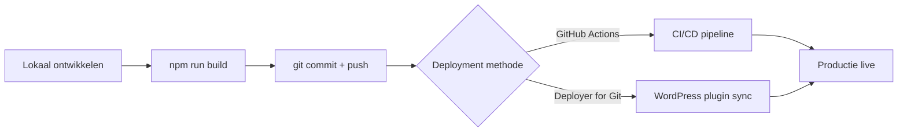

## Overzicht

Deployments zijn altijd geautomatiseerd — nooit handmatig via (S)FTP. Er zijn twee methodes: **GitHub Actions** (CI/CD pipeline) of de **Deployer for Git** WordPress plugin.

---

## Standaard Deployment Flow



<Steps>
  <Step title="Build assets" icon="terminal">
    ```bash
    npm run build
    ```
    Compileer CSS en bundel JavaScript lokaal.
  </Step>
  <Step title="Commit en push" icon="git-branch">
    ```bash
    git add .
    git commit -m "Update: beschrijving van wijzigingen"
    git push origin main
    ```
  </Step>
  <Step title="Deploy naar server" icon="upload">
    De deploy wordt automatisch getriggerd via GitHub Actions (bij push naar `main`) of handmatig via de Deployer for Git plugin in WordPress.
  </Step>
  <Step title="Controleer productie" icon="check-circle">
    Open de live site en controleer of alle wijzigingen correct zijn doorgevoerd. Let op:
    - CSS correct geladen (cache busting via `filemtime()`)
    - Nieuwe blocks zichtbaar
    - ACF velden gesynchroniseerd
  </Step>
</Steps>

---

## Deployment Methodes

<Tabs>
  <Tab title="GitHub Actions" icon="git-branch">
    Geautomatiseerde deployment bij push naar `main` via een CI/CD pipeline. Configuratie via `.github/workflows/deploy.yml`.

    De workflow draait typisch:
    1. Lint checks (ESLint, Stylelint)
    2. Build assets (`npm run build`)
    3. Deploy via rsync over SSH naar de server

    Zie de CI/CD skill documentatie voor volledige setup.
  </Tab>
  <Tab title="Deployer for Git" icon="upload">
    De **Deployer for Git** WordPress plugin deployt automatisch vanuit een Git repository naar de server.

    **Setup:**
    1. Installeer de plugin op de productieserver
    2. Koppel de GitHub repository
    3. Configureer welke branch (meestal `main`) wordt gedeployed
    4. Bij een push naar de gekoppelde branch wordt de code automatisch gesynchroniseerd

    Dit is de eenvoudigste optie voor projecten zonder CI/CD pipeline.
  </Tab>
</Tabs>

---

## Na Deployment Checklist

| Check | Beschrijving |
|-------|-------------|
| Site laden | Pagina's laden zonder errors |
| CSS check | Styling correct (geen cache issues) |
| JS check | Interactieve elementen werken |
| ACF sync | Veldgroepen gesynchroniseerd in admin |
| Responsive | Mobiel en desktop correct |
| Formulieren | Contactformulieren verzenden |
| SEO | Meta tags en schema markup aanwezig |

---

## Productie vs Lokaal

De `kj_is_live_domain()` functie schakelt automatisch tussen omgevingen:

| Feature | Lokaal | Productie |
|---------|--------|-----------|
| Auto-updates | Ingeschakeld | Uitgeschakeld |
| Update emails | Uitgeschakeld | Uitgeschakeld |
| Error reporting | Aan (debug) | Uit |
| CSS pad | `assets/css/style.css` | `assets/css/style.css` of `dist/css/style.css` |

<Callout kind="warning" title="Wachtwoorden">
  Sla server credentials nooit op in documentatie of code. Gebruik een wachtwoordmanager.
</Callout>
