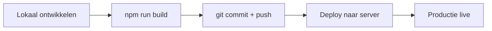

## Overzicht

Deployment verschilt per project maar volgt een standaard patroon: build lokaal, commit, en deploy naar de server.

---

## Standaard Deployment Flow



<Steps>
  <Step title="Build assets" icon="terminal">
    ```bash
    npm run build
    ```
    Compileer CSS en bundel JavaScript lokaal.
  </Step>
  <Step title="Commit en push" icon="git-branch">
    ```bash
    git add .
    git commit -m "Update: beschrijving van wijzigingen"
    git push origin main
    ```
  </Step>
  <Step title="Deploy naar server" icon="upload">
    Afhankelijk van het project: handmatig via SFTP, SSH rsync, of geautomatiseerd via GitHub Actions.
  </Step>
  <Step title="Controleer productie" icon="check-circle">
    Open de live site en controleer of alle wijzigingen correct zijn doorgevoerd. Let op:
    - CSS correct geladen (cache busting via `filemtime()`)
    - Nieuwe blocks zichtbaar
    - ACF velden gesynchroniseerd
  </Step>
</Steps>

---

## Deployment Methodes

<Tabs>
  <Tab title="SFTP / Handmatig" icon="upload">
    Upload gewijzigde bestanden via een SFTP-client (FileZilla, Cyberduck, of VS Code SFTP extensie).

    **Upload alleen:**
    - Gewijzigde PHP bestanden
    - `assets/css/style.css` (gecompileerd)
    - `assets/js/pagebuilder.js` (gebundeld)
    - `acf-json/` bestanden (bij veldwijzigingen)

    **Upload nooit:**
    - `node_modules/`
    - `.git/`
  </Tab>
  <Tab title="SSH / rsync" icon="terminal">
    Snellere optie via de commandline:

    ```bash
    rsync -avz --exclude='node_modules' --exclude='.git' \
        ./ user@server:/pad/naar/wp-content/themes/theme-naam/
    ```
  </Tab>
  <Tab title="GitHub Actions" icon="git-branch">
    Geautomatiseerde deployment bij push naar `main`. Configuratie via `.github/workflows/deploy.yml`.

    Projecten met CI/CD: zie de CI/CD skill documentatie voor setup.
  </Tab>
</Tabs>

---

## Na Deployment Checklist

| Check | Beschrijving |
|-------|-------------|
| Site laden | Pagina's laden zonder errors |
| CSS check | Styling correct (geen cache issues) |
| JS check | Interactieve elementen werken |
| ACF sync | Veldgroepen gesynchroniseerd in admin |
| Responsive | Mobiel en desktop correct |
| Formulieren | Contactformulieren verzenden |
| SEO | Meta tags en schema markup aanwezig |

---

## Productie vs Lokaal

De `kj_is_live_domain()` functie schakelt automatisch tussen omgevingen:

| Feature | Lokaal | Productie |
|---------|--------|-----------|
| Auto-updates | Ingeschakeld | Uitgeschakeld |
| Update emails | Uitgeschakeld | Uitgeschakeld |
| Error reporting | Aan (debug) | Uit |
| CSS pad | `assets/css/style.css` | `assets/css/style.css` of `dist/css/style.css` |

<Callout kind="warning" title="Wachtwoorden">
  Sla server credentials nooit op in documentatie of code. Gebruik een wachtwoordmanager.
</Callout>
