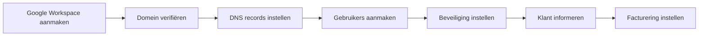

## Overzicht

Google Workspace wordt **direct voor de klant** opgezet — er is geen partneraccount tussenin. Je maakt het account aan, verifieert het domein en draagt het beheer over aan de klant.



---

## Vereisten

| Vereiste | Beschrijving |
|----------|-------------|
| Domeinnaam | Actief domein met DNS toegang |
| Creditcard klant | Betaling loopt via het klant-account |
| Google account | Nieuw of bestaand Google account voor de admin |

---

## Stap 1 — Google Workspace account aanmaken

<Steps>
  <Step title="Google Workspace openen" icon="globe">
    Navigeer naar [workspace.google.com](https://workspace.google.com) en klik op **Get Started** of **Aan de slag**.
  </Step>
  <Step title="Bedrijfsgegevens invoeren" icon="edit">
    Vul de bedrijfsnaam, het aantal medewerkers en het land in.
  </Step>
  <Step title="Admin account aanmaken" icon="user-plus">
    Maak het eerste admin account aan, bijv. `admin@domein.nl`. Dit wordt het hoofdbeheeraccount.
  </Step>
  <Step title="Abonnement kiezen" icon="shopping-cart">
    Kies het juiste abonnement:

    | Plan | Opslag | Prijs (ca.) | Gebruik |
    |------|--------|-------------|---------|
    | **Business Starter** | 30 GB/gebruiker | ~6/mnd | Basis e-mail |
    | **Business Standard** | 2 TB/gebruiker | ~12/mnd | E-mail + Drive |
    | **Business Plus** | 5 TB/gebruiker | ~18/mnd | Uitgebreid + Vault |
  </Step>
  <Step title="Betaalgegevens invoeren" icon="credit-card">
    Voer de **creditcard of betaalgegevens van de klant** in. Het abonnement loopt direct op naam van de klant.
  </Step>
</Steps>

<Callout kind="warning" title="Facturering op naam van klant">
  In tegenstelling tot Microsoft/PAX8 loopt Google Workspace direct via de klant. Zorg dat de betaalgegevens van de klant worden gebruikt, niet je eigen gegevens.
</Callout>

---

## Stap 2 — Domein verifiëren

<Steps>
  <Step title="Verificatiemethode kiezen" icon="check-circle">
    Google biedt meerdere verificatiemethodes. De **TXT record** methode is het meest gangbaar.
  </Step>
  <Step title="TXT record toevoegen" icon="settings">
    Voeg het verificatie-TXT-record toe aan de DNS van het domein. Google toont de exacte waarde in het verificatiescherm.
  </Step>
  <Step title="Verificatie voltooien" icon="check-circle">
    Klik op **Verifiëren** in de Google Admin Console. Dit kan enkele minuten duren.
  </Step>
</Steps>

---

## Stap 3 — DNS records instellen

Na verificatie moeten de e-mail DNS records worden ingesteld zodat mail via Google wordt gerouteerd.

<Steps>
  <Step title="MX records instellen" icon="mail">
    Vervang de bestaande MX records door de Google MX records:

    | Prioriteit | Server |
    |-----------|--------|
    | 1 | `ASPMX.L.GOOGLE.COM` |
    | 5 | `ALT1.ASPMX.L.GOOGLE.COM` |
    | 5 | `ALT2.ASPMX.L.GOOGLE.COM` |
    | 10 | `ALT3.ASPMX.L.GOOGLE.COM` |
    | 10 | `ALT4.ASPMX.L.GOOGLE.COM` |
  </Step>
  <Step title="SPF record toevoegen" icon="shield">
    Voeg een TXT record toe voor SPF:

    ```
    v=spf1 include:_spf.google.com ~all
    ```
  </Step>
  <Step title="DKIM instellen" icon="key">
    Ga in de **Google Admin Console** naar **Apps > Google Workspace > Gmail > Authenticate email**. Genereer de DKIM key en voeg deze toe als TXT record in de DNS.
  </Step>
  <Step title="DMARC instellen (optioneel)" icon="shield">
    Voeg een DMARC record toe voor extra bescherming:

    ```
    v=DMARC1; p=quarantine; rua=mailto:admin@domein.nl
    ```
  </Step>
</Steps>

<Callout kind="tip" title="DNS propagatie">
  MX records kunnen tot 48 uur duren. Tijdens deze periode kunnen e-mails nog via de oude provider binnenkomen.
</Callout>

---

## Stap 4 — Gebruikers aanmaken

<Steps>
  <Step title="Google Admin Console openen" icon="settings">
    Ga naar [admin.google.com](https://admin.google.com) en log in met het admin account.
  </Step>
  <Step title="Gebruikers toevoegen" icon="user-plus">
    Navigeer naar **Directory > Users > Add new user**. Vul naam en e-mailadres in voor elke gebruiker.
  </Step>
  <Step title="Wachtwoorden instellen" icon="lock">
    Stel een tijdelijk wachtwoord in en vink aan dat de gebruiker het wachtwoord moet wijzigen bij eerste login.
  </Step>
  <Step title="Credentials opslaan" icon="clipboard">
    Sla alle inloggegevens op in je **wachtwoordmanager**.
  </Step>
</Steps>

---

## Stap 5 — Beveiliging instellen

<Steps>
  <Step title="2FA afdwingen" icon="shield">
    Ga naar **Security > 2-Step Verification** en schakel dit in als organisatiebeleid. Geef gebruikers een grace period van 7 dagen.
  </Step>
  <Step title="Herstelopties instellen" icon="phone">
    Voeg een herstel-telefoonnummer en -emailadres toe aan het admin account.
  </Step>
  <Step title="App-wachtwoorden configureren" icon="key">
    Indien de klant e-mail wil gebruiken in een externe client (bijv. Apple Mail zonder OAuth), configureer dan app-specifieke wachtwoorden.
  </Step>
</Steps>

---

## Stap 6 — Klant informeren

Stuur de klant de inloggegevens en instructies:

```
Hoi [naam],

Het nieuwe emailadres is aangemaakt via Google Workspace.

Om in te loggen en je wachtwoord te wijzigen, ga naar:
https://mail.google.com

Met onderstaande gegevens:
[emailadres]
[tijdelijk wachtwoord]

Je wordt gevraagd om je wachtwoord te wijzigen bij de eerste login.

Tip: Download de Gmail app op je telefoon voor de beste ervaring.

Bij vragen hoor ik het graag!
```

---

## Stap 7 — Facturering instellen

<Steps>
  <Step title="Factureringsoverzicht controleren" icon="file-text">
    De facturering loopt automatisch via Google. Controleer in de **Admin Console > Billing** of het juiste abonnement en de betaalmethode actief zijn.
  </Step>
  <Step title="Eigen facturering opzetten" icon="repeat">
    Als je een servicekosten-marge rekent bovenop het Google Workspace abonnement, zet dan een periodieke factuur op voor de klant.
  </Step>
</Steps>

<Callout kind="tip" title="Jaarlijks vs maandelijks">
  Google Workspace biedt korting bij een jaarlijks abonnement (Annual plan). Adviseer dit aan klanten die zeker zijn van hun keuze.
</Callout>

---

## Volgende stappen

<Columns cols={2}>
  <Card title="Microsoft 365 (PAX8)" icon="mail" href="/email/microsoft-365">
    E-mail opzetten via Microsoft 365 en PAX8.
  </Card>
  <Card title="MXRoute" icon="mail" href="/email/mxroute">
    Budget e-mail opzetten via MXRoute reseller.
  </Card>
</Columns>
