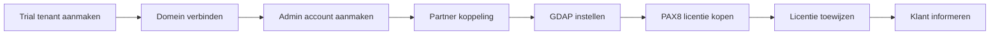

## Overzicht

E-mail via Microsoft 365 wordt opgezet als **PAX8 partner**. Je maakt eerst een trial tenant aan via office.com, verbindt het domein, koppelt het aan je partneraccount en koopt de licentie via PAX8 door.



---

## Stap 1 — Trial tenant aanmaken

<Steps>
  <Step title="Office.com openen in incognito" icon="globe">
    Open een **incognito tabblad** en navigeer naar [office.com](https://office.com). Dit is belangrijk zodat je niet inlogt met je eigen account.
  </Step>
  <Step title="Business Basic Trial registreren" icon="credit-card">
    Registreer een **Business Basic Trial**. Voeg het gewenste emailadres in als gebruikersnaam, bijv. `naam@nieuweklant.nl`.
  </Step>
  <Step title="Betaalgegevens invoeren" icon="credit-card">
    Vul je eigen creditcard gegevens in (AMEX of N26). Dit is nodig voor de trial registratie.
  </Step>
  <Step title="Proefversie starten" icon="play">
    Start de proefversie en voltooi de authenticatie met de **Microsoft Authenticator**.
  </Step>
  <Step title="Trial opzeggen en betaalmethode verwijderen" icon="x-circle">
    Ga direct naar **Abonnement beheren > Abonnement opzeggen en verwijderen**. Verwijder daarna de betalingswijze (creditcard) indien mogelijk.
  </Step>
</Steps>

<Callout kind="warning" title="Trial direct opzeggen">
  Zeg de trial direct op na het aanmaken. De licentie wordt later via PAX8 gekocht. Als je dit vergeet, wordt je creditcard belast na de trial periode.
</Callout>

---

## Stap 2 — Domein verbinden

<Steps>
  <Step title="TXT record toevoegen" icon="check-circle">
    Verbind de domeinnaam door het **TXT verificatierecord** toe te voegen in de DNS van het domein. Microsoft geeft de exacte waarde.
  </Step>
  <Step title="Overige DNS records toevoegen" icon="settings">
    Voeg de overige DNS records toe:

    | Record type | Doel |
    |-------------|------|
    | **MX** | Mail routing naar Microsoft |
    | **CNAME** | Autodiscover voor e-mailclients |
    | **TXT** | SPF record voor spam preventie |
  </Step>
</Steps>

<Callout kind="tip" title="DNS propagatie">
  DNS wijzigingen kunnen tot 48 uur duren om wereldwijd door te voeren, maar zijn meestal binnen 15-30 minuten actief.
</Callout>

---

## Stap 3 — Admin account aanmaken

<Steps>
  <Step title="Admin gebruiker aanmaken" icon="user-plus">
    Maak een nieuwe gebruiker aan met het adres `admin@domein.nl`. Dit wordt het beheeraccount.
  </Step>
  <Step title="Credentials opslaan" icon="lock">
    Sla alle inloggegevens direct op in je **wachtwoordmanager** (1Password / Bitwarden).
  </Step>
  <Step title="Geen licentie toewijzen" icon="x">
    Maak de gebruiker aan **zonder licentie** — de licentie komt later via PAX8.
  </Step>
  <Step title="Alle admin rollen toewijzen" icon="shield">
    Selecteer **alle admin rollen** voor het beheeraccount.
  </Step>
  <Step title="Klant-account aanmaken (optioneel)" icon="user">
    Maak eventueel al een account aan voor de klant zelf, bijv. `naam@domein.nl`.
  </Step>
</Steps>

---

## Stap 4 — Microsoft Partner koppeling

<Steps>
  <Step title="New Relationship aanvragen" icon="link">
    Ga naar het **Microsoft Partner centrum** en vraag een **New Relationship** aan voor de nieuwe tenant.
  </Step>
  <Step title="Link openen in incognito" icon="globe">
    Kopieer de gegenereerde link en open deze in het **incognito tabblad** waar de klant-tenant ingelogd is.
  </Step>
  <Step title="Overeenkomst accepteren" icon="check-circle">
    Accepteer de partnerovereenkomst in de klant-tenant.
  </Step>
</Steps>

---

## Stap 5 — GDAP instellen

GDAP (Granular Delegated Admin Privileges) geeft je beheertoegang tot de klant-tenant met specifieke rollen.

<Steps>
  <Step title="Nieuwe Admin Relationship starten" icon="shield">
    Start een nieuwe **Admin Relationship** in het Partner centrum.
  </Step>
  <Step title="Naam instellen" icon="edit">
    Noem de relatie `Bedrijfsnaam x KayJilesen`.
  </Step>
  <Step title="Entra Roles selecteren" icon="check-circle">
    Selecteer de benodigde Entra Roles (zie tabel hieronder).
  </Step>
  <Step title="Duur en auto-extend instellen" icon="clock">
    Kies voor **365 dagen** en stel **Auto extend** in op **Yes**.
  </Step>
  <Step title="Finalize en accepteren" icon="check-circle">
    Kies **Finalize request**, kopieer de link naar het incognito tabblad en accepteer de partnerrelatie.
  </Step>
  <Step title="Security groups toewijzen" icon="users">
    Voeg de juiste **Security groups** toe aan de GDAP relatie.
  </Step>
</Steps>

### Vereiste Entra Roles

| Role | Beschrijving |
|------|-------------|
| **Exchange Administrator** | E-mail en Exchange Online beheer |
| **Authentication Administrator** | Authenticatie methodes beheren |
| **License Administrator** | Licenties toewijzen en beheren |
| **Password Administrator** | Wachtwoorden resetten |
| **User Administrator** | Gebruikers aanmaken en beheren |
| **Billing Administrator** | Facturering en abonnementen |
| **Domain Name Administrator** | Domeinen koppelen en beheren |

---

## Stap 6 — PAX8 licentie kopen

<Steps>
  <Step title="Nieuwe Client aanmaken in PAX8" icon="user-plus">
    Maak een nieuwe **Client** aan in het PAX8 dashboard.
  </Step>
  <Step title="Office abonnement selecteren" icon="shopping-cart">
    Ga in de **Catalog** naar het juiste Office abonnement (bijv. Business Basic of Business Standard).
  </Step>
  <Step title="Abonnement configureren" icon="settings">
    Configureer het abonnement:

    | Instelling | Waarde |
    |-----------|--------|
    | **Billing term** | Annual |
    | **Bestaand account** | Yes, customer has account |
    | **Bestaande tenant** | No, ordering for existing Microsoft tenant |
  </Step>
  <Step title="Tenant ID opzoeken" icon="search">
    Zoek het **Customer Tenant ID** in het Partner centrum overzicht via **Microsoft Entra ID**.
  </Step>
  <Step title="Reseller Relationship accepteren" icon="check-circle">
    Accepteer de **Reseller Relationship Link** via het incognito tabblad.
  </Step>
  <Step title="Aankoop afronden" icon="credit-card">
    Rond de aankoop af in PAX8.
  </Step>
</Steps>

---

## Stap 7 — Licentie toewijzen

<Steps>
  <Step title="Gebruikers openen" icon="users">
    Ga in het **incognito tabblad** (klant-tenant) naar **Gebruikers**.
  </Step>
  <Step title="Licentie toewijzen" icon="check-circle">
    Wijs de nieuwe licentie (gekocht via PAX8) toe aan de gebruiker(s).
  </Step>
</Steps>

---

## Stap 8 — Klant informeren

Stuur de klant een e-mail met de inloggegevens. Gebruik onderstaand template:

```
Hoi [naam],

Het nieuwe emailadres is aangemaakt via Office365.

Om deze in je mailprogramma te installeren dien je eerst eenmalig
in te loggen en het wachtwoord te wijzigen.

Login via:
office.com

Met onderstaande gegevens:
[emailadres]
[wachtwoord]

Bij vragen hoor ik het graag!
```

---

## Stap 9 — Facturering instellen

<Steps>
  <Step title="Eerste factuur aanmaken" icon="file-text">
    Zet de eerste factuur op voor het huidige jaar (naar rato indien niet per 1 januari).
  </Step>
  <Step title="Periodieke factuur instellen" icon="repeat">
    Zet een **periodieke factuur** op voor de komende jaren, zodat de verlenging automatisch gefactureerd wordt.
  </Step>
</Steps>

<Callout kind="tip" title="Facturering">
  Zorg dat de factuurperiode aansluit bij de PAX8 billing cycle (annual). Zo voorkom je mismatches in kosten.
</Callout>

---

## Volgende stappen

<Columns cols={2}>
  <Card title="Google Workspace" icon="mail" href="/email/google-workspace">
    E-mail opzetten via Google Workspace.
  </Card>
  <Card title="MXRoute" icon="mail" href="/email/mxroute">
    Budget e-mail opzetten via MXRoute reseller.
  </Card>
</Columns>
