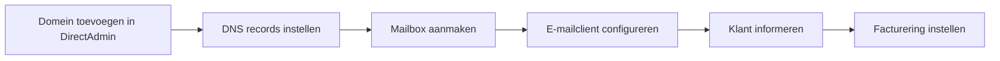

## Overzicht

MXRoute is een **budget e-mail hosting** provider die ideaal is voor klanten die alleen een professioneel e-mailadres nodig hebben zonder de extra features van Microsoft 365 of Google Workspace. Je beheert alles via een reseller account.



---

## Vereisten

| Vereiste | Beschrijving |
|----------|-------------|
| MXRoute reseller account | Actief reseller account bij MXRoute |
| Domeinnaam | Actief domein met DNS toegang |
| DirectAdmin toegang | Toegang tot het DirectAdmin panel van MXRoute |

---

## Wanneer MXRoute kiezen?

| Scenario | Aanbeveling |
|----------|-------------|
| Klant heeft alleen e-mail nodig | MXRoute |
| Klant wil ook Office apps (Word, Excel) | Microsoft 365 |
| Klant wil Google Drive integratie | Google Workspace |
| Budget is beperkt | MXRoute |
| Meerdere mailboxen, weinig opslagbehoefte | MXRoute |

---

## Stap 1 — Domein toevoegen

<Steps>
  <Step title="DirectAdmin openen" icon="globe">
    Log in op het **DirectAdmin** panel van je MXRoute reseller account.
  </Step>
  <Step title="Nieuw domein toevoegen" icon="plus">
    Ga naar **Account Manager > Domain Setup** en voeg het domein van de klant toe (bijv. `domein.nl`).
  </Step>
  <Step title="E-mail routing bevestigen" icon="check-circle">
    Controleer dat de e-mail routing correct is ingesteld op **Local Mail Server**.
  </Step>
</Steps>

---

## Stap 2 — DNS records instellen

Stel de DNS records in bij de domeinregistrar of DNS provider van het domein.

<Steps>
  <Step title="MX records instellen" icon="mail">
    Voeg de MXRoute MX records toe:

    | Prioriteit | Server |
    |-----------|--------|
    | 10 | Wordt getoond in DirectAdmin |
    | 20 | Backup MX (wordt getoond in DirectAdmin) |

    <Callout kind="warning" title="Exacte waarden">
      De MX records zijn specifiek per server. Kopieer de exacte waarden uit je DirectAdmin panel — gebruik niet de waarden van een andere MXRoute server.
    </Callout>
  </Step>
  <Step title="SPF record toevoegen" icon="shield">
    Voeg een TXT record toe voor SPF. De exacte waarde wordt getoond in DirectAdmin, typisch:

    ```
    v=spf1 include:mxroute.com ~all
    ```
  </Step>
  <Step title="DKIM instellen" icon="key">
    Ga in DirectAdmin naar **E-Mail Manager > DomainKeys (DKIM)**. Genereer de DKIM key en voeg het getoonde TXT record toe aan de DNS.
  </Step>
  <Step title="DMARC instellen (optioneel)" icon="shield">
    Voeg een DMARC record toe:

    ```
    v=DMARC1; p=quarantine; rua=mailto:admin@domein.nl
    ```
  </Step>
</Steps>

---

## Stap 3 — Mailbox aanmaken

<Steps>
  <Step title="E-Mail Accounts openen" icon="mail">
    Ga in DirectAdmin naar **E-Mail Manager > E-Mail Accounts**.
  </Step>
  <Step title="Nieuwe mailbox aanmaken" icon="plus">
    Klik op **Create Account** en vul in:

    | Veld | Waarde |
    |------|--------|
    | **Username** | bijv. `info` of `naam` |
    | **Wachtwoord** | Genereer een sterk wachtwoord |
    | **Quota** | Stel een limiet in (bijv. 1 GB of 5 GB) |
  </Step>
  <Step title="Credentials opslaan" icon="lock">
    Sla de inloggegevens direct op in je **wachtwoordmanager**.
  </Step>
</Steps>

<Callout kind="tip" title="Catch-all">
  Je kunt optioneel een **catch-all** e-mailadres instellen zodat alle mail naar het domein (ook naar niet-bestaande adressen) in een specifieke mailbox terechtkomt. Dit is handig bij nieuwe domeinen.
</Callout>

---

## Stap 4 — E-mailclient configureren

De klant kan de mailbox gebruiken via webmail of een e-mailclient. Hieronder de instellingen:

### Serverinstellingen

| Instelling | Inkomend (IMAP) | Uitgaand (SMTP) |
|-----------|----------------|-----------------|
| **Server** | Zie DirectAdmin | Zie DirectAdmin |
| **Poort** | 993 (SSL) | 465 (SSL) of 587 (STARTTLS) |
| **Beveiliging** | SSL/TLS | SSL/TLS of STARTTLS |
| **Gebruikersnaam** | Volledig e-mailadres | Volledig e-mailadres |
| **Wachtwoord** | Mailbox wachtwoord | Mailbox wachtwoord |

<Callout kind="warning" title="Exacte servernamen">
  De servernamen (hostname) zijn specifiek per MXRoute server. Kopieer de exacte waarden uit DirectAdmin. Gebruik nooit `mail.domein.nl` tenzij je een eigen CNAME hebt ingesteld.
</Callout>

### Webmail

Webmail is bereikbaar via de URL die in DirectAdmin wordt getoond, typisch via **Roundcube** of **Snappymail**.

---

## Stap 5 — Klant informeren

Stuur de klant de inloggegevens en configuratie-instructies:

```
Hoi [naam],

Het nieuwe emailadres is aangemaakt.

Je kunt je e-mail openen via webmail:
[webmail URL]

Met onderstaande gegevens:
[emailadres]
[wachtwoord]

Wil je de e-mail instellen op je telefoon of computer?
Gebruik dan deze instellingen:

Inkomend (IMAP):
  Server: [servernaam]
  Poort: 993 (SSL)

Uitgaand (SMTP):
  Server: [servernaam]
  Poort: 465 (SSL)

Gebruikersnaam: [volledig emailadres]
Wachtwoord: [wachtwoord]

Bij vragen hoor ik het graag!
```

---

## Stap 6 — Facturering instellen

<Steps>
  <Step title="Kosten berekenen" icon="calculator">
    MXRoute werkt met een **reseller model** — je betaalt een vast bedrag voor je reseller account en kunt onbeperkt mailboxen aanmaken binnen je quotum.
  </Step>
  <Step title="Klantfactuur aanmaken" icon="file-text">
    Maak een factuur aan voor de klant. Bereken een jaarlijkse of maandelijkse marge bovenop je kosten.
  </Step>
  <Step title="Periodieke factuur instellen" icon="repeat">
    Zet een **periodieke factuur** op zodat de verlenging automatisch wordt gefactureerd.
  </Step>
</Steps>

<Callout kind="tip" title="Kostenoverzicht bijhouden">
  Houd een overzicht bij van welke klanten op welke MXRoute server draaien en hoeveel quota ze gebruiken. Zo kun je tijdig upgraden als je tegen je limieten aanloopt.
</Callout>

---

## Volgende stappen

<Columns cols={2}>
  <Card title="Microsoft 365 (PAX8)" icon="mail" href="/email/microsoft-365">
    E-mail opzetten via Microsoft 365 en PAX8.
  </Card>
  <Card title="Google Workspace" icon="mail" href="/email/google-workspace">
    E-mail opzetten via Google Workspace.
  </Card>
</Columns>
