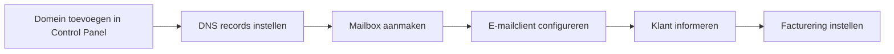

## Overzicht

MXRoute is een **budget e-mail hosting** provider die ideaal is voor klanten die alleen een professioneel e-mailadres nodig hebben zonder de extra features van Microsoft 365 of Google Workspace. Je beheert alles via een reseller account met twee panels: het **Management Panel** voor abonnementen en het **Control Panel** voor e-mail configuratie.


```mermaid
graph LR
    A["Domein toevoegen in Control Panel"] --> B["DNS records instellen"]
    B --> C["Mailbox aanmaken"]
    C --> D["E-mailclient configureren"]
    D --> E["Klant informeren"]
    E --> F["Facturering instellen"]
```

---

## Vereisten

| Vereiste | Beschrijving |
|----------|-------------|
| MXRoute reseller account | Actief reseller account bij MXRoute |
| Domeinnaam | Actief domein met DNS toegang |
| Management Panel | [management.mxroute.com](https://management.mxroute.com) — abonnementen en facturering |
| Control Panel | [panel.mxroute.com](https://panel.mxroute.com) — e-mail en domeinbeheer (bereikbaar via "Login to Panel" in Management Panel) |

---

## Wanneer MXRoute kiezen?

| Scenario | Aanbeveling |
|----------|-------------|
| Klant heeft alleen e-mail nodig | MXRoute |
| Klant wil ook Office apps (Word, Excel) | Microsoft 365 |
| Klant wil Google Drive integratie | Google Workspace |
| Budget is beperkt | MXRoute |
| Meerdere mailboxen, weinig opslagbehoefte | MXRoute |

---

## Stap 1 — Domein toevoegen

<Steps>
  <Step title="Management Panel openen" icon="globe">
    Log in op [management.mxroute.com](https://management.mxroute.com) en klik op **Login to Panel** om het Control Panel te openen.
  </Step>
  <Step title="Domein verificatie starten" icon="key">
    Ga in het Control Panel naar **DNS** en kopieer de **verificatie-TXT-record** voor het nieuwe domein. Voeg dit record toe bij de DNS provider van het domein.
  </Step>
  <Step title="Nieuw domein toevoegen" icon="plus">
    Ga naar **Domains** en klik op **Add Domain**. Voer de domeinnaam in (bijv. `domein.nl`). Het domein wordt geverifieerd aan de hand van het TXT record.
  </Step>
</Steps>

<Callout kind="tip" title="Verificatie">
  Domeinverificatie duurt meestal 5-30 minuten. Alle nieuwe domeinen moeten geverifieerd worden voordat ze gebruikt kunnen worden.
</Callout>

---

## Stap 2 — DNS records instellen

Stel de DNS records in bij de domeinregistrar of DNS provider van het domein. De exacte MX waarden zijn te vinden in het Control Panel onder **DNS** (met kopieerknoppen).

<Steps>
  <Step title="MX records instellen" icon="mail">
    Voeg de MXRoute MX records toe:

    | Prioriteit | Server |
    |-----------|--------|
    | 10 | `(jouw-server).mxrouting.net` |
    | 20 | `(jouw-server)-relay.mxrouting.net` |

    <Callout kind="warning" title="Server-specifieke waarden">
      De MX records zijn specifiek per server. Kopieer de exacte waarden uit het Control Panel — gebruik niet de waarden van een andere MXRoute server.
    </Callout>
  </Step>
  <Step title="SPF record toevoegen" icon="shield">
    Voeg een TXT record toe voor SPF:

    ```
    v=spf1 include:mxroute.com -all
    ```

    Alternatief kan ook `include:mxlogin.com` gebruikt worden — beide zijn identiek.
  </Step>
  <Step title="DKIM instellen" icon="key">
    Ga in het Control Panel naar **DNS**, selecteer je domein en kopieer de unieke DKIM key. Voeg deze toe als TXT record:

    | Veld | Waarde |
    |------|--------|
    | **Type** | TXT |
    | **Naam** | `x._domainkey` |
    | **Waarde** | De DKIM key uit het Control Panel |
  </Step>
  <Step title="DMARC instellen (optioneel)" icon="shield">
    Voeg een DMARC record toe:

    ```
    v=DMARC1; p=quarantine; rua=mailto:admin@domein.nl
    ```
  </Step>
</Steps>

<Callout kind="tip" title="DNS Tester">
  Het Control Panel bevat een ingebouwde **DNS Tester** om te controleren of alle records correct zijn ingesteld.
</Callout>

---

## Stap 3 — Mailbox aanmaken

<Steps>
  <Step title="Email Accounts openen" icon="mail">
    Ga in het Control Panel naar **Email Accounts**.
  </Step>
  <Step title="Nieuwe mailbox aanmaken" icon="plus">
    Klik op **Create Account** en vul in:

    | Veld | Waarde |
    |------|--------|
    | **Username** | bijv. `info` of `naam` |
    | **Wachtwoord** | Genereer een sterk wachtwoord |
    | **Quota** | Stel een limiet in of kies unlimited |
  </Step>
  <Step title="Credentials opslaan" icon="lock">
    Sla de inloggegevens direct op in je **wachtwoordmanager**.
  </Step>
</Steps>

<Callout kind="tip" title="Catch-all">
  Je kunt optioneel een **catch-all** e-mailadres instellen via **Advanced** zodat alle mail naar het domein (ook naar niet-bestaande adressen) in een specifieke mailbox terechtkomt.
</Callout>

---

## Stap 4 — E-mailclient configureren

De klant kan de mailbox gebruiken via **Crossbox webmail** of een e-mailclient.

### Serverinstellingen

De server hostname is dezelfde als je primaire MX record.

| Instelling | Inkomend (IMAP) | Uitgaand (SMTP) |
|-----------|----------------|-----------------|
| **Server** | Zie MX record (`(jouw-server).mxrouting.net`) |  Zie MX record (`(jouw-server).mxrouting.net`) |
| **Poort** | 993 (SSL) | 465 (SSL) of 587 (STARTTLS) |
| **Beveiliging** | SSL/TLS | SSL/TLS of STARTTLS |
| **Gebruikersnaam** | Volledig e-mailadres | Volledig e-mailadres |
| **Wachtwoord** | Mailbox wachtwoord | Mailbox wachtwoord |

<Callout kind="warning" title="Exacte servernamen">
  De servernamen (hostname) zijn specifiek per MXRoute server. Gebruik de hostname van je primaire MX record. Gebruik nooit `mail.domein.nl` tenzij je een eigen CNAME hebt ingesteld.
</Callout>

### Webmail (Crossbox)

Webmail is bereikbaar via [mail.mxlogin.com](https://mail.mxlogin.com). Inloggen met het volledige e-mailadres en wachtwoord.

Je kunt optioneel een **custom webmail URL** instellen (bijv. `mail.domein.nl`) via de Crossbox branding instellingen in het Control Panel.

---

## Stap 5 — Klant informeren

Stuur de klant de inloggegevens en configuratie-instructies:

```
Hoi [naam],

Het nieuwe emailadres is aangemaakt.

Je kunt je e-mail openen via webmail:
https://mail.mxlogin.com

Met onderstaande gegevens:
[emailadres]
[wachtwoord]

Wil je de e-mail instellen op je telefoon of computer?
Gebruik dan deze instellingen:

Inkomend (IMAP):
  Server: [servernaam].mxrouting.net
  Poort: 993 (SSL)

Uitgaand (SMTP):
  Server: [servernaam].mxrouting.net
  Poort: 465 (SSL)

Gebruikersnaam: [volledig emailadres]
Wachtwoord: [wachtwoord]

Bij vragen hoor ik het graag!
```

---

## Stap 6 — Facturering instellen

<Steps>
  <Step title="Kosten berekenen" icon="calculator">
    MXRoute werkt met een **reseller model** — je betaalt een vast bedrag voor je reseller account en kunt onbeperkt mailboxen aanmaken binnen je quotum.
  </Step>
  <Step title="Klantfactuur aanmaken" icon="file-text">
    Maak een factuur aan voor de klant. Bereken een jaarlijkse of maandelijkse marge bovenop je kosten.
  </Step>
  <Step title="Periodieke factuur instellen" icon="repeat">
    Zet een **periodieke factuur** op zodat de verlenging automatisch wordt gefactureerd.
  </Step>
</Steps>

<Callout kind="tip" title="Kostenoverzicht bijhouden">
  Houd een overzicht bij van welke klanten op welke MXRoute server draaien en hoeveel quota ze gebruiken. Zo kun je tijdig upgraden als je tegen je limieten aanloopt.
</Callout>

---

## Volgende stappen

<Columns cols={2}>
  <Card title="Microsoft 365 (PAX8)" icon="mail" href="/email/microsoft-365">
    E-mail opzetten via Microsoft 365 en PAX8.
  </Card>
  <Card title="Google Workspace" icon="mail" href="/email/google-workspace">
    E-mail opzetten via Google Workspace.
  </Card>
</Columns>
