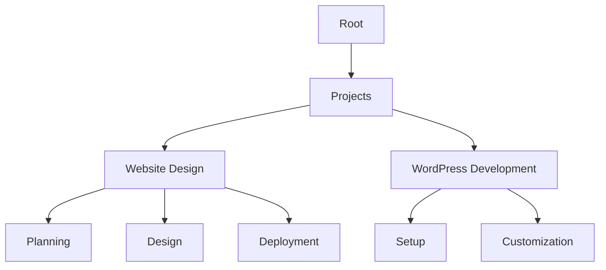

## Overview

Kay Jilesen provides a powerful documentation platform to organize and manage your project documentation efficiently. You can structure content hierarchically, collaborate with teams using version control, search through documents quickly, and customize the look with themes and branding. These features help you create professional docs that scale with your projects.

<Columns cols={2}>
  <Card title="Document Structuring" icon="layers" href="#document-structuring">
    Build nested hierarchies for complex documentation.
  </Card>
  <Card title="Collaboration" icon="users" href="#collaboration">
    Work together with real-time edits and version history.
  </Card>
  <Card title="Search Tools" icon="search" href="#search-tools">
    Find content instantly with advanced filtering.
  </Card>
  <Card title="Customization" icon="palette" href="#customization">
    Tailor themes and branding to match your style.
  </Card>
</Columns>

## Document Structuring and Hierarchy

Organize your documentation into a clear hierarchy using folders and pages. This mirrors your project's structure, making navigation intuitive.



<Steps>
  <Step title="Create Folders" icon="folder">
    Use the sidebar to nest pages under parent folders.
  </Step>
  <Step title="Add Pages" icon="file-text">
    Drag and drop MDX files into the hierarchy.
  </Step>
  <Step title="Link Navigation" icon="link">
    Automatic sidebar generation reflects your structure.
  </Step>
</Steps>

## Collaboration and Version Control

Invite team members to collaborate seamlessly. Track changes with Git-based version control integrated directly into the platform.

<Tabs>
  <Tab title="Invite Collaborators" icon="user-plus">
    Share edit access via email invitations.
  </Tab>
  <Tab title="Version History" icon="git-branch">
    View diffs and revert changes easily.
  </Tab>
</Tabs>

<Callout kind="tip">
  Enable branch previews for safe testing of updates.
</Callout>

## Search and Filtering Tools

Powerful search helps you locate documents quickly. Filter by tags, dates, or authors.

| Filter Type | Description | Example |
|-------------|-------------|---------|
| Tags | Narrow by labels like `design`, `development` | `tag:wordpress` |
| Date Range | Find recent updates | `updated:>2024-01-01` |
| Author | Search by contributor | `author:kay` |
| Full-Text | Keyword matching across content | `strategy design` |

<CodeGroup tabs="Query Examples">
  ```javascript
  // Advanced search query
  const results = searchDocs({
    query: "website strategy",
    filters: { tags: ["design"], updated: ">2024-01-01" }
  });
  ```
  ```python
  # Python client search
  results = client.search(
      query="website strategy",
      filters={"tags": ["design"]}
  )
  ```
</CodeGroup>

## Customization Themes and Branding

Personalize your docs with custom themes. Apply your brand colors like `#1A2D35` and fonts.

<Expandable title="Advanced Theme Config" default-open="false">
  Edit the theme in your config file:

````yaml
theme:
  colors:
    primary: "#1A2D35"
  fonts:
    heading: "Inter"
    body: "Inter"
  logo: "/kay-jilesen-logo.svg"
````

</Expandable>

<Callout kind="success">
  Preview changes live before publishing.
</Callout>

These core features form the foundation of your documentation workflow. Start by structuring your first project and invite collaborators to build together.