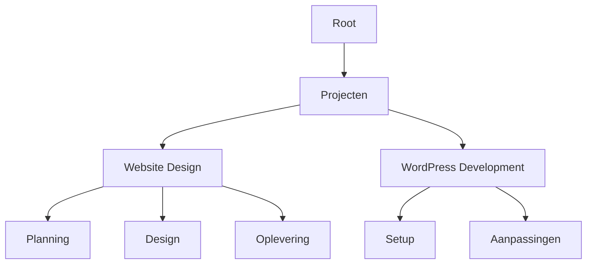

## Overzicht

Dit platform biedt een krachtige documentatieomgeving om je projectdocumentatie efficiënt te organiseren en beheren. Je kunt content hiërarchisch structureren, samenwerken met teams via versiebeheer, snel door documenten zoeken en het uiterlijk aanpassen met thema's en branding. Deze functies helpen je professionele documentatie te maken die meegroeit met je projecten.

<Columns cols={2}>
  <Card title="Documentstructuur" icon="layers" href="#documentstructuur">
    Bouw geneste hiërarchieën voor complexe documentatie.
  </Card>
  <Card title="Samenwerking" icon="users" href="#samenwerking">
    Werk samen met realtime bewerkingen en versiegeschiedenis.
  </Card>
  <Card title="Zoektools" icon="search" href="#zoektools">
    Vind content direct met geavanceerde filtering.
  </Card>
  <Card title="Aanpassingen" icon="palette" href="#aanpassingen">
    Stem thema's en branding af op jouw stijl.
  </Card>
</Columns>

## Documentstructuur en hiërarchie

Organiseer je documentatie in een overzichtelijke hiërarchie met mappen en pagina's. Dit weerspiegelt de structuur van je project, waardoor navigatie intuïtief wordt.



<Steps>
  <Step title="Mappen aanmaken" icon="folder">
    Gebruik de zijbalk om pagina's onder bovenliggende mappen te nestelen.
  </Step>
  <Step title="Pagina's toevoegen" icon="file-text">
    Sleep MDX-bestanden naar de hiërarchie.
  </Step>
  <Step title="Navigatie koppelen" icon="link">
    Automatische zijbalkgeneratie weerspiegelt je structuur.
  </Step>
</Steps>

## Samenwerking en versiebeheer

Nodig teamleden uit om naadloos samen te werken. Volg wijzigingen met Git-gebaseerd versiebeheer dat direct in het platform is geïntegreerd.

<Tabs>
  <Tab title="Medewerkers uitnodigen" icon="user-plus">
    Deel bewerkingstoegang via e-mailuitnodigingen.
  </Tab>
  <Tab title="Versiegeschiedenis" icon="git-branch">
    Bekijk diffs en draai wijzigingen eenvoudig terug.
  </Tab>
</Tabs>

<Callout kind="tip">
  Schakel branch-previews in om updates veilig te testen.
</Callout>

## Zoeken en filteren

Krachtige zoekfunctionaliteit helpt je documenten snel te vinden. Filter op tags, datums of auteurs.

| Filtertype | Beschrijving | Voorbeeld |
|------------|-------------|---------|
| Tags | Verfijnen op labels zoals `design`, `development` | `tag:wordpress` |
| Datumbereik | Recente updates vinden | `updated:>2024-01-01` |
| Auteur | Zoeken op bijdrager | `author:kay` |
| Volledige tekst | Trefwoorden zoeken in content | `strategie design` |

<CodeGroup tabs="Query voorbeelden">
  ```javascript
  // Geavanceerde zoekopdracht
  const results = searchDocs({
    query: "website strategie",
    filters: { tags: ["design"], updated: ">2024-01-01" }
  });
  ```
  ```python
  # Python client zoeken
  results = client.search(
      query="website strategie",
      filters={"tags": ["design"]}
  )
  ```
</CodeGroup>

## Thema's en branding aanpassen

Personaliseer je documenten met aangepaste thema's. Pas je merkkleuren toe zoals `#1A2D35` en lettertypes.

<Expandable title="Geavanceerde thema-configuratie" default-open="false">
  Bewerk het thema in je configuratiebestand:

````yaml
theme:
  colors:
    primary: "#1A2D35"
  fonts:
    heading: "Inter"
    body: "Inter"
  logo: "/kay-jilesen-logo.svg"
````

</Expandable>

<Callout kind="success">
  Bekijk wijzigingen live voordat je publiceert.
</Callout>

Deze kernfunctionaliteiten vormen de basis van je documentatieworkflow. Begin met het structureren van je eerste project en nodig medewerkers uit om samen te bouwen.