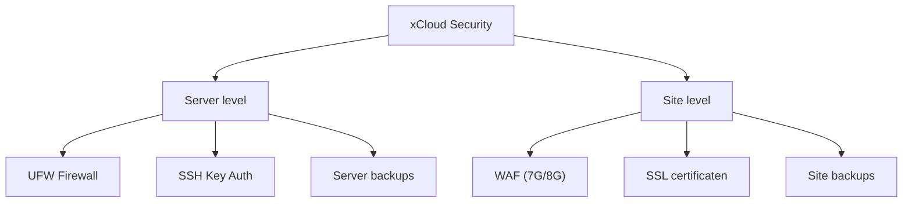

## Overzicht

xCloud biedt uitgebreide backup en security features op zowel server- als site-niveau. Automatische dagelijkse backups, Web Application Firewall (WAF) en gratis SSL zijn standaard inbegrepen.

---

## Backups

### Backup types

xCloud biedt twee niveaus van backups:

| Type | Niveau | Beschrijving |
|------|--------|-------------|
| **Server backup** | Server | Volledige server backup via Hetzner snapshots |
| **Site backup** | Site | Database en/of bestanden per site |

### Site backup opties

| Optie | Beschrijving |
|-------|-------------|
| **Lokale backup** | Opgeslagen op dezelfde server als de site |
| **Remote backup** | Opgeslagen bij een externe storage provider |
| **Full backup** | Database + alle bestanden |
| **Incrementele backup** | Alleen gewijzigde bestanden sinds laatste backup |

---

## Site backup configureren

<Steps>
  <Step title="Backup instellingen openen" icon="settings">
    Ga naar **Site > Backups** in het xCloud dashboard.
  </Step>
  <Step title="Backup type kiezen" icon="database">
    Kies welke onderdelen je wilt backuppen:

    - **Database backup** — de WordPress database
    - **Files backup** — thema's, plugins, uploads en overige bestanden

    Je kunt één of beide opties inschakelen.
  </Step>
  <Step title="Schema instellen" icon="clock">
    Stel de backup frequentie in (dagelijks, wekelijks) en het aantal te bewaren backups.
  </Step>
  <Step title="Remote storage koppelen (optioneel)" icon="cloud">
    Voor externe opslag kun je een storage provider koppelen:

    | Provider | Beschrijving |
    |----------|-------------|
    | **Hetzner Object Storage** | S3-compatibele opslag bij Hetzner |
    | **Google Drive** | Backups opslaan in Google Drive |
    | **Cloudflare R2** | S3-compatibele opslag via Cloudflare |
    | **DigitalOcean Spaces** | Object storage bij DigitalOcean |
  </Step>
</Steps>

<Callout kind="warning" title="Lokale backups">
  Lokale backups staan op dezelfde server als je site. Bij een serverstoring zijn deze ook verloren. Gebruik altijd een **remote backup** als primaire backup strategie.
</Callout>

---

## Server backup

Server-level backups worden geconfigureerd via **Server > Backup Management**. Dit maakt snapshots van de volledige server inclusief alle sites.

<Callout kind="tip" title="Hetzner snapshots">
  Hetzner biedt ook eigen server snapshots via de Cloud Console. Deze kun je combineren met xCloud backups voor extra zekerheid.
</Callout>

---

## Firewall

### UFW Firewall

xCloud configureert automatisch een **UFW (Uncomplicated Firewall)** op je server. Via het xCloud dashboard kun je:

- Bestaande regels **bekijken**
- Nieuwe regels **toevoegen**
- Regels **verwijderen** of **uitschakelen**

### Web Application Firewall (WAF)

xCloud biedt 7G en 8G WAF regels die automatisch kwaadaardig verkeer blokkeren:

| Bescherming tegen | WAF regel |
|-------------------|-----------|
| SQL injection | 7G + 8G |
| Cross-site scripting (XSS) | 7G + 8G |
| Bad bots en scrapers | 7G + 8G |
| File inclusion attacks | 7G + 8G |
| Directory traversal | 7G + 8G |

<Callout kind="info" title="NGINX vereist">
  WAF regel customization (7G/8G whitelist) is momenteel alleen beschikbaar voor NGINX servers.
</Callout>

### WAF activeren

Ga naar **Site > Security** en activeer de gewenste WAF versie. De 8G firewall is de nieuwste versie met verbeterde regels.

### Regels whitelisten

Als de WAF legitieme requests blokkeert (bijv. bepaalde form submissions of API calls), kun je specifieke regels whitelisten via **Site > Security > WAF Rules**.

---

## SSL certificaten

Elk site op xCloud krijgt een gratis **Let's Encrypt** SSL certificaat. Zie [Site Management](/hosting/site-management) voor configuratie details.

---

## SSH beveiliging

| Instelling | Status |
|-----------|--------|
| Root SSH via key | Ingeschakeld |
| Root SSH via wachtwoord | Uitgeschakeld |
| Standaard SSH poort | 22 |

<Callout kind="tip" title="SSH keys beheren">
  Voeg SSH keys toe en beheer ze via **Server > SSH Keys** in het xCloud dashboard. Verwijder keys van teamleden die geen toegang meer nodig hebben.
</Callout>

---

## Security checklist

Gebruik deze checklist voor een veilige setup:

| Check | Beschrijving |
|-------|-------------|
| Remote backups actief | Backups worden extern opgeslagen |
| WAF ingeschakeld | 7G of 8G firewall is actief |
| SSL actief | HTTPS is ingeschakeld voor alle sites |
| SSH keys | Alleen geautoriseerde keys hebben toegang |
| PHP versie actueel | Laatste stabiele PHP versie in gebruik |
| WordPress updates | Core, thema's en plugins up-to-date |
| Ongebruikte plugins | Verwijderd (niet alleen gedeactiveerd) |
| Database prefix | Geen standaard `wp_` prefix |
| Admin URL | Overweeg een custom login URL |

---

## Gerelateerd

<Columns cols={3}>
  <Card title="Server Setup" icon="server" href="/hosting/server-setup">
    Hetzner server opzetten via xCloud.
  </Card>
  <Card title="Site Management" icon="globe" href="/hosting/site-management">
    Sites aanmaken, domeinen en SSL.
  </Card>
  <Card title="Deployments" icon="git-branch" href="/hosting/deployments">
    Git integratie en deployment workflow.
  </Card>
</Columns>
